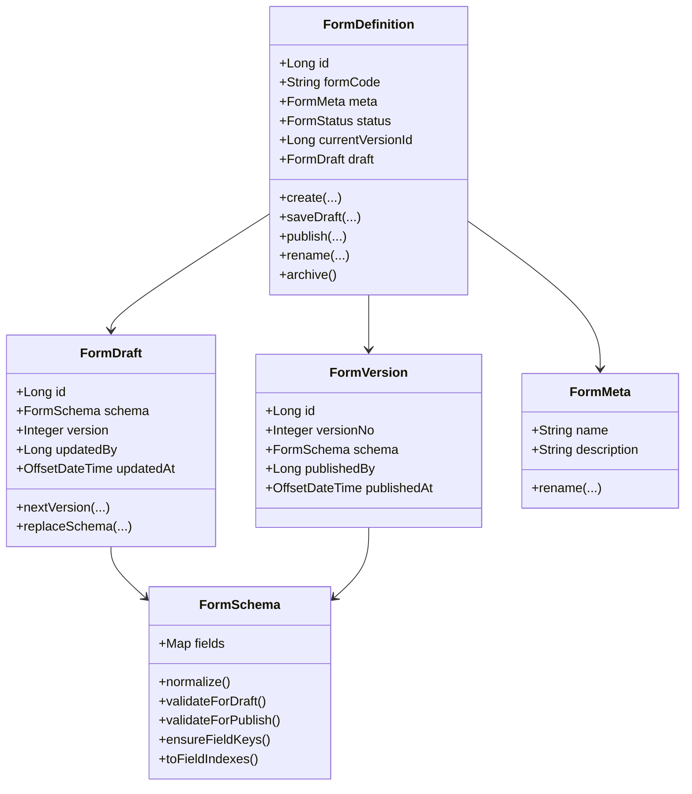

# 表单领域重构草案

## 1. 文档目标

本文档用于回答当前 `form` 模块在 DDD 落地中的一个核心问题：

- 为什么领域层看起来几乎没有业务逻辑
- 当前表单新增、保存草稿、发布等逻辑是否存在职责错位
- 应如何在不大幅推翻现有代码的前提下，把关键业务规则收回领域层

本文档聚焦单表单编辑器场景，不讨论审批、报表、打印等后续扩展上下文的详细实现。

## 2. 当前问题判断

结论：当前 `form` 模块已经具备了一部分业务规则，但总体仍属于“应用层脚本化 + 领域层贫血”的状态，需要优化。

### 2.1 当前已有的业务规则

目前代码中并不是完全没有规则，实际已有以下规则存在：

- 创建表单时自动分配默认 `formCode`
- 保存草稿时进行字段结构归一化
- 保存草稿时补齐 `serverId/field_key`
- 保存草稿时做节点关系合法性校验
- 发布时做更严格的结构校验
- 发布时生成版本快照
- 保存草稿与发布时同步草稿字段索引和版本字段索引

这些规则大多落在：

- `FormCommandAppService`
- `FormSchemaNormalizer`

而不是落在聚合根和领域对象中。

### 2.2 当前的核心问题

当前的主要问题不是“没有业务逻辑”，而是“业务逻辑没有被领域模型承接住”。

表现为：

1. `FormDefinition` 聚合根只有属性和 getter，几乎没有行为。
2. `FormDraft`、`FormVersion` 只是数据 record，不表达业务不变量。
3. 应用服务承担了过多领域决策。
4. 字段结构合法性、`field_key` 生成、索引构建等核心规则被放在 application 层组件中。
5. Repository 暴露了很多流程型持久化方法，反映出领域边界尚未收紧。

## 3. 现状职责错位分析

### 3.1 新增表单

当前新增表单流程的关键决策包括：

- 生成 `formId`
- 生成默认 `formCode`
- 初始状态设置为 `DRAFT`
- 创建一份初始草稿

这些规则本质上属于“创建表单聚合”的业务行为，应该由领域模型定义其不变量。

但当前实现是应用服务直接 new 对象并逐个持久化。

带来的问题：

- 初始状态规则分散
- 初始草稿是否必须存在没有被聚合显式约束
- 后续若要加“创建表单事件”或“默认模板初始化”会继续堆在应用层

### 3.2 保存草稿

当前保存草稿流程包含：

- 表单存在性校验
- 字段图结构校验
- 组件约束校验
- `field_key/serverId` 补齐
- 索引表重建
- 草稿版本递增
- 表单头信息更新
- 状态维持在 `DRAFT`

这些规则里，真正属于应用层的只有：

- 开启事务
- 调用仓储加载/保存
- DTO 组装

其余大部分都属于领域层应关注的内容。

### 3.3 发布

当前发布流程包含：

- 草稿存在性校验
- 发布前严格校验
- 生成不可变版本号
- 生成发布版快照
- 同步发布版字段索引
- 更新当前版本指针
- 状态切换为 `ACTIVE`

这些都是典型的聚合行为与状态迁移逻辑，理应由聚合根统一表达，而不是应用服务串行拼装。

## 4. DDD 视角下应该如何建模

### 4.1 聚合边界建议

建议继续以 `FormDefinition` 作为聚合根，但要让其真正承载业务行为。

建议边界如下：

- 聚合根：`FormDefinition`
- 聚合内部实体：
  - `FormDraft`
  - `FormVersion`
- 值对象：
  - `FormSchema`
  - `FormFieldKey`
  - `FormStatus`
  - `FormMeta`
- 领域服务：
  - `FormSchemaDomainService` 或 `FormStructurePolicy`

其中：

- `FormDefinition` 负责表单生命周期与状态迁移
- `FormSchema` 负责字段树结构合法性与标准化
- `FormDraft` 负责草稿版本推进
- `FormVersion` 负责发布版快照不可变性

### 4.2 推荐职责划分

#### 聚合根 `FormDefinition`

负责：

- 创建新表单
- 修改表单头信息
- 接受并保存草稿
- 基于草稿发布版本
- 切换当前生效版本
- 判断当前状态是否允许某些行为

不负责：

- JSON 序列化
- SQL 持久化
- HTTP DTO 映射

#### 值对象 `FormSchema`

负责：

- 承载 `fields` 结构
- 校验节点图合法性
- 补齐 `field_key`
- 校验组件约束
- 导出字段索引集合

说明：

- 当前 `FormSchemaNormalizer` 中的大部分规则都适合迁移到这里

#### 实体 `FormDraft`

负责：

- 表达草稿快照
- 控制草稿版本增长
- 保存最后更新时间和更新人

#### 实体 `FormVersion`

负责：

- 表达某次发布产生的不可变快照
- 保证 `versionNo` 一旦创建不可变

#### 领域服务 `FormStructurePolicy`

负责：

- 当某些结构规则不适合进单个对象时，统一封装复杂校验
- 比如字段图拓扑规则、顶层节点策略、未来组件白名单策略

## 5. 推荐的目标模型

### 5.1 目标类关系



### 5.2 聚合核心行为建议

建议 `FormDefinition` 至少具备以下行为：

```java
public class FormDefinition extends AggregateRoot<Long> {

    public static FormDefinition create(
        Long formId,
        String formCode,
        String name,
        Long operatorId,
        OffsetDateTime now
    );

    public DraftSaveResult saveDraft(
        FormMeta meta,
        FormSchema schema,
        Long operatorId,
        OffsetDateTime now
    );

    public PublishResult publish(
        Integer nextVersionNo,
        Long versionId,
        Long operatorId,
        OffsetDateTime now
    );

    public void rename(String name, String description);

    public void delete();
}
```

说明：

- `saveDraft` 不只是“改字段”，而是一次完整的草稿保存业务行为
- `publish` 不只是“插入版本表”，而是一次状态迁移
- 返回结果对象中可带出：
  - 最新草稿
  - 发布版本
  - 字段索引
  - 领域事件

## 6. 应用层重构后应保留什么

重构后，应用服务应该回到“用例编排者”的位置。

### 6.1 `create`

应用层负责：

1. 校验请求格式
2. 检查编码是否冲突
3. 调用聚合工厂创建
4. 调用仓储保存
5. 返回 DTO

### 6.2 `saveDraft`

应用层负责：

1. 加载聚合
2. 将请求转换为 `FormMeta`、`FormSchema`
3. 调用聚合的 `saveDraft`
4. 持久化聚合、草稿、索引
5. 发布领域事件
6. 返回 DTO

### 6.3 `publish`

应用层负责：

1. 加载聚合与当前草稿
2. 获取 `nextVersionNo`
3. 调用聚合 `publish`
4. 持久化版本与当前版本指针
5. 发布 `FormPublishedEvent`
6. 返回 DTO

## 7. Repository 应如何收敛

当前 Repository 暴露了过多流程型操作。建议逐步从“脚本型仓储”收敛到“聚合持久化仓储”。

### 7.1 当前问题

目前仓储接口同时暴露：

- `saveDraft`
- `saveVersion`
- `updateCurrentVersion`
- `replaceDraftFields`
- `replaceVersionFields`
- `nextVersionNo`

这会导致应用服务必须知道太多内部持久化细节。

### 7.2 收敛建议

第一阶段可以不一步到位，但建议演进到以下形态：

- `FormDefinitionRepository`
  - `findById`
  - `findByFormCode`
  - `save(FormDefinitionAggregateSnapshot snapshot)`
  - `deleteById`

或至少做到：

- 仓储对外暴露的是“保存聚合结果”
- 而不是“保存半成品步骤”

可以新增聚合快照对象，例如：

- `FormAggregateState`
- `DraftSavePersistence`
- `PublishPersistence`

由聚合输出，仓储负责落库。

## 8. 领域事件建议

当前表单聚合已经适合引入领域事件，至少建议补齐：

- `FormCreatedEvent`
- `FormDraftSavedEvent`
- `FormPublishedEvent`
- `FormDeletedEvent`

价值：

- 审计中心可统一订阅
- 权限快照、规则快照可在后续解耦
- 为未来拆分微服务保留事件边界

## 9. 渐进式重构方案

不建议一次性大改，建议按三步推进。

### 9.1 第一步：把规则从 application 收回 domain

目标：

- 不大改接口
- 先纠正职责位置

建议动作：

1. 将 `FormSchemaNormalizer` 迁移到 `domain.service` 或重构为 `domain.model.valueobject.FormSchema`
2. 将节点结构合法性、组件约束、`field_key` 补齐、字段索引生成迁移到领域层
3. `FormCommandAppService` 只保留编排逻辑

### 9.2 第二步：让聚合根拥有行为

建议动作：

1. 为 `FormDefinition` 增加静态工厂 `create`
2. 增加 `saveDraft`
3. 增加 `publish`
4. 增加 `rename/updateMeta`
5. 在方法中显式表达状态迁移和不变量

### 9.3 第三步：收敛持久化协议

建议动作：

1. 聚合返回结构化持久化结果
2. 仓储屏蔽 `replaceDraftFields`、`replaceVersionFields` 等细节
3. 引入领域事件出站机制

## 10. 当前阶段最值得先做的优化

如果只做最小但高价值的优化，我建议优先做这三件事：

1. 把 `FormSchemaNormalizer` 从 application 层迁到 domain 层
2. 给 `FormDefinition` 增加 `saveDraft` 和 `publish` 两个核心行为
3. 让 `FormDraft` 和 `FormVersion` 不再只是 record，而是最小可表达不变量的领域对象

这样做的好处是：

- 改动范围可控
- 不会推翻现有数据库模型
- 领域测试会更容易写
- 后续字段权限、规则快照、版本演进都会更顺

## 11. 重构后的收益

完成上述重构后，能够获得以下收益：

- 表单新增、保存、发布逻辑从“脚本式流程”变为“聚合行为”
- 结构合法性规则有统一归属
- `field_key/serverId` 生命周期清晰
- 应用层更薄，测试边界更清晰
- 为字段级权限、规则绑定、发布事件打下稳定基础

## 12. 最终结论

当前表单模块不是“没有业务逻辑”，而是“业务逻辑主要停留在应用层和辅助组件中，领域层承载不足”。

因此需要优化，而且建议立即开始做渐进式重构：

1. 先把结构规则和字段规则下沉到领域层
2. 再让 `FormDefinition` 成为真正有行为的聚合根
3. 最后收敛仓储和事件边界

这样既符合 DDD 的设计目标，也不会让当前单体工程承受过高的重构风险。
