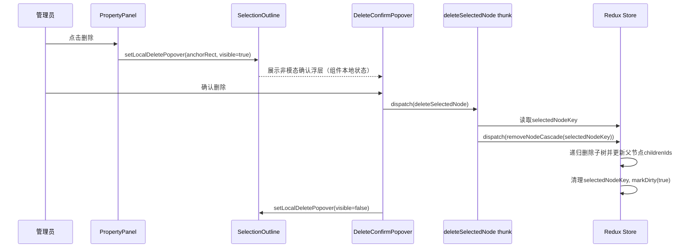

# 组件树与节点树设计

## 1. 设计目标（二维表）
| 目标 | 说明 |
|---|---|
| 统一建模 | 字段组件、容器组件、说明文本统一为节点模型 |
| 统一树结构 | 顶层与容器内部都使用同一套父子关系规则 |
| 降低复杂度 | 不再维护 `rootIds` 与容器双轨逻辑 |
| 可扩展 | 支持后续组件类型扩展、复杂嵌套与能力演进 |

## 2. 总体结论（二维表）
| 项 | 结论 | 说明 |
|---|---|---|
| 顶层根节点 | 引入固定 `page` 节点 | 作为所有顶层组件唯一父节点 |
| 顶层顺序 | 使用 `page.childrenIds` | 不再使用 `rootIds` |
| 容器结构 | 容器节点保留 `childrenIds` | 管理容器内子节点及顺序 |
| 父子关系 | 全树统一 `parentId + childrenIds` | 顶层与容器内部一套规则 |

## 3. 节点模型（二维表）
| 字段 | 类型 | 说明 |
|---|---|---|
| `id` | `string` | 节点唯一ID |
| `type` | `'page' \| 'container' \| 'field' \| 'text'` | 节点类型 |
| `parentId` | `string \| null` | 父节点ID，`page` 为 `null` |
| `childrenIds` | `string[]` | 子节点ID列表（有序） |
| `props` | `Record<string, any>` | 节点属性 |
| `layout` | `{ span?: number; order?: number }` | 布局属性 |

示例：
```ts
type NodeType = 'page' | 'container' | 'field' | 'text';

type Node = {
  id: string;
  type: NodeType;
  parentId: string | null;
  childrenIds: string[];
  props: Record<string, any>;
  layout: { span?: number; order?: number };
};
```

## 4. Store状态建议（二维表）
| 状态 | 类型 | 说明 |
|---|---|---|
| `nodesById` | `Record<NodeId, Node>` | 一维索引存储全部节点 |
| `PAGE_NODE_ID` | `const string` | 固定根节点常量（如 `page_root`） |
| `selectedNodeKey` | `NodeId \| null` | 当前选中节点 |
| `dirty` | `boolean` | 是否有未保存变更 |

## 5. Store拆分（二维表）
| Slice | 关键状态 | 职责 |
|---|---|---|
| `formSchemaSlice` | `nodesById` `selectedNodeKey` `dirty` | 节点树编辑、结构变更、发布保存相关状态（通过 `PAGE_NODE_ID` 访问根节点） |
| `editorHistorySlice` | `past` `future` `presentHash` | 历史快照管理与撤销重做 |

## 5.1 Node内部数据结构（二维表）
| 字段 | 类型 | 说明 |
|---|---|---|
| `id` | `string` | 前端节点唯一ID，作为编辑器内部稳定主键 |
| `serverId` | `string \\| null` | 服务端持久化后的节点ID，未保存前可为空 |
| `type` | `'page' \\| 'container' \\| 'field' \\| 'text'` | 节点类型 |
| `parentId` | `string \\| null` | 父节点ID，`page` 节点为 `null` |
| `childrenIds` | `string[]` | 子节点ID及顺序索引，不包含子节点实体数据 |
| `props` | `Record<string, any>` | 组件业务属性，如标题、占位、选项等 |
| `layout` | `{ span?: number; order?: number }` | 布局属性，如栅格宽度与排序 |

节点定义：
```ts
const PAGE_NODE_ID = 'page_root' as const;

type NodeType = 'page' | 'container' | 'field' | 'text';

type Node = {
  id: string;
  serverId: string | null;
  type: NodeType;
  parentId: string | null;
  childrenIds: string[];
  props: Record<string, any>;
  layout: { span?: number; order?: number };
};
```

## 5.2 Store索引结构（二维表）
| 结构 | 类型 | 说明 |
|---|---|---|
| `nodesById` | `Record<NodeId, Node>` | 节点索引表，唯一节点实体数据源 |
| `PAGE_NODE_ID` | `const string` | 固定根节点常量（如 `page_root`） |
| `nodesById[PAGE_NODE_ID].childrenIds` | `NodeId[]` | 顶层节点顺序来源 |
| `selectedNodeKey` | `NodeId \\| null` | 当前选中节点 |

## 5.3 节点约束（二维表）
| 约束 | 说明 |
|---|---|
| 唯一性 | `id` 全局唯一，字段与容器共享同一命名空间 |
| 双标识模型 | 前端使用 `id` 作为内部主键，服务端使用 `serverId` 作为持久化标识 |
| 单一数据源 | 节点实体数据仅存于 `nodesById`，不在节点内嵌套子节点对象 |
| 父子一致性 | 节点 `parentId` 与父节点 `childrenIds` 必须双向一致 |
| 关系索引 | `childrenIds` 只表达父子关系和顺序，不重复存储子节点实体 |
| 结构合法性 | 仅 `page/container` 可包含非空 `childrenIds`；`field/text` 子节点应为空 |
| 根节点保护 | `PAGE_NODE_ID` 不可删除、不可拖动 |

## 5.4 本地ID与服务端ID关系（二维表）
| 场景 | `id`（前端） | `serverId`（服务端） | 处理策略 |
|---|---|---|---|
| 新建未保存节点 | 本地生成，如 `tmp_xxx`/uuid | `null` | 先在编辑器内使用本地 `id` 参与拖拽、选中、排序 |
| 首次保存成功 | 保持不变 | 服务端返回真实ID | 仅回填 `serverId`，不替换 `id` |
| 已保存节点再次编辑 | 保持不变 | 已存在 | 继续用 `id` 作为 store 主键，`serverId` 用于接口交互 |
| 接口回填/对账 | 作为 `clientId` 使用 | 作为持久化ID使用 | 推荐接口同时返回 `clientId + serverId` 进行映射 |

## 6. 关键Reducer（二维表）
| Reducer | 输入 | 行为 |
|---|---|---|
| `addNode` | `nodeTemplate` `targetParentId?` `index?` | 新增节点并插入目标父节点 `childrenIds` |
| `selectNode` | `nodeId` | 设置当前选中节点 |
| `updateNodeProps` | `nodeId` `patch` | 合并节点属性并 `dirty=true` |
| `moveNode` | `nodeId` `targetParentId?` `index` | 节点跨层/同层移动并维护顺序 |
| `moveNodeToContainer` | `nodeId` `containerId` `index` | 节点移入容器 |
| `removeNodeCascade` | `nodeId` | 递归删除节点及其全部子节点 |
| `markDirty` | `boolean` | 设置脏状态 |
| `resetDraft` | `snapshot` | 回滚到草稿快照 |

## 7. Thunk设计（二维表）
| Thunk | 触发场景 | 关键动作 |
|---|---|---|
| `loadFormDraft` | 打开编辑器 | 拉取草稿并初始化节点树 |
| `saveDraft` | 点击保存 | 将节点树序列化后提交接口 |
| `publishForm` | 点击发布 | 发布前校验节点树完整性后提交 |
| `deleteSelectedNode` | 删除确认 | 读取 `selectedNodeKey` 并派发 `removeNodeCascade` |

## 8. 删除策略（二维表）
| 删除对象 | 策略 | 结果 |
|---|---|---|
| 字段/说明文本节点 | 直接删除 | 从父节点 `childrenIds` 移除并删索引 |
| 容器节点（空） | 删除容器节点 | 清理容器引用与选中态 |
| 容器节点（有子节点） | 级联删除 | 递归删除整个子树 |
| `page` 节点 | 禁止删除 | 返回错误并提示 |

## 9. 删除时序（同步更新）


## 10. 组件与节点树连接（二维表）
| 组件 | 读取Selector | 派发Action |
|---|---|---|
| `DesignCanvas` | `selectPageChildren` `selectNodeTree` `selectSelectedNodeKey` | `addNode` `moveNode` `selectNode` |
| `ContainerGroup` | `selectContainerChildren(containerId)` | `moveNodeToContainer` `removeNodeCascade` |
| `PropertyPanel` | `selectSelectedNode` `selectSelectedNodeType` | `updateNodeProps` |
| `DeleteConfirmPopover` | `selectSelectedNode` | `deleteSelectedNode` |

## 11. 去掉 `rootIds` 的原因（二维表）
| 对比项 | 使用 `rootIds` | 使用 `page.childrenIds` |
|---|---|---|
| 顶层顺序 | 由 `rootIds` 维护 | 由 `page` 节点统一维护 |
| 父子规则 | 顶层与容器两套逻辑 | 全树统一一套逻辑 |
| reducer复杂度 | 需分支处理顶层与容器 | 统一“对父节点 childrenIds 操作” |
| 可维护性 | 中等 | 更高 |

## 12. 顶层约束（二维表）
| 约束 | 说明 |
|---|---|
| `page` 节点不可删除 | 防止树结构失根 |
| `page` 节点不可拖动 | 保持模型稳定 |
| 顶层组件操作 | 本质是对 `page.childrenIds` 的增删改排 |

## 13. 迁移建议（从 `rootIds` 到 `page`）（二维表）
| 步骤 | 动作 | 产出 |
|---|---|---|
| Step 1 | 创建固定 `page_root` 节点 | 根节点初始化 |
| Step 2 | 将旧 `rootIds` 赋值给 `page_root.childrenIds` | 顶层顺序迁移 |
| Step 3 | 顶层节点 `parentId` 统一设为 `page_root` | 父子关系归一 |
| Step 4 | 定义 `PAGE_NODE_ID='page_root'` 常量并替代 `pageNodeId` 状态字段 | 根节点访问统一 |
| Step 5 | 删除旧 `rootIds` 字段与分支逻辑 | reducer简化 |
| Step 6 | 补齐回归测试（新增/移动/删除） | 行为一致性保障 |
