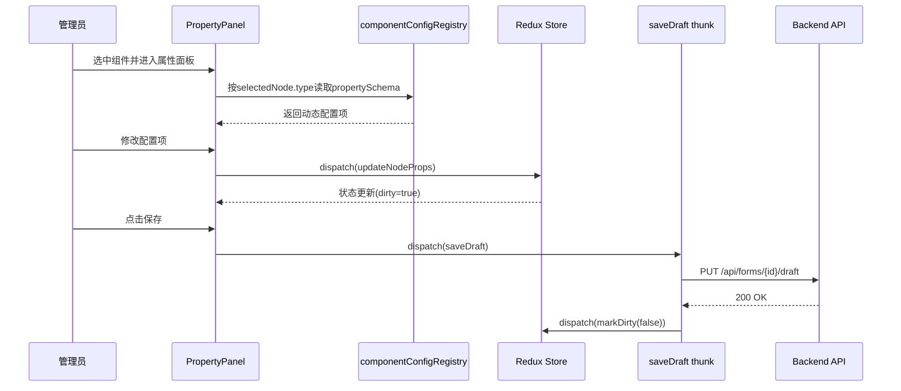
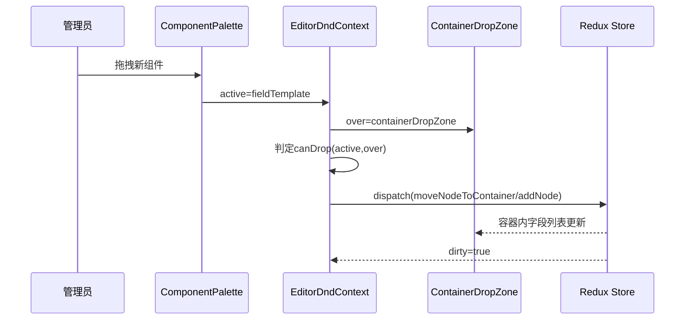
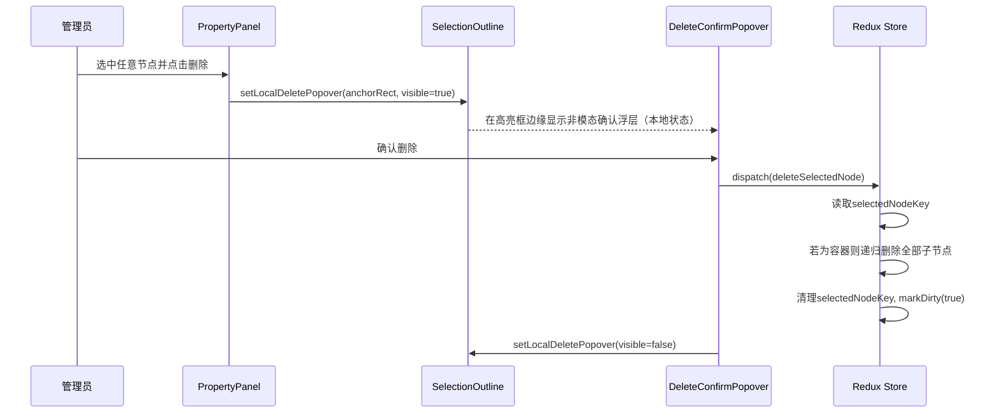

# 表单编辑器前端设计

## 元信息
| 字段 | 内容 |
|---|---|
| 状态 | 已定稿 |
| 负责人 | 待补充 |
| 创建日期 | 待补充 |
| 最后更新 | 2026-03-19 |
| 适用范围 | 01-单表单编辑器前端 |
| 输入文档 | `docs/需求/01-单表单编辑器/阶段需求.md`、`docs/设计/技术调研与选型.md` |

## 1. 目标与边界（二维表）
| 维度 | 说明 |
|---|---|
| 目标 | 支撑单表单编辑器的组件拖拽、容器分组、属性配置、版本发布 |
| 技术栈 | React + TypeScript + Ant Design + dnd-kit + Redux Toolkit |
| 状态管理原则 | 业务状态集中在Redux，UI瞬时状态与编辑器交互状态分层管理 |
| 边界 | 不包含填报、查询、导出、审批、报表、打印 |

## 2. 编辑器组件拆分（二维表）
| 模块 | 核心组件 | 职责 | 数据来源 |
|---|---|---|---|
| 编辑器主工作区 | EditorShell、TopToolbar、ComponentPalette、DesignCanvas、PropertyPanel | 组件拖拽、画布编排、属性编辑、保存发布 | `formSchemaSlice` + `editorHistorySlice` |
| 容器分组能力 | ContainerGroup、ContainerDropZone、ContainerFields | 容器内字段管理与排序 | `formSchemaSlice` |
| 选择与删除 | SelectionOutline、DeleteConfirmPopover | 当前选中高亮与非模态删除确认 | `formSchemaSlice`（弹层状态本地维护） |

## 3. 组件树（表单编辑器）
```text
FormEditorModule（表单编辑器模块：覆盖编辑态与预览态）
├── FormEditorPage（表单编辑页：承载编辑态主工作区）
│   └── EditorShell（编辑器骨架：组织工具栏/组件区/画布/属性区布局）
│       ├── EditorDndContext（拖拽上下文：统一管理active/over与碰撞检测）
│       ├── TopToolbar（顶部工具栏：保存、预览、发布、版本展示）
│       │   ├── SaveDraftButton（保存草稿按钮：触发草稿保存）
│       │   ├── PreviewButton（预览按钮：切换到预览态）
│       │   ├── PublishButton（发布按钮：触发发布前校验与发布）
│       │   └── VersionBadge（版本标识：展示当前草稿/发布版本号）
│       ├── ComponentPalette（组件面板：展示可拖拽组件）
│       │   ├── BasicFieldGroup（基础字段组：文本/数字/日期组件入口）
│       │   ├── OptionFieldGroup（选项字段组：单选/多选/下拉组件入口）
│       │   ├── UploadFieldItem（附件组件项：上传控件拖拽入口）
│       │   └── ContainerGroupItem（分组容器组件项：创建可嵌套字段容器）
│       ├── FormEditorRenderer（编辑态渲染器：递归渲染节点树并挂载编辑包装器）
│       │   ├── PageRootNode（页面根节点：顶层节点统一挂载点，承载childrenIds顺序）
│       │   ├── CanvasDropZone（画布投放区：接收拖拽新增节点）
│       │   ├── EditorNodeWrapper（普通节点编辑包装器：高亮、拖拽、删除入口）
│       │   ├── ContainerEditorWrapper（容器编辑包装器：投放区、空态、容器操作）
│       │   │   ├── ContainerHeader（容器头部：分组标题、折叠、排序操作）
│       │   │   ├── ContainerDropZone（容器投放区：接收新组件或已有字段）
│       │   │   └── ContainerFields（容器字段区：容器内节点增删改排）
│       │   ├── RuntimeNodeRenderer（运行态内核渲染器：渲染真实组件内容）
│       │   └── SelectionOutline（选中高亮框：标记当前编辑节点）
│       │       └── DeleteConfirmPopover（删除确认浮层：锚定高亮框边缘的非模态确认）
│       ├── PropertyPanel（属性面板：编辑节点配置）
│       │   ├── PropertySchemaResolver（配置解析器：按选中组件类型读取配置注册表）
│       │   ├── PropertyGroupRenderer（分组渲染器：基础/校验/布局/高级分组输出）
│       │   ├── PropertyControlFactory（控件工厂：按control类型渲染Input/Switch/Select）
│       │   └── ValueAdapter（值适配器：处理UI值与schema值映射）
│       └── PublishConfirmModal（发布确认弹窗：二次确认与风险提示）
└── FormPreviewPage（表单预览页：承载预览态页面）
    └── FormPreviewRenderer（预览态渲染器：递归渲染节点树，不包含编辑增强）
        ├── PageRootNode（页面根节点：顶层节点统一挂载点，承载childrenIds顺序）
        └── RuntimeNodeRenderer（运行态内核渲染器：渲染真实组件内容）
```

## 3.1 编辑态与运行态分层（二维表）
| 层次 | 作用 | 说明 |
|---|---|---|
| `RuntimeNodeRenderer` | 运行态内核渲染器 | 只负责按节点类型渲染真实业务组件 |
| `EditorNodeWrapper` | 编辑态普通节点包装器 | 增加选中、高亮、拖拽手柄、删除入口 |
| `ContainerEditorWrapper` | 编辑态容器包装器 | 增加投放区、空态提示、容器操作栏 |
| `FormEditorRenderer` | 编辑页渲染器 | 使用编辑态包装器递归渲染节点树 |
| `FormPreviewRenderer` | 预览页渲染器 | 使用运行态渲染器递归渲染节点树，不挂编辑能力 |

约束：
`表单编辑器前端设计` 中的组件默认指编辑态组件；运行态组件设计单独见 [编辑态运行态组件设计.md](./前端设计/编辑态运行态组件设计.md)。

## 4. Redux Store拆分（编辑器范围）（二维表）
| Slice | 状态职责 | 关键字段 | 主要Reducer | 异步Thunk |
|---|---|---|---|---|
| `formSchemaSlice` | 表单schema编辑与版本状态（统一节点树） | `formId` `nodesById` `selectedNodeKey` `dirty` | `addNode` `moveNode` `moveNodeToContainer` `updateNodeProps` `removeNodeCascade` `selectNode` `markDirty` `resetDraft` | `loadFormDraft` `saveDraft` `publishForm` `loadPublishedSchema` `deleteSelectedNode` |
| `editorHistorySlice` | 编辑器历史回放状态 | `past` `future` `presentHash` | `pushSnapshot` `undo` `redo` `clearHistory` | - |

## 4.1 Node内部数据结构（二维表）
| 字段 | 类型 | 说明 |
|---|---|---|
| `id` | `string` | 前端节点唯一ID，作为编辑器内部稳定主键 |
| `serverId` | `string \\| null` | 服务端持久化后的节点ID，未保存前可为空 |
| `type` | `'page' \\| 'container' \\| 'field' \\| 'text'` | 节点类型 |
| `parentId` | `string \\| null` | 父节点ID，`page` 节点为 `null` |
| `childrenIds` | `string[]` | 子节点ID及顺序索引，不包含子节点实体数据 |
| `props` | `Record<string, any>` | 组件业务属性，如标题、占位、选项等 |
| `layout` | `{ span?: number; order?: number }` | 布局属性，如栅格宽度与排序 |

节点定义：
```ts
const PAGE_NODE_ID = 'page_root' as const;

type NodeType = 'page' | 'container' | 'field' | 'text';

type Node = {
  id: string;
  serverId: string | null;
  type: NodeType;
  parentId: string | null;
  childrenIds: string[];
  props: Record<string, any>;
  layout: {
    span?: number;
    order?: number;
  };
};
```

## 4.2 Store索引结构（二维表）
| 结构 | 类型 | 说明 |
|---|---|---|
| `nodesById` | `Record<NodeId, Node>` | 节点索引表，唯一节点实体数据源 |
| `PAGE_NODE_ID` | `const string` | 固定根节点常量（如 `page_root`） |
| `nodesById[PAGE_NODE_ID].childrenIds` | `NodeId[]` | 顶层节点顺序来源 |
| `selectedNodeKey` | `NodeId \\| null` | 当前选中节点 |

## 4.3 节点约束（二维表）
| 约束 | 说明 |
|---|---|
| 唯一性 | `id` 全局唯一，字段与容器共享同一命名空间 |
| 双标识模型 | 前端使用 `id` 作为内部主键，服务端使用 `serverId` 作为持久化标识 |
| 单一数据源 | 节点实体数据仅存于 `nodesById`，不在节点内嵌套子节点对象 |
| 父子一致性 | 节点 `parentId` 与父节点 `childrenIds` 必须双向一致 |
| 关系索引 | `childrenIds` 只表达父子关系和顺序，不重复存储子节点实体 |
| 结构合法性 | 仅 `page/container` 可包含非空 `childrenIds`；`field/text` 子节点应为空 |
| 根节点保护 | `PAGE_NODE_ID` 不可删除、不可拖动 |

## 4.4 本地ID与服务端ID关系（二维表）
| 场景 | `id`（前端） | `serverId`（服务端） | 处理策略 |
|---|---|---|---|
| 新建未保存节点 | 本地生成，如 `tmp_xxx`/uuid | `null` | 先在编辑器内使用本地 `id` 参与拖拽、选中、排序 |
| 首次保存成功 | 保持不变 | 服务端返回真实ID | 仅回填 `serverId`，不替换 `id` |
| 已保存节点再次编辑 | 保持不变 | 已存在 | 继续用 `id` 作为 store 主键，`serverId` 用于接口交互 |
| 接口回填/对账 | 作为 `clientId` 使用 | 作为持久化ID使用 | 推荐接口同时返回 `clientId + serverId` 进行映射 |

## 5. 属性配置解藕设计（二维表）
| 项 | 设计 | 说明 |
|---|---|---|
| 配置注册中心 | `componentConfigRegistry` | 维护组件类型到配置schema映射 |
| 配置项定义 | `PropertySchemaItem` | 包含 `key/label/control/group/visibleWhen/normalize` |
| 面板输入 | `selectedNode.type` | 用于查找节点类型对应配置项（字段/容器/说明文本等） |
| 面板输出 | `patch` | 统一通过 `updateNodeProps` 写回 |
| 共享复用 | `sharedPropertySchemas` | 通用配置片段统一维护 |

## 6. 组件与Store连接（二维表）
| 组件 | 读取Selector | 派发Action/Thunk | 说明 |
|---|---|---|---|
| `DesignCanvas` | `selectPageChildren` `selectSelectedNodeKey` `selectNodeTree` | `moveNode` `selectNode` `addNode` `moveNodeToContainer` | 画布拖拽与选中交互核心（含新组件投放） |
| `ContainerGroup` | `selectContainerNode` `selectContainerChildren` `selectSelectedNode` | `addNode` `updateNodeProps` `moveNodeToContainer` `removeNodeCascade` | 容器节点及子节点管理 |
| `PropertyPanel` | `selectSelectedNode` `selectSelectedNodeType` | `updateNodeProps` | 动态读取注册表并渲染配置项，删除弹层状态本地管理 |
| `DeleteConfirmPopover` | `selectSelectedNode` | `deleteSelectedNode` | 锚定SelectionOutline的非模态删除确认（显示开关与锚点为本地状态） |
| `TopToolbar` | `selectDirty` `selectCanPublish` | `saveDraft` `publishForm` | 保存/发布与状态反馈 |

## 7. 关键交互关系（编辑器）
### 7.1 节点属性修改并保存


### 7.2 从组件面板拖拽新组件到容器


### 7.3 选中组件后删除（非模态确认浮层）


## 8. 删除确认规则（二维表）
| 删除对象 | 确认文案 | 删除后处理 |
|---|---|---|
| 字段组件节点 | 确认删除该组件？删除后不可恢复 | 删除当前节点，清理选中态，记录历史栈 |
| 容器节点（空） | 确认删除该容器？ | 删除容器节点，清理选中态，记录历史栈 |
| 容器节点（含子节点） | 该容器下包含子组件，确认级联删除？ | 递归删除该容器及其全部子节点，记录历史栈 |

## 8.1 节点树数据模型（二维表）
| 字段 | 类型 | 说明 |
|---|---|---|
| `nodesById` | `Record<NodeId, Node>` | 一维索引存储全部节点（字段/容器/说明文本） |
| `PAGE_NODE_ID` | `const string` | 固定页面根节点常量（如 `page_root`） |
| `nodesById[PAGE_NODE_ID].childrenIds` | `NodeId[]` | 顶层节点顺序 |
| `node.childrenIds` | `NodeId[]` | 子节点顺序，字段节点通常为空 |
| `selectedNodeKey` | `NodeId \\| null` | 当前选中节点 |

示例：
```ts
const PAGE_NODE_ID = 'page_root' as const;

type Node = {
  id: string;
  type: 'page' | 'field' | 'container' | 'text';
  props: Record<string, any>;
  layout: { span?: number; order?: number };
  parentId: string | null;
  childrenIds: string[];
};
```

## 9. 目录与代码组织建议（二维表）
| 路径 | 内容 |
|---|---|
| `front/src/pages/editor` | 编辑器页面与容器组件 |
| `front/src/components/editor/property-panel` | 配置解析器与动态属性渲染 |
| `front/src/components/editor/canvas` | 画布、容器、选中高亮与删除浮层 |
| `front/src/store/slices/formSchemaSlice.ts` | 表单schema状态 |
| `front/src/store/slices/editorHistorySlice.ts` | 编辑器历史快照（undo/redo） |
| `front/src/store/selectors/editorSelectors.ts` | 编辑器selector与派生状态 |
| `front/src/types/schema` | schema与配置项类型定义 |
