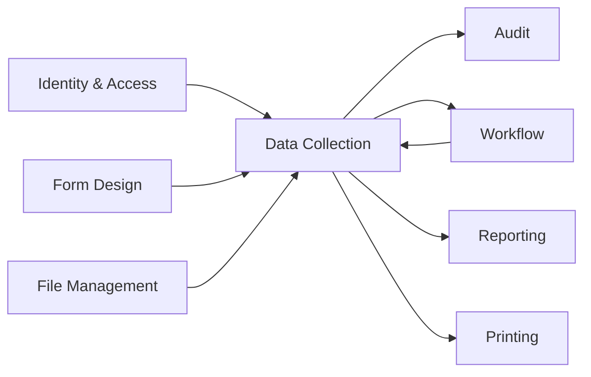
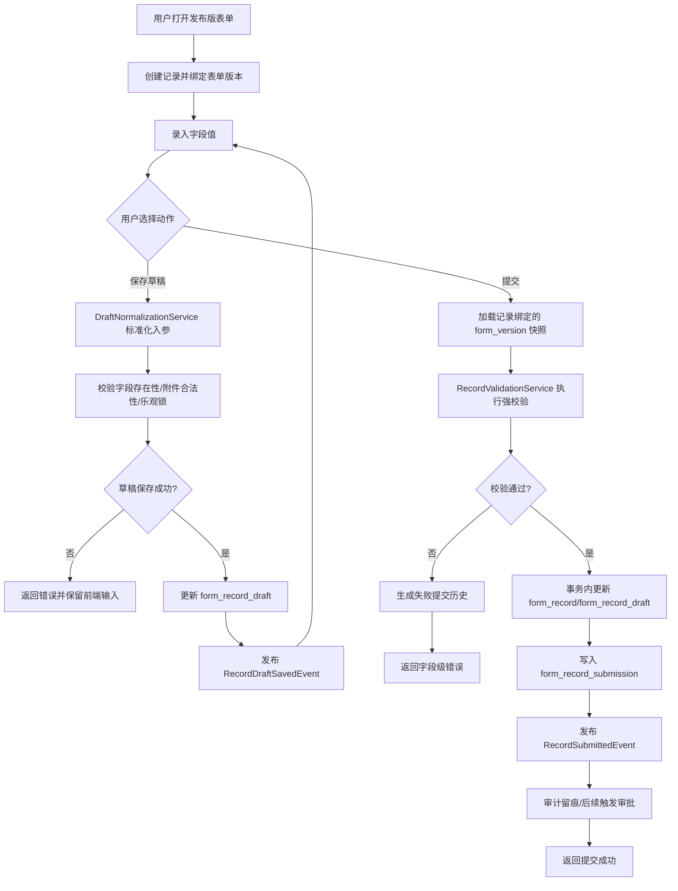
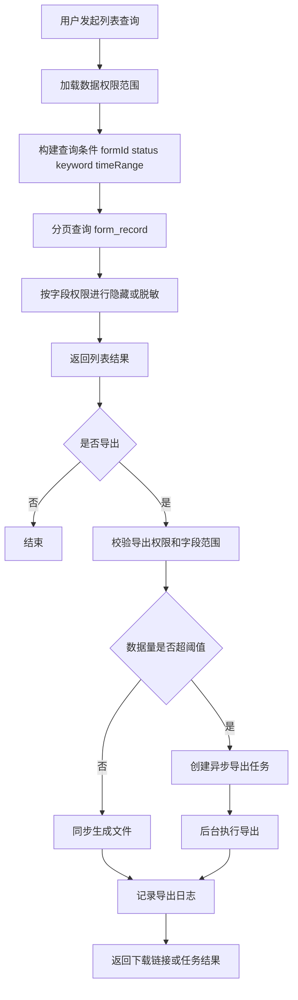

# 单表单填报后端技术设计

## 1. 文档目标

基于以下需求与设计文档，对“单表单填报”进行后端技术设计，目标是在 MVP 阶段落地“发布表单 -> 新建填报 -> 暂存草稿 -> 提交 -> 查询 -> 导出 -> 审计”的业务闭环，并兼容后续审批、报表、打印扩展。

- `docs/需求/02-单表单填报/需求拆分.md`
- `docs/需求/01-单表单编辑器/表单编辑器需求拆解.md`
- `docs/需求/03-多表单扩展/需求拆分.md`
- `docs/需求/04-基础审批/需求拆分.md`
- `docs/需求/05-基础报表/需求拆分.md`
- `docs/需求/06-基础打印/需求拆分.md`
- `docs/设计/后端架构.md`
- `docs/设计/01-单表单编辑器/后端方案设计/表单结构持久化方案.md`

## 2. 设计范围与约束

| 维度 | 设计结论 | 说明 |
|---|---|---|
| 业务范围 | 单主表记录填报 | 不支持子表、明细表、跨表联动 |
| 表单来源 | 仅允许基于已发布表单版本填报 | 草稿表单不可直接用于生产填报 |
| 数据状态 | 支持草稿、已提交 | 为后续审批预留 `IN_APPROVAL/APPROVED/REJECTED` 等扩展状态 |
| 校验策略 | 草稿弱校验、提交强校验 | 草稿允许不完整，提交必须通过字段规则 |
| 一致性策略 | 聚合内本地事务强一致 | 聚合间通过应用服务编排和领域事件协作 |
| 事实源 | 表单运行时以 `form_version` 快照为准 | 避免编辑器草稿影响已发布填报 |
| 扩展预留 | 版本绑定、字段索引、审计日志、导出任务 | 兼容后续审批、报表、打印能力 |

## 3. 限界上下文与职责分工

### 3.1 上下文划分

| 限界上下文 | 领域类型 | 核心职责 | 单表单填报中的角色 |
|---|---|---|---|
| Form Design | 核心域 | 管理表单草稿、发布版本、字段结构快照 | 提供可填报的发布版表单 |
| Data Collection | 核心域 | 记录创建、草稿保存、提交、查询、导出 | 本文重点设计对象 |
| Identity & Access | 通用子域 | 用户、角色、组织、权限、数据范围 | 鉴权与数据权限控制 |
| File Management | 通用子域 | 附件元数据、上传引用、访问控制 | 附件字段校验与归档 |
| Audit | 通用子域 | 操作日志、审计留痕 | 记录填报、提交、导出行为 |
| Workflow | 核心域（后续） | 审批实例与状态推进 | 消费提交事件并回写状态 |
| Reporting | 支撑子域（后续） | 报表统计与筛选分析 | 消费提交后的事实数据 |
| Printing | 支撑子域（后续） | 打印模板与 PDF 输出 | 消费已审批记录 |

### 3.2 上下文协作



| 上游/下游 | 协作方式 | 数据契约 |
|---|---|---|
| Data Collection <- Form Design | ACL + 查询接口 | `PublishedFormSnapshot`、`FieldSchemaSnapshot` |
| Data Collection <- Identity & Access | ACL + 权限接口 | `UserContext`、`DataPermissionScope` |
| Data Collection <- File Management | 应用服务调用 | `FileMetadata`、`FileRef` |
| Data Collection -> Audit | 领域事件 | `RecordDraftSavedEvent`、`RecordSubmittedEvent`、`RecordExportedEvent` |
| Data Collection -> Workflow | 领域事件 | `RecordSubmittedEvent` |
| Workflow -> Data Collection | 应用服务回调/事件 | `RecordApprovalStatusChangedEvent` |

## 4. DDD 领域设计

### 4.1 聚合总览

| 聚合 | 聚合根 | 主要实体/值对象 | 核心职责 | 一致性边界 |
|---|---|---|---|---|
| 填报记录聚合 | `FormRecord` | `RecordDraftSnapshot`、`RecordFieldValue`、`RecordStatus`、`FormVersionBinding`、`SubmitInfo` | 管理一条填报记录从新建、暂存到提交的完整生命周期 | 单条记录内状态与数据强一致 |
| 提交历史聚合 | `RecordSubmission` | `SubmissionPayloadSnapshot`、`ValidationIssue`、`SubmissionResult` | 固化每次提交动作、校验结果和版本快照摘要 | 单次提交事实不可变 |
| 导出任务聚合 | `RecordExportTask` | `ExportFilter`、`ExportColumn`、`ExportStatus`、`ExportFileRef` | 管理导出申请、执行状态、结果文件 | 单个导出任务内强一致 |

说明：

- MVP 写模型重点为 `FormRecord`。
- `RecordSubmission` 用于审计、流程追踪、问题定位，不承载记录当前状态。
- 导出能力按需求为 P1，但表结构与接口在本次设计中一并定义，避免后续返工。

### 4.2 聚合一：填报记录聚合 `FormRecord`

#### 4.2.1 聚合结构

| 对象 | 类型 | 职责 |
|---|---|---|
| `FormRecord` | 聚合根 | 维护记录身份、绑定表单版本、当前状态、草稿数据、提交数据和并发版本 |
| `RecordDraftSnapshot` | 实体 | 保存当前编辑中的字段值快照、草稿更新时间、草稿修改人 |
| `RecordFieldValue` | 值对象 | 表达单字段提交值，包含 `fieldKey`、标准化值、显示值、附件引用 |
| `FormVersionBinding` | 值对象 | 固化 `formId`、`formVersionId`、`versionNo`，确保记录与发布版表单绑定 |
| `RecordStatus` | 值对象/枚举 | 描述记录当前状态，如 `DRAFT`、`SUBMITTED` |
| `SubmitInfo` | 值对象 | 保存最后一次提交人、提交时间、提交批次号 |

#### 4.2.2 聚合职责

| 职责 | 说明 | 约束 |
|---|---|---|
| 创建记录 | 基于已发布表单版本创建空白记录 | 表单必须处于可填报状态 |
| 保存草稿 | 接收用户输入并保存弱校验后的字段值 | 只校验结构、字段存在性、附件引用合法性 |
| 加载续填 | 返回当前草稿或已提交记录详情 | 受数据权限与字段权限控制 |
| 提交记录 | 执行强校验并切换状态 | 提交成功后草稿与提交快照同步 |
| 重复提交保护 | 防止同一记录被并发重复提交 | 依赖乐观锁与状态机校验 |
| 审批状态回写 | 后续审批域回写 `IN_APPROVAL/APPROVED/REJECTED` | 仅允许合法状态转换 |

#### 4.2.3 聚合不变式

| 编号 | 不变式 | 说明 |
|---|---|---|
| INV-01 | 记录必须绑定一个且仅一个发布版表单版本 | 禁止基于草稿表单填报 |
| INV-02 | 记录所属租户、表单、版本在生命周期内不可变 | 保证统计与审计一致性 |
| INV-03 | `SUBMITTED` 记录不能直接回到空白新建态 | 仅允许后续审批流转或驳回后再编辑 |
| INV-04 | 草稿保存不改变记录绑定的表单版本 | 表单新版本发布不影响已存在记录 |
| INV-05 | 提交时字段值集合必须通过发布版 schema 校验 | 包括必填、格式、范围、枚举、附件限制 |
| INV-06 | 记录的最后一次成功提交必须存在对应 `RecordSubmission` 事实 | 审计与流程必须可追溯 |

### 4.3 聚合二：提交历史聚合 `RecordSubmission`

#### 4.3.1 聚合结构

| 对象 | 类型 | 职责 |
|---|---|---|
| `RecordSubmission` | 聚合根 | 固化一次提交事实及结果 |
| `SubmissionPayloadSnapshot` | 值对象 | 保存本次提交的字段值快照摘要 |
| `ValidationIssue` | 值对象 | 记录字段级校验失败信息 |
| `SubmissionResult` | 值对象 | 描述提交成功、失败、失败原因与耗时 |

#### 4.3.2 聚合职责

| 职责 | 说明 |
|---|---|
| 记录提交请求 | 保存谁在什么时间发起了提交 |
| 记录校验结果 | 保存字段级错误，便于审计与问题复现 |
| 记录提交结果 | 保存成功/失败状态和最终写入结果 |
| 提供追溯依据 | 为审批、报表、运维定位提供事实链路 |

### 4.4 聚合三：导出任务聚合 `RecordExportTask`

| 对象 | 类型 | 职责 |
|---|---|---|
| `RecordExportTask` | 聚合根 | 管理导出任务状态、文件结果和失败原因 |
| `ExportFilter` | 值对象 | 固化导出时使用的筛选条件 |
| `ExportColumn` | 值对象 | 固化导出字段清单和列顺序 |
| `ExportFileRef` | 值对象 | 指向生成后的导出文件 |

| 设计说明 | 结论 |
|---|---|
| 小数据量 | 可同步导出并直接返回下载链接 |
| 大数据量 | 转异步任务，状态流转 `PENDING -> PROCESSING -> SUCCEEDED/FAILED` |
| 权限策略 | 导出字段与查询权限、字段权限一致 |

### 4.5 实体与值对象职责明细

| 对象 | 分类 | 核心属性 | 职责边界 |
|---|---|---|---|
| `FormRecord` | 聚合根 | `recordId`、`tenantId`、`formVersionBinding`、`status`、`draftSnapshot`、`submittedDataJson` | 生命周期管理、状态迁移、协调校验 |
| `RecordDraftSnapshot` | 实体 | `draftDataJson`、`updatedBy`、`updatedAt` | 承载草稿编辑态数据 |
| `RecordFieldValue` | 值对象 | `fieldKey`、`valueType`、`rawValue`、`displayValue` | 统一标准化字段值表示 |
| `SubmitInfo` | 值对象 | `submittedBy`、`submittedAt`、`submissionNo` | 标记成功提交事实 |
| `ValidationIssue` | 值对象 | `fieldKey`、`errorCode`、`message` | 字段级错误描述 |
| `ExportFilter` | 值对象 | `keyword`、`statusSet`、`timeRange` | 固化导出边界，保证可审计 |

## 5. 领域服务、仓储与接口设计

### 5.1 领域服务

| 服务 | 类型 | 核心职责 | 输入 | 输出 |
|---|---|---|---|---|
| `RecordValidationService` | 领域服务 | 按发布版字段 schema 执行提交强校验 | 表单快照、字段值集合 | `ValidationResult` |
| `DraftNormalizationService` | 领域服务 | 将前端入参标准化为领域字段值 | 表单快照、草稿 DTO | `RecordFieldValue[]` |
| `RecordPermissionService` | 领域服务/ACL | 判断用户是否可新建、查看、编辑、提交、导出 | 用户上下文、记录、权限范围 | 布尔结果/字段权限 |
| `RecordExportService` | 领域服务 | 构建导出列与导出数据集 | 导出任务、查询结果 | 导出文件引用 |
| `RecordUniquenessPolicy` | 领域策略 | 为第二阶段唯一性校验预留策略点 | 表单快照、字段值 | 通过/失败 |

### 5.2 仓储接口

| 仓储接口 | 聚合 | 核心方法 |
|---|---|---|
| `FormRecordRepository` | `FormRecord` | `save`、`findById`、`findByIdForUpdate`、`findByFormAndCreator`、`pageQuery` |
| `RecordSubmissionRepository` | `RecordSubmission` | `save`、`findLatestByRecordId`、`listByRecordId` |
| `RecordExportTaskRepository` | `RecordExportTask` | `save`、`findById`、`pagePendingTasks` |

### 5.3 外部防腐层接口

| ACL 接口 | 上游系统 | 职责 |
|---|---|---|
| `PublishedFormQueryFacade` | Form Design | 查询发布版表单、字段 schema、版本状态 |
| `UserPermissionFacade` | Identity & Access | 查询角色、数据范围、字段权限、导出权限 |
| `FileQueryFacade` | File Management | 校验附件引用、文件类型、大小、归属关系 |
| `AuditLogPort` | Audit | 发布审计日志事件 |

### 5.4 应用服务接口

| 应用服务 | 方法 | 说明 |
|---|---|---|
| `RecordCommandApplicationService` | `createRecord` | 新建记录并返回初始化草稿 |
| `RecordCommandApplicationService` | `saveDraft` | 保存草稿 |
| `RecordCommandApplicationService` | `submitRecord` | 提交记录 |
| `RecordCommandApplicationService` | `resubmitRecord` | 驳回后重新提交，MVP 可先预留 |
| `RecordQueryApplicationService` | `getRecordDetail` | 查询详情 |
| `RecordQueryApplicationService` | `pageRecords` | 查询列表 |
| `RecordExportApplicationService` | `createExportTask` | 创建导出任务 |
| `RecordExportApplicationService` | `executeExportTask` | 执行导出任务 |

## 6. 业务规则明细

### 6.1 核心业务规则表

| 规则编号 | 业务场景 | 规则内容 | 触发时机 | 处理方式 | 关联上下文 |
|---|---|---|---|---|---|
| BR-01 | 新建填报 | 只能基于已发布且启用的表单版本创建记录 | 创建记录 | 阻断创建并提示“表单未发布或已停用” | Form Design |
| BR-02 | 新建填报 | 新建记录时必须绑定 `formId + formVersionId + versionNo` | 创建记录 | 系统自动绑定，不允许前端篡改 | Data Collection |
| BR-03 | 草稿保存 | 草稿允许字段不完整 | 保存草稿 | 仅保存当前输入，不校验必填完整性 | Data Collection |
| BR-04 | 草稿保存 | 草稿必须通过结构校验，字段 key 必须存在于表单版本中 | 保存草稿 | 非法字段直接拒绝保存 | Form Design / Data Collection |
| BR-05 | 草稿保存 | 附件字段保存时，附件引用必须存在且归属于当前用户可见范围 | 保存草稿 | 拒绝非法附件引用 | File Management |
| BR-06 | 草稿续填 | 同一记录草稿可被原创建人持续编辑 | 打开详情、保存草稿 | 按记录权限控制 | Identity & Access |
| BR-07 | 草稿续填 | 已提交记录默认不可继续编辑 | 打开详情、保存草稿 | 返回只读视图；后续驳回后可再编辑 | Data Collection |
| BR-08 | 提交校验 | 提交前必须拉取记录绑定的发布版字段 schema 作为唯一校验依据 | 提交记录 | 使用 `form_version` 快照强校验 | Form Design |
| BR-09 | 提交校验 | 必填字段不能为空 | 提交记录 | 返回字段级错误 | Data Collection |
| BR-10 | 提交校验 | 文本字段必须满足长度、正则格式约束 | 提交记录 | 返回字段级错误 | Data Collection |
| BR-11 | 提交校验 | 数字字段必须满足最小值、最大值、小数位约束 | 提交记录 | 返回字段级错误 | Data Collection |
| BR-12 | 提交校验 | 日期字段必须满足日期格式和可选范围约束 | 提交记录 | 返回字段级错误 | Data Collection |
| BR-13 | 提交校验 | 单选、多选、下拉值必须命中已发布选项集 | 提交记录 | 返回字段级错误 | Form Design |
| BR-14 | 提交校验 | 多选值数量不得超过配置上限 | 提交记录 | 返回字段级错误 | Data Collection |
| BR-15 | 提交校验 | 附件必须满足类型、大小、数量限制 | 提交记录 | 返回字段级错误 | File Management |
| BR-16 | 提交处理 | 提交成功后，记录状态从 `DRAFT` 变更为 `SUBMITTED` | 提交成功 | 原子更新状态与提交信息 | Data Collection |
| BR-17 | 提交处理 | 提交成功后必须落一条提交历史 | 提交成功 | 同事务保存 `RecordSubmission` | Audit / Workflow |
| BR-18 | 提交处理 | 提交失败不改变原草稿数据与原状态 | 提交失败 | 回滚事务，返回错误明细 | Data Collection |
| BR-19 | 版本隔离 | 记录一旦创建，其绑定表单版本不随新版本发布而变化 | 保存草稿、提交、查询 | 始终使用绑定版本解释数据 | Form Design |
| BR-20 | 查询列表 | 列表查询只能返回当前用户权限范围内的记录 | 查询列表 | 数据权限过滤 | Identity & Access |
| BR-21 | 查询详情 | 字段级无权限时，应隐藏或脱敏该字段值 | 查询详情 | 按字段权限处理返回值 | Identity & Access |
| BR-22 | 导出数据 | 导出字段范围必须小于等于当前用户字段可见范围 | 创建导出任务 | 拒绝越权导出 | Identity & Access |
| BR-23 | 导出数据 | 大批量导出采用异步任务处理 | 创建导出任务 | 返回任务 ID，后台生成文件 | Data Collection |
| BR-24 | 审计留痕 | 草稿保存、提交、导出必须记录操作日志 | 对应动作完成后 | 发布审计事件 | Audit |
| BR-25 | 并发控制 | 提交和草稿保存必须基于乐观锁版本号 | 保存草稿、提交 | 版本冲突时提示刷新重试 | Data Collection |
| BR-26 | 审批预留 | 未来接入审批后，`SUBMITTED` 可进入 `IN_APPROVAL` | 审批启用后 | 由工作流回写状态 | Workflow |
| BR-27 | 报表预留 | 报表统计以成功提交记录为事实数据 | 报表同步 | 仅消费已提交/已审批状态 | Reporting |
| BR-28 | 打印预留 | 打印只允许消费满足业务状态要求的记录 | 打印执行 | 结合审批状态限制输出 | Printing |

### 6.2 状态流转规则表

| 当前状态 | 触发动作 | 下一状态 | 是否 MVP 生效 | 说明 |
|---|---|---|---|---|
| `INIT` | 创建记录 | `DRAFT` | 是 | 新建即进入草稿态 |
| `DRAFT` | 保存草稿 | `DRAFT` | 是 | 保持草稿态 |
| `DRAFT` | 提交 | `SUBMITTED` | 是 | MVP 最终提交态 |
| `SUBMITTED` | 审批启用后流转 | `IN_APPROVAL` | 否 | 第三阶段生效 |
| `IN_APPROVAL` | 审批通过 | `APPROVED` | 否 | 第三阶段生效 |
| `IN_APPROVAL` | 驳回 | `REJECTED` | 否 | 第三阶段生效 |
| `REJECTED` | 保存草稿 | `DRAFT` | 否 | 第三阶段生效 |
| `REJECTED` | 重新提交 | `IN_APPROVAL` | 否 | 第三阶段生效 |
| `IN_APPROVAL` | 撤回 | `WITHDRAWN` | 否 | 第三阶段生效 |

### 6.3 校验规则执行策略表

| 校验类型 | 草稿保存 | 提交 | 错误返回形式 | 说明 |
|---|---|---|---|---|
| 表单版本可用性 | 必须校验 | 必须校验 | 全局错误 | 表单停用后不可新建，已存在记录仍可查看 |
| 字段存在性 | 必须校验 | 必须校验 | 字段级错误 | 防篡改 |
| 必填校验 | 不校验 | 必须校验 | 字段级错误 | 草稿允许空值 |
| 文本长度/格式 | 可选弱校验 | 必须校验 | 字段级错误 | 草稿阶段可只做基础清洗 |
| 数字范围/精度 | 可选弱校验 | 必须校验 | 字段级错误 | 提交必须严格匹配 |
| 日期范围 | 可选弱校验 | 必须校验 | 字段级错误 | 以发布版配置为准 |
| 枚举值合法性 | 必须校验 | 必须校验 | 字段级错误 | 防止选项集外值 |
| 附件类型/大小/数量 | 必须校验 | 必须校验 | 字段级错误 | 避免非法文件落库 |
| 唯一性校验 | 预留 | 预留 | 字段级错误 | 第二阶段启用 |

## 7. 数据模型设计

### 7.1 表设计总览

| 表名 | 用途 | 类型 | 说明 |
|---|---|---|---|
| `form_record` | 填报记录主表 | 核心业务表 | 保存记录当前状态、绑定版本、提交摘要 |
| `form_record_draft` | 记录草稿表 | 扩展表 | 保存当前编辑中的草稿 JSON |
| `form_record_submission` | 提交历史表 | 事实表 | 保存每次提交动作与结果 |
| `form_record_operation_log` | 记录操作日志表 | 审计表 | 保存草稿、提交、导出等操作事实 |
| `form_record_export_task` | 导出任务表 | 任务表 | 保存导出申请、执行状态、文件地址 |

说明：

- `form_definition`、`form_version`、`form_version_field` 由表单设计上下文维护，本文不重复定义表结构，仅作为外部依赖。
- 若项目希望控制表数量，也可将 `form_record_draft` 合并进 `form_record`；本文保留独立表，便于读写分离与降低主表膨胀。

### 7.2 表字段字典：`form_record`

| 字段名 | 类型 | 含义 | 是否必填 | 示例 | 备注 |
|---|---|---|---|---|---|
| `id` | bigint | 记录主键 ID | 是 | `10001` | 系统生成 |
| `tenant_id` | bigint | 租户 ID | 是 | `2001` | 多租户隔离键 |
| `form_id` | bigint | 表单定义 ID | 是 | `3001` | 对应 `form_definition.id` |
| `form_version_id` | bigint | 表单版本 ID | 是 | `4008` | 对应 `form_version.id` |
| `form_version_no` | varchar(32) | 表单版本号 | 是 | `v3` | 冗余保存，便于查询 |
| `record_no` | varchar(64) | 业务记录编号 | 是 | `REC202603150001` | 对外展示编号 |
| `status` | varchar(32) | 当前记录状态 | 是 | `DRAFT` | 如 `DRAFT/SUBMITTED` |
| `creator_id` | bigint | 创建人 ID | 是 | `501` | 首次创建用户 |
| `creator_name` | varchar(128) | 创建人名称 | 是 | `张三` | 冗余保存，便于检索 |
| `owner_id` | bigint | 当前归属人 ID | 是 | `501` | MVP 可等于创建人 |
| `submitted_by` | bigint | 最后一次提交人 ID | 否 | `501` | 未提交时为空 |
| `submitted_at` | datetime | 最后一次提交时间 | 否 | `2026-03-15 16:30:00` | 未提交时为空 |
| `last_submission_id` | bigint | 最后一次成功提交 ID | 否 | `90001` | 指向提交历史 |
| `submitted_data_json` | jsonb | 最后一次成功提交的数据快照 | 否 | `{...}` | MVP 可为空直到首次提交 |
| `search_text` | text | 关键字搜索拼接文本 | 否 | `张三 巡检 2026-03-15` | 加速模糊检索 |
| `data_version` | int | 乐观锁版本号 | 是 | `5` | 保存草稿/提交时递增 |
| `created_at` | datetime | 创建时间 | 是 | `2026-03-15 15:00:00` | 审计字段 |
| `updated_at` | datetime | 最后更新时间 | 是 | `2026-03-15 16:30:00` | 审计字段 |
| `deleted` | boolean | 逻辑删除标记 | 是 | `false` | 默认 `false` |

### 7.3 表字段字典：`form_record_draft`

| 字段名 | 类型 | 含义 | 是否必填 | 示例 | 备注 |
|---|---|---|---|---|---|
| `id` | bigint | 草稿表主键 ID | 是 | `70001` | 系统生成 |
| `tenant_id` | bigint | 租户 ID | 是 | `2001` | 多租户隔离键 |
| `record_id` | bigint | 对应记录 ID | 是 | `10001` | 唯一索引 |
| `draft_data_json` | jsonb | 当前草稿字段值快照 | 是 | `{...}` | 保存当前编辑值 |
| `draft_search_text` | text | 草稿态搜索拼接文本 | 否 | `巡检 张三` | 便于草稿列表检索 |
| `last_saved_by` | bigint | 最后一次保存草稿的用户 ID | 是 | `501` | 审计字段 |
| `last_saved_at` | datetime | 最后一次保存草稿时间 | 是 | `2026-03-15 16:20:00` | 审计字段 |
| `data_version` | int | 乐观锁版本号 | 是 | `5` | 与主表协同控制并发 |
| `created_at` | datetime | 创建时间 | 是 | `2026-03-15 15:00:00` | 审计字段 |
| `updated_at` | datetime | 更新时间 | 是 | `2026-03-15 16:20:00` | 审计字段 |

### 7.4 表字段字典：`form_record_submission`

| 字段名 | 类型 | 含义 | 是否必填 | 示例 | 备注 |
|---|---|---|---|---|---|
| `id` | bigint | 提交历史主键 ID | 是 | `90001` | 系统生成 |
| `tenant_id` | bigint | 租户 ID | 是 | `2001` | 多租户隔离键 |
| `record_id` | bigint | 所属记录 ID | 是 | `10001` | 对应 `form_record.id` |
| `submission_no` | varchar(64) | 提交流水号 | 是 | `SUB202603150001` | 对外追踪编号 |
| `form_id` | bigint | 表单定义 ID | 是 | `3001` | 冗余保存 |
| `form_version_id` | bigint | 提交使用的表单版本 ID | 是 | `4008` | 必须与记录绑定版本一致 |
| `submitter_id` | bigint | 提交人 ID | 是 | `501` | 操作人 |
| `submitter_name` | varchar(128) | 提交人名称 | 是 | `张三` | 冗余保存 |
| `submitted_data_json` | jsonb | 本次提交数据快照 | 是 | `{...}` | 审计事实 |
| `validation_result_json` | jsonb | 校验结果明细 | 否 | `[]` | 成功可为空数组 |
| `result_status` | varchar(32) | 提交结果 | 是 | `SUCCEEDED` | `SUCCEEDED/FAILED` |
| `failure_reason` | varchar(512) | 提交失败原因摘要 | 否 | `字段 phone 格式错误` | 失败时记录 |
| `cost_ms` | int | 提交耗时毫秒 | 否 | `128` | 运维观测 |
| `created_at` | datetime | 创建时间 | 是 | `2026-03-15 16:30:00` | 审计字段 |

### 7.5 表字段字典：`form_record_operation_log`

| 字段名 | 类型 | 含义 | 是否必填 | 示例 | 备注 |
|---|---|---|---|---|---|
| `id` | bigint | 操作日志主键 ID | 是 | `95001` | 系统生成 |
| `tenant_id` | bigint | 租户 ID | 是 | `2001` | 多租户隔离键 |
| `record_id` | bigint | 关联记录 ID | 否 | `10001` | 导出批量任务可为空 |
| `form_id` | bigint | 表单定义 ID | 是 | `3001` | 审计检索维度 |
| `operation_type` | varchar(32) | 操作类型 | 是 | `SAVE_DRAFT` | 如 `CREATE/SAVE_DRAFT/SUBMIT/EXPORT` |
| `operator_id` | bigint | 操作人 ID | 是 | `501` | 审计主体 |
| `operator_name` | varchar(128) | 操作人名称 | 是 | `张三` | 冗余保存 |
| `operation_result` | varchar(32) | 操作结果 | 是 | `SUCCESS` | `SUCCESS/FAILED` |
| `detail_json` | jsonb | 操作详情 | 否 | `{...}` | 保存差异摘要或失败原因 |
| `occurred_at` | datetime | 操作发生时间 | 是 | `2026-03-15 16:30:00` | 审计字段 |

### 7.6 表字段字典：`form_record_export_task`

| 字段名 | 类型 | 含义 | 是否必填 | 示例 | 备注 |
|---|---|---|---|---|---|
| `id` | bigint | 导出任务主键 ID | 是 | `98001` | 系统生成 |
| `tenant_id` | bigint | 租户 ID | 是 | `2001` | 多租户隔离键 |
| `form_id` | bigint | 表单定义 ID | 是 | `3001` | 导出作用对象 |
| `requester_id` | bigint | 申请人 ID | 是 | `501` | 创建任务的人 |
| `requester_name` | varchar(128) | 申请人名称 | 是 | `张三` | 冗余保存 |
| `filter_json` | jsonb | 导出筛选条件 | 是 | `{...}` | 固化导出边界 |
| `column_json` | jsonb | 导出列配置 | 是 | `[{...}]` | 固化导出字段 |
| `status` | varchar(32) | 导出任务状态 | 是 | `PENDING` | `PENDING/PROCESSING/SUCCEEDED/FAILED` |
| `file_id` | bigint | 导出结果文件 ID | 否 | `88001` | 对应文件中心 |
| `file_url` | varchar(1024) | 下载地址 | 否 | `https://...` | 可冗余保存 |
| `failure_reason` | varchar(512) | 失败原因 | 否 | `字段权限不足` | 失败时记录 |
| `requested_at` | datetime | 申请时间 | 是 | `2026-03-15 17:00:00` | 审计字段 |
| `finished_at` | datetime | 完成时间 | 否 | `2026-03-15 17:01:30` | 审计字段 |

### 7.7 索引与约束建议

| 对象 | 建议 |
|---|---|
| `form_record` | 唯一索引 `record_no`；普通索引 `(tenant_id, form_id, status)`、`(tenant_id, creator_id, status)`、`(tenant_id, submitted_at)` |
| `form_record_draft` | 唯一索引 `(tenant_id, record_id)` |
| `form_record_submission` | 索引 `(tenant_id, record_id, created_at desc)`、`(tenant_id, submission_no)` |
| `form_record_operation_log` | 索引 `(tenant_id, form_id, occurred_at desc)`、`(tenant_id, operator_id, occurred_at desc)` |
| `form_record_export_task` | 索引 `(tenant_id, requester_id, requested_at desc)`、`(tenant_id, status, requested_at asc)` |

## 8. 接口与执行流程设计

### 8.0 字段与填报数据映射设计

#### 8.0.1 映射原则

| 原则 | 设计说明 | 原因 |
|---|---|---|
| 字段稳定标识 | 填报数据必须通过 `field_key` 对应表单字段 | 字段标题、前端节点 `id` 都可能变化 |
| 版本绑定解释 | 每条记录必须绑定 `form_version_id` | 同一个 `formId` 在不同版本下字段规则可能不同 |
| 运行时解译 | 后端始终基于 `form_version.fields_json` 或 `form_version_field` 解译数据 | 保证历史记录按当时版本解释 |
| 存储与传输分层 | 接口层使用结构化字段值对象，存储层使用 JSON 快照 | 兼顾可扩展性和存储效率 |

#### 8.0.2 字段 Schema 结构示例

表单发布后，运行时会拿到发布版字段 schema。单个字段建议统一抽象为如下结构：

```json
{
  "fieldKey": "fld_customer_name",
  "fieldCode": "customerName",
  "fieldName": "客户名称",
  "componentType": "TEXT",
  "valueType": "STRING",
  "required": true,
  "readonly": false,
  "validators": {
    "maxLength": 50,
    "pattern": null
  },
  "display": {
    "placeholder": "请输入客户名称"
  }
}
```

不同字段类型在 schema 中的差异主要体现在 `componentType`、`valueType` 和 `validators`。

#### 8.0.3 完整字段 Schema JSON 示例

下面示例覆盖文本、数字、日期、单选、多选、附件等典型字段：

```json
{
  "formId": 3001,
  "formVersionId": 4008,
  "versionNo": "v3",
  "fields": [
    {
      "fieldKey": "fld_customer_name",
      "fieldCode": "customerName",
      "fieldName": "客户名称",
      "componentType": "TEXT",
      "valueType": "STRING",
      "required": true,
      "validators": {
        "maxLength": 50
      }
    },
    {
      "fieldKey": "fld_amount",
      "fieldCode": "amount",
      "fieldName": "金额",
      "componentType": "NUMBER",
      "valueType": "DECIMAL",
      "required": true,
      "validators": {
        "min": 0,
        "max": 999999.99,
        "scale": 2
      }
    },
    {
      "fieldKey": "fld_inspect_date",
      "fieldCode": "inspectDate",
      "fieldName": "巡检日期",
      "componentType": "DATE",
      "valueType": "DATE",
      "required": true,
      "validators": {
        "minDate": "2026-01-01",
        "maxDate": "2026-12-31"
      }
    },
    {
      "fieldKey": "fld_priority",
      "fieldCode": "priority",
      "fieldName": "优先级",
      "componentType": "RADIO",
      "valueType": "ENUM",
      "required": true,
      "options": [
        { "label": "高", "value": "HIGH" },
        { "label": "中", "value": "MEDIUM" },
        { "label": "低", "value": "LOW" }
      ]
    },
    {
      "fieldKey": "fld_tags",
      "fieldCode": "tags",
      "fieldName": "标签",
      "componentType": "CHECKBOX",
      "valueType": "ENUM_LIST",
      "required": false,
      "validators": {
        "maxSelect": 3
      },
      "options": [
        { "label": "安全", "value": "SAFE" },
        { "label": "设备", "value": "DEVICE" },
        { "label": "环境", "value": "ENV" }
      ]
    },
    {
      "fieldKey": "fld_attachment",
      "fieldCode": "attachment",
      "fieldName": "附件",
      "componentType": "ATTACHMENT",
      "valueType": "FILE_LIST",
      "required": false,
      "validators": {
        "maxCount": 5,
        "maxSizeMb": 20,
        "accept": ["pdf", "jpg", "png"]
      }
    }
  ]
}
```

#### 8.0.4 填报接口入参结构示例

接口层建议使用“字段值数组”结构，便于逐字段校验、扩展显示值和附件元数据：

```json
{
  "recordId": 10001,
  "formId": 3001,
  "formVersionId": 4008,
  "dataVersion": 5,
  "values": [
    {
      "fieldKey": "fld_customer_name",
      "valueType": "STRING",
      "rawValue": "张三"
    },
    {
      "fieldKey": "fld_amount",
      "valueType": "DECIMAL",
      "rawValue": 125.5
    },
    {
      "fieldKey": "fld_inspect_date",
      "valueType": "DATE",
      "rawValue": "2026-03-16"
    },
    {
      "fieldKey": "fld_priority",
      "valueType": "ENUM",
      "rawValue": "HIGH"
    },
    {
      "fieldKey": "fld_tags",
      "valueType": "ENUM_LIST",
      "rawValue": ["SAFE", "DEVICE"]
    },
    {
      "fieldKey": "fld_attachment",
      "valueType": "FILE_LIST",
      "rawValue": [
        {
          "fileId": 88001,
          "fileName": "report.pdf"
        }
      ]
    }
  ]
}
```

#### 8.0.5 存储层 JSON 结构示例

数据库中的 `draft_data_json` 与 `submitted_data_json` 建议采用 `field_key -> value` 的对象结构：

```json
{
  "fld_customer_name": "张三",
  "fld_amount": 125.5,
  "fld_inspect_date": "2026-03-16",
  "fld_priority": "HIGH",
  "fld_tags": ["SAFE", "DEVICE"],
  "fld_attachment": [
    {
      "fileId": 88001,
      "fileName": "report.pdf"
    }
  ]
}
```

这种方式的优点：

- 存储紧凑，适合直接落 `jsonb`
- 回填详情时可直接按 `field_key` 取值
- 查询、导出、审计时容易和字段 schema 做 join/映射

#### 8.0.6 字段类型与数据结构对应表

| 组件类型 | `valueType` | 存储结构 | 示例 |
|---|---|---|---|
| 文本 `TEXT/TEXTAREA` | `STRING` | 字符串 | `"张三"` |
| 数字 `NUMBER` | `INTEGER/DECIMAL` | 数字 | `125.5` |
| 日期 `DATE` | `DATE` | ISO 日期字符串 | `"2026-03-16"` |
| 单选 `RADIO/SELECT` | `ENUM` | 枚举值字符串 | `"HIGH"` |
| 多选 `CHECKBOX` | `ENUM_LIST` | 字符串数组 | `["SAFE","DEVICE"]` |
| 附件 `ATTACHMENT` | `FILE_LIST` | 文件对象数组 | `[{ "fileId": 88001 }]` |

#### 8.0.7 后端解译过程

| 步骤 | 输入 | 处理动作 | 输出 |
|---|---|---|---|
| 1 | `record.formVersionId` | 加载发布版字段 schema | `FieldSchema[]` |
| 2 | 接口层 `values[]` | 转换为 `Map<fieldKey, rawValue>` | 标准化字段映射 |
| 3 | `FieldSchema[] + Map` | 逐字段校验必填、类型、范围、选项 | `ValidationResult` |
| 4 | 校验通过后的字段映射 | 写入 `draft_data_json` 或 `submitted_data_json` | JSON 快照 |
| 5 | 查询详情时的 JSON 快照 | 按 schema 顺序回组装响应 DTO | 前端可渲染数据 |

#### 8.0.8 查询回显结构示例

返回前端详情时，建议仍然返回结构化数组，便于界面直接渲染：

```json
{
  "recordId": 10001,
  "formId": 3001,
  "formVersionId": 4008,
  "status": "DRAFT",
  "values": [
    {
      "fieldKey": "fld_customer_name",
      "fieldName": "客户名称",
      "componentType": "TEXT",
      "valueType": "STRING",
      "rawValue": "张三",
      "displayValue": "张三"
    },
    {
      "fieldKey": "fld_priority",
      "fieldName": "优先级",
      "componentType": "RADIO",
      "valueType": "ENUM",
      "rawValue": "HIGH",
      "displayValue": "高"
    }
  ]
}
```

#### 8.0.9 为什么不用字段标题或前端节点 ID 存数据

| 方式 | 问题 |
|---|---|
| 用字段标题作为 key | 标题可修改，历史数据无法稳定追溯 |
| 用前端节点 `id` 作为 key | 节点 `id` 是编辑器内部标识，复制、拖拽、重建后可能变化 |
| 只存顺序数组 | 字段排序调整后，数据会错位 |
| 使用 `field_key` | 稳定、可跨版本追踪、可支撑权限/规则/打印/报表 |

### 8.1 API 清单

| 接口 | 方法 | 说明 | 权限 |
|---|---|---|---|
| `/api/forms/{formId}/records` | `POST` | 新建记录 | 填报权限 |
| `/api/records/{recordId}/draft` | `PUT` | 保存草稿 | 记录编辑权限 |
| `/api/records/{recordId}/submit` | `POST` | 提交记录 | 记录提交权限 |
| `/api/records/{recordId}` | `GET` | 查询记录详情 | 记录查看权限 |
| `/api/forms/{formId}/records` | `GET` | 查询记录列表 | 列表查看权限 |
| `/api/forms/{formId}/record-exports` | `POST` | 创建导出任务 | 导出权限 |
| `/api/record-exports/{taskId}` | `GET` | 查询导出任务结果 | 任务查看权限 |

### 8.2 提交流程图



### 8.3 查询与导出流程图



## 9. 关键时序说明

| 场景 | 关键步骤 | 说明 |
|---|---|---|
| 新建记录 | 鉴权 -> 获取发布版表单 -> 创建 `form_record` + `form_record_draft` | 记录与版本一次性绑定 |
| 保存草稿 | 鉴权 -> 标准化 -> 弱校验 -> 更新草稿 -> 记日志 | 草稿允许不完整 |
| 提交记录 | 鉴权 -> 读取发布版快照 -> 强校验 -> 更新记录状态 -> 写提交事实 -> 发布事件 | 提交成功后成为事实数据 |
| 查询详情 | 鉴权 -> 加载记录 -> 结合字段权限裁剪输出 | 保证字段级安全 |
| 导出数据 | 鉴权 -> 固化条件与列 -> 生成文件 -> 记日志 | 导出结果可审计 |

## 10. 演进建议

| 阶段 | 建议演进 | 原因 |
|---|---|---|
| 第二阶段 | 将唯一性校验、联动、公式校验下沉至独立 `Rule Center` | 规则复杂度上升后避免污染记录聚合 |
| 第三阶段 | 将 `SUBMITTED` 拆分为 `IN_APPROVAL/APPROVED/REJECTED` | 支撑审批闭环 |
| 报表阶段 | 构建面向分析的读模型或宽表 | 避免直接扫业务写模型 |
| 打印阶段 | 增加打印模板绑定和打印日志关联记录 | 支撑审批后单据输出 |

## 11. 设计结论

| 主题 | 结论 |
|---|---|
| 核心聚合 | 以 `FormRecord` 为核心写模型，`RecordSubmission` 和 `RecordExportTask` 作为配套事实聚合 |
| 事实源 | 单表单填报运行时严格依赖发布版表单快照，不依赖编辑器草稿 |
| 校验模型 | 草稿弱校验、提交强校验，并通过字段级错误反馈提升可用性 |
| 持久化策略 | 主记录、草稿、提交历史、导出任务分表存储，兼顾闭环与扩展性 |
| 扩展兼容 | 通过版本绑定、状态预留、事件驱动，兼容后续审批、报表、打印场景 |
