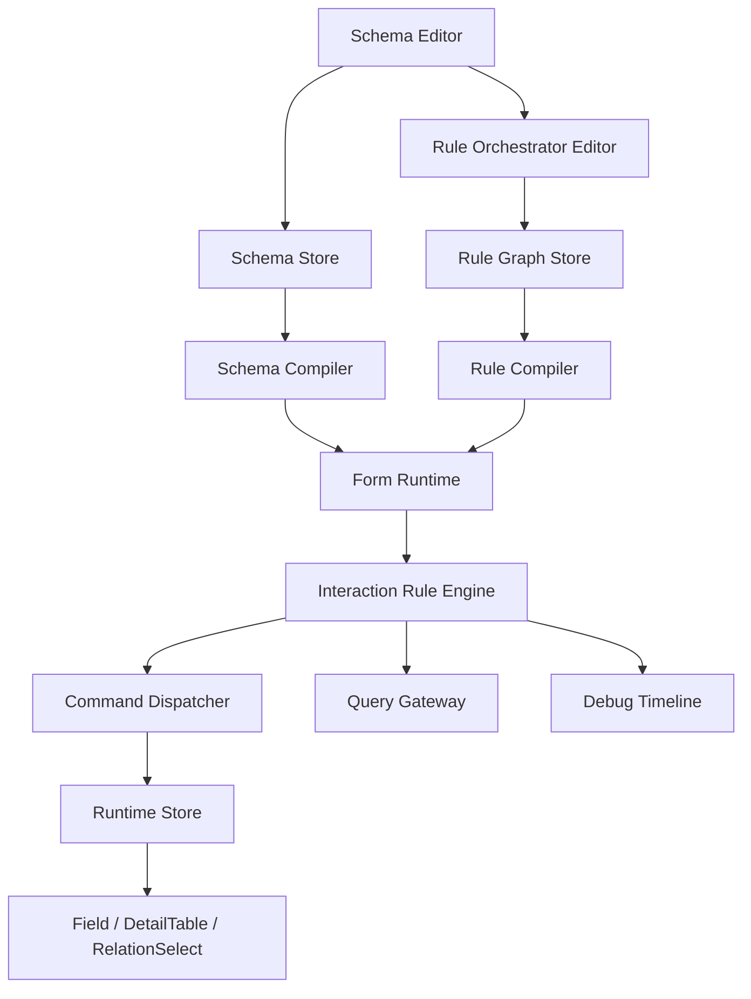
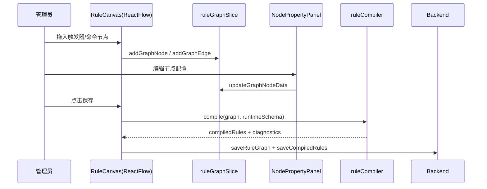
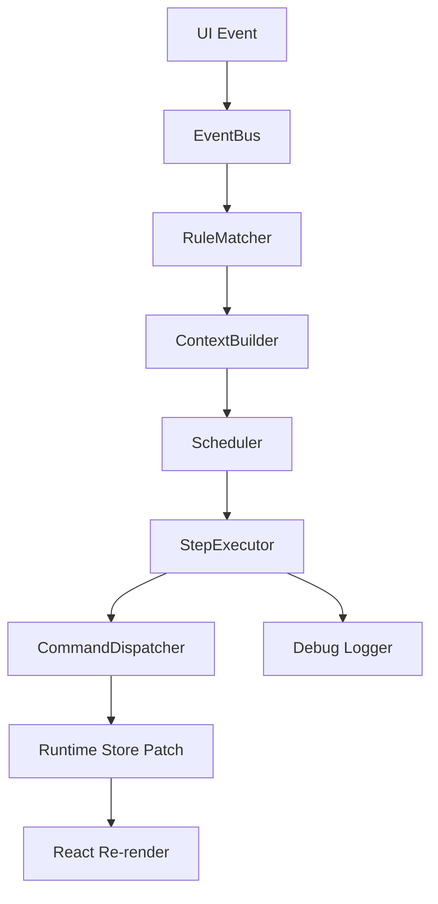
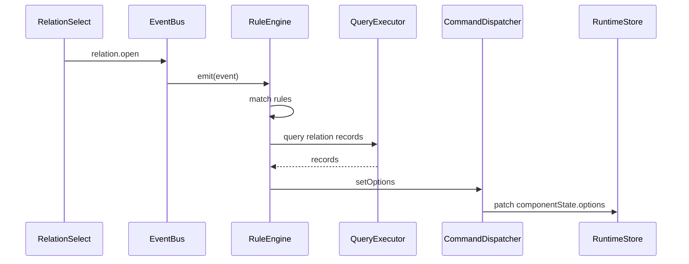
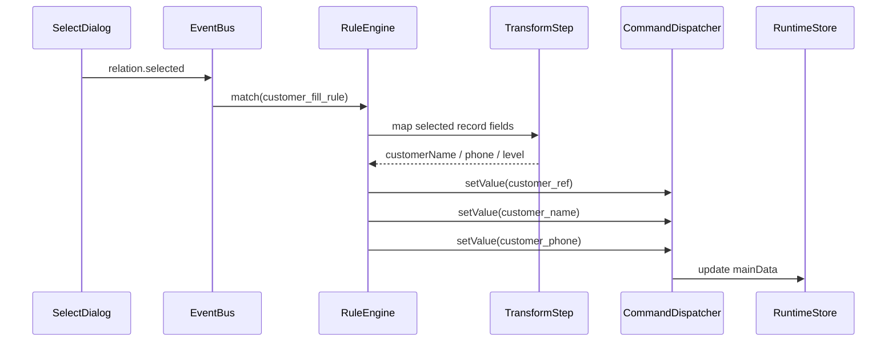
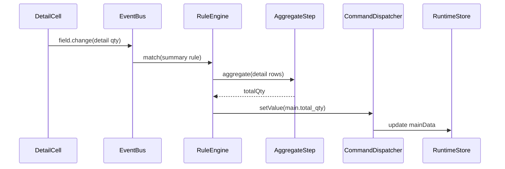

# 多表单扩展前端设计

## 1. 设计目标

基于以下现状与需求，设计一版可持续演进的多表单前端架构：

- 现有技术栈已稳定在 React 18 + TypeScript + Ant Design + Redux Toolkit + dnd-kit + Vite
- 编辑器已采用统一节点树模型，`detail_table` 节点和 `relation-select` 组件已进入代码基线
- 填报服务已升级为 `mainData + detailTables` 双层运行态数据结构
- 需求已覆盖一期的主子表/关联选择，以及二期的字段联动、计算规则、提交流程规则

本方案目标不是单纯补几个组件，而是建立一套可以承载“一期结构能力 + 二期交互规则 + 后续审批/报表扩展”的前端能力底座。

## 2. 现状评估

## 2.1 已有前端基础

结合当前代码，前端已经具备以下能力：

| 模块 | 当前状态 | 说明 |
|---|---|---|
| 编辑器节点树 | 已具备 | `front/src/store/slices/formSchemaSlice.ts` 已支持 `detail_table` |
| 节点类型定义 | 已具备 | `front/src/types/schema/node.ts` 已扩展 `NodeType` |
| 明细表运行态展示 | 已具备基础版 | `front/src/pages/fill/components/RecordFormCanvas.tsx` 已支持表格型明细 |
| 双层填报数据模型 | 已具备 | `front/src/pages/fill/services/recordRuntime.ts` 已采用 `mainData/detailTables` |
| 关联选择基础配置 | 已具备基础版 | 编辑器中已支持 `relation-select` 配置项 |
| 规则引擎 | 未建设 | 当前仍以字段组件直接改值为主，没有统一事件/规则/命令运行时 |
| 可视化流程编排 | 未建设 | 规则还没有可视化画布、DSL、编译与调试链路 |

## 2.2 当前架构短板

当前实现足以承载一期结构能力，但若直接在组件中继续加 `if/else`，会很快遇到以下问题：

| 问题 | 影响 |
|---|---|
| 主表、明细表、关联选择的联动逻辑散落在页面组件 | 规则复用困难，测试与排障成本高 |
| 没有统一的事件、作用域、命令协议 | 二期字段联动与计算规则难以配置化 |
| 组件只会“自己改自己” | 无法稳定支撑主表驱动明细、明细汇总主表、关联回填当前行 |
| 缺少可视化规则编排器 | 管理员只能配置简单表单属性，复杂规则难以表达 |
| 没有执行日志/调试面板 | 规则命中、冲突、死循环、异步失败无法定位 |

结论：多表单阶段前端必须从“表单渲染器”升级为“表单运行时平台”。

## 3. 总体架构

## 3.1 分层设计



## 3.2 核心结论

| 层级 | 核心职责 |
|---|---|
| Schema Editor | 负责页面结构、字段属性、明细表列结构配置 |
| Rule Orchestrator Editor | 负责交互规则的可视化流程编排 |
| Schema Compiler | 将节点树编译成运行时可消费的渲染模型、索引和作用域元数据 |
| Rule Compiler | 将流程图编译成规则 DSL 和可执行计划 |
| Form Runtime | 负责主表、明细表、关联选择的页面渲染 |
| Interaction Rule Engine | 负责事件捕获、规则匹配、上下文构建、执行单元调度 |
| Command Dispatcher | 将标准命令转换为对运行时 store 的 patch |
| Runtime Store | 保存事实数据、组件状态、候选项缓存、错误、调试信息 |

## 4. 前端目录建议

```text
front/src/
├── pages/
│   ├── editor/
│   │   ├── components/formDesign
│   │   ├── components/ruleDesign
│   │   └── services
│   └── fill/
│       ├── components
│       ├── runtime
│       └── services
├── store/
│   ├── slices/formSchemaSlice.ts
│   ├── slices/ruleGraphSlice.ts
│   ├── slices/runtimeEngineSlice.ts
│   ├── slices/relationSelectSlice.ts
│   └── selectors
├── runtime/
│   ├── compiler/schemaCompiler.ts
│   ├── compiler/ruleCompiler.ts
│   ├── engine/eventBus.ts
│   ├── engine/ruleEngine.ts
│   ├── engine/scheduler.ts
│   ├── engine/commandDispatcher.ts
│   ├── engine/contextBuilder.ts
│   ├── engine/executors
│   ├── engine/operators
│   └── engine/pathResolver.ts
└── types/
    ├── schema
    ├── rule
    └── runtime
```

## 5. 表单结构层设计

## 5.1 节点树继续沿用统一模型

现有节点树模型不推翻，继续使用：

```ts
type NodeType = "page" | "container" | "detail_table" | "field" | "text";
```

原因：

1. 当前 `formSchemaSlice` 已支持统一增删改排
2. 明细表本质上仍是“特殊容器”
3. 节点树适合编辑态拖拽和属性投射
4. 规则引擎只需基于编译后的作用域索引运行，不必侵入编辑器结构模型

## 5.2 结构编译产物

节点树不直接给规则引擎使用，而是先编译为运行时元数据：

```ts
type RuntimeSchema = {
  formId: string;
  versionId: string;
  page: {
    rootId: string;
    orderedChildren: string[];
  };
  fieldsByKey: Record<string, RuntimeFieldMeta>;
  detailTablesByKey: Record<string, RuntimeDetailTableMeta>;
  scopes: Record<string, RuntimeScopeMeta>;
  dependencies: {
    relationFields: string[];
    computedTargets: string[];
    triggerIndex: Record<string, string[]>;
  };
};

type RuntimeFieldMeta = {
  nodeId: string;
  fieldKey: string;
  component: string;
  label: string;
  parentScope: "MAIN" | "DETAIL";
  detailTableKey?: string;
  path: string;
  props: Record<string, unknown>;
};

type RuntimeDetailTableMeta = {
  nodeId: string;
  tableKey: string;
  title: string;
  columnFieldKeys: string[];
  rowPolicy: {
    minRows: number;
    maxRows: number;
    allowAddRow: boolean;
    allowDeleteRow: boolean;
  };
};
```

编译收益：

| 收益 | 说明 |
|---|---|
| 去 UI 化 | 规则引擎只依赖字段 key、作用域和依赖关系，不依赖 React 组件实例 |
| 建索引 | 主表字段、明细字段、关联字段、计算目标都可快速查询 |
| 统一路径 | 为错误定位、规则执行、命令分发提供统一 path |
| 发布校验 | 可在编译阶段检查悬空字段、非法映射、循环依赖 |

## 6. 可视化流程编排设计

## 6.1 技术选型

可视化流程编排建议采用：

- 画布引擎：`@xyflow/react`（React Flow）
- 布局算法：`elkjs`
- UI 容器：Ant Design Drawer/Panel/Form
- 状态管理：Redux Toolkit
- DSL 编译：前端自研 `ruleCompiler`

## 6.2 选型结论

| 方案 | 结论 | 原因 |
|---|---|---|
| `@xyflow/react` | 推荐 | React 生态成熟，节点/连线/自定义面板能力完整，适合流程编排 |
| `dnd-kit` 单独实现画布 | 不推荐 | 适合表单组件拖拽，不适合复杂节点图、端口、缩放、分支连线 |
| BPMN 全量方案 | 暂不推荐 | 过重，概念超出当前交互规则场景，学习和实现成本高 |

选择 `@xyflow/react` 的核心原因：

1. 当前项目就是 React 技术栈，接入成本最低
2. 支持自定义节点、Handle、MiniMap、Controls、Selection、Viewport
3. 能表达条件分支、失败分支、异步节点、子流程等图模型
4. 后续如果规则量上来，可平滑扩展调试面板、运行高亮、节点断点

## 6.3 编排模型

规则配置不直接编辑 JSON，而是编辑流程图；流程图保存时编译为结构化 DSL。

### 6.3.1 画布节点类型

| 节点类型 | 作用 |
|---|---|
| `trigger` | 规则起点，描述事件来源 |
| `condition` | 条件判断、分支路由 |
| `query` | 查询外部记录、当前表单数据、上下文 |
| `transform` | 字段映射、过滤、排序、聚合、公式计算 |
| `command` | 向运行时发命令，如 `setValue`、`setOptions` |
| `loop` | 对明细行逐行执行 |
| `script` | 预留扩展，执行受限表达式 |
| `notice` | 用户提示、日志打点 |
| `end` | 显式结束节点 |

### 6.3.2 连线类型

| 连线类型 | 说明 |
|---|---|
| `success` | 默认成功流转 |
| `failure` | 异常或失败分支 |
| `true/false` | 条件分支 |
| `empty/nonEmpty` | 空值判断快捷分支 |

### 6.3.3 节点配置面板

每个节点右侧属性面板分三块：

| 区块 | 内容 |
|---|---|
| 基础信息 | 节点名称、描述、超时、失败策略 |
| 业务配置 | 触发事件、字段引用、条件、映射、目标组件 |
| 调试设置 | 输出到日志、是否保留中间结果、调试标签 |

## 6.4 图模型与 DSL 双模型

编辑态存图模型，发布态存 DSL。

```ts
type RuleGraph = {
  id: string;
  formId: string;
  version: string;
  nodes: RuleGraphNode[];
  edges: RuleGraphEdge[];
  viewport?: { x: number; y: number; zoom: number };
};

type RuleGraphNode = {
  id: string;
  type: "trigger" | "condition" | "query" | "transform" | "command" | "loop" | "notice" | "end";
  position: { x: number; y: number };
  data: Record<string, unknown>;
};

type RuleGraphEdge = {
  id: string;
  source: string;
  target: string;
  branch?: "success" | "failure" | "true" | "false" | "empty" | "nonEmpty";
};
```

编译后 DSL：

```ts
type CompiledRule = {
  ruleId: string;
  name: string;
  enabled: boolean;
  priority: number;
  trigger: RuntimeTrigger;
  scope: RuntimeRuleScope;
  steps: CompiledStep[];
  onFailure: "interrupt" | "continue" | "rollback" | "fallback";
  debug: {
    tags: string[];
    keepSnapshots: boolean;
  };
};
```

## 6.5 编译规则

`ruleCompiler` 负责完成以下工作：

| 编译阶段 | 处理内容 |
|---|---|
| 图合法性校验 | 检查开始节点唯一性、孤立节点、死链、非法分支 |
| 引用校验 | 校验字段 key、明细表 key、目标命令、来源表单是否合法 |
| 拓扑排序 | 把图结构转成线性可执行计划 |
| 分支折叠 | 将分支边转成步骤内的 `next` 指针 |
| 作用域标注 | 为每个步骤标注 `MAIN/CURRENT_ROW/DETAIL_ALL_ROWS` |
| 依赖提取 | 构建 `event -> rules[]`、`field -> downstream rules[]` 索引 |

## 6.6 MVP 节点集

为了控制实现复杂度，P0 只开放以下可视节点：

1. `trigger`
2. `condition`
3. `query`
4. `transform`
5. `command`
6. `notice`
7. `end`

`loop` 与 `script` 建议 P1 引入。P0 的逐行逻辑可以先通过 `scope=CURRENT_ROW` + 编译器约束承载。

## 6.7 规则画布实现方案



## 6.8 编排器调试能力

规则编排器必须内建调试能力，否则发布后很难排障：

| 能力 | 说明 |
|---|---|
| 节点级校验提示 | 配置不完整时节点上直接显示红点/错误摘要 |
| 发布前诊断 | 汇总所有错误、循环依赖、未连接节点、非法字段引用 |
| 预览运行 | 在预览页输入样本数据后，回放规则命中链路 |
| 运行高亮 | 执行某条规则时高亮经过的节点与分支 |
| Timeline | 展示 `trigger -> step -> command -> patch -> result` |

## 7. 运行态交互规则执行方案

## 7.1 设计目标

运行态交互规则引擎负责处理：

- 主表字段联动
- 主表驱动明细表
- 明细行内联动
- 明细汇总主表
- 关联选择候选项刷新
- 关联选择结果回填
- 提交前预校验和提示

不负责：

- 跨表事务写入
- 最终业务裁决
- 幂等、锁、补偿

## 7.2 总体执行链路



## 7.3 核心模块

| 模块 | 责任 |
|---|---|
| `eventBus` | 标准化收集页面事件、字段变更、明细行事件、系统事件 |
| `ruleMatcher` | 根据 `eventType + target + scope` 匹配启用规则 |
| `contextBuilder` | 构建当前规则执行所需的页面、字段、用户、数据上下文 |
| `scheduler` | 控制规则队列、优先级、并发、去抖、重入保护 |
| `stepExecutor` | 按步骤执行查询、判断、转换、命令、反馈 |
| `commandDispatcher` | 将标准命令转换为对 runtime store 的最小 patch |
| `runtimeEngineSlice` | 存规则执行状态、队列、日志、调试快照 |

## 7.4 事件模型

```ts
type RuntimeEvent =
  | {
      type: "field.change";
      eventId: string;
      fieldKey: string;
      scope: "MAIN";
      value: unknown;
      prevValue: unknown;
      source: "user" | "rule";
      timestamp: number;
    }
  | {
      type: "field.change";
      eventId: string;
      fieldKey: string;
      scope: "DETAIL";
      detailTableKey: string;
      rowId: string;
      rowIndex: number;
      value: unknown;
      prevValue: unknown;
      source: "user" | "rule";
      timestamp: number;
    }
  | {
      type: "detail.row.added" | "detail.row.removed";
      eventId: string;
      detailTableKey: string;
      rowId: string;
      rowIndex: number;
      source: "user" | "rule";
      timestamp: number;
    }
  | {
      type: "relation.open" | "relation.selected" | "form.init" | "form.submit.before";
      eventId: string;
      payload: Record<string, unknown>;
      timestamp: number;
    };
```

设计原则：

1. 事件永远是事实，不直接携带业务动作
2. 规则只订阅标准事件，不订阅 React 组件内部状态
3. `source` 必须标记 `user/rule`，用于死循环保护

## 7.5 运行上下文模型

```ts
type RuleExecutionContext = {
  executionId: string;
  ruleId: string;
  event: RuntimeEvent;
  page: {
    formId: string;
    versionId: string;
    mode: "create" | "edit" | "readonly";
  };
  user: {
    userId?: string;
    roleKeys: string[];
    orgId?: string;
  };
  runtime: {
    mainData: Record<string, unknown>;
    detailTables: Record<string, DetailRowRuntime[]>;
    componentState: ComponentStateMap;
    validationErrors: Record<string, string[]>;
  };
  scope: {
    kind: "MAIN" | "CURRENT_ROW" | "DETAIL_ALL_ROWS";
    detailTableKey?: string;
    rowId?: string;
    rowIndex?: number;
  };
  temp: Record<string, unknown>;
  traces: ExecutionTraceItem[];
};

type DetailRowRuntime = {
  __rowId: string;
  __status?: "active" | "deleted";
  values: Record<string, unknown>;
};
```

说明：

| 上下文字段 | 用途 |
|---|---|
| `runtime.mainData/detailTables` | 规则执行时读取事实数据 |
| `componentState` | 保存显示/只读/必填/候选项等派生状态 |
| `scope` | 决定命令作用到主表、当前行还是整张明细表 |
| `temp` | 跨步骤传递中间结果，如查询结果、聚合值、映射产物 |
| `traces` | 调试面板和错误回放使用 |

## 7.6 运行时状态结构

```ts
type RuntimeStore = {
  data: {
    mainData: Record<string, unknown>;
    detailTables: Record<string, DetailRowRuntime[]>;
  };
  componentState: {
    fields: Record<string, FieldRuntimeState>;
    detailTables: Record<string, DetailTableRuntimeState>;
  };
  engine: {
    pendingEvents: RuntimeEvent[];
    runningExecutions: Record<string, RunningExecution>;
    traces: ExecutionTraceItem[];
    diagnostics: EngineDiagnostic[];
  };
};

type FieldRuntimeState = {
  visible: boolean;
  readonly: boolean;
  required: boolean;
  disabled: boolean;
  options?: RuntimeOption[];
  placeholder?: string;
  hint?: string;
  loading?: boolean;
};

type DetailTableRuntimeState = {
  visible: boolean;
  readonly: boolean;
  columns: Record<string, { visible: boolean; readonly: boolean; width?: number }>;
  rowStates: Record<string, { disabled?: boolean; hidden?: boolean }>;
};
```

关键结论：

- `data` 保存事实数据
- `componentState` 保存规则派生状态
- `engine` 保存执行现场和可观测数据

这样可以避免“显示隐藏”“只读禁用”“候选项缓存”混入主业务数据。

## 7.7 命令协议

规则引擎不直接操作组件，而是发标准命令：

```ts
type RuntimeCommand =
  | { type: "setValue"; target: RuntimeTarget; value: unknown }
  | { type: "clearValue"; target: RuntimeTarget }
  | { type: "setVisible"; target: RuntimeTarget; value: boolean }
  | { type: "setReadonly"; target: RuntimeTarget; value: boolean }
  | { type: "setRequired"; target: RuntimeTarget; value: boolean }
  | { type: "setOptions"; target: RuntimeTarget; options: RuntimeOption[] }
  | { type: "appendRow"; target: { detailTableKey: string }; row: Record<string, unknown> }
  | { type: "updateRow"; target: { detailTableKey: string; rowId: string }; patch: Record<string, unknown> }
  | { type: "replaceRows"; target: { detailTableKey: string }; rows: Record<string, unknown>[] }
  | { type: "showMessage"; level: "info" | "warning" | "error"; text: string };

type RuntimeTarget =
  | { scope: "MAIN"; fieldKey: string }
  | { scope: "DETAIL"; detailTableKey: string; rowId: string; fieldKey: string }
  | { scope: "DETAIL_COLUMN"; detailTableKey: string; fieldKey: string }
  | { scope: "DETAIL_TABLE"; detailTableKey: string };
```

命令与组件解耦后，`Input/Select/Table` 只关心 store 状态变化，不关心规则细节。

## 7.8 执行单元模型

```ts
type CompiledStep =
  | QueryStep
  | ConditionStep
  | TransformStep
  | CommandStep
  | NoticeStep;

type QueryStep = {
  id: string;
  kind: "query";
  queryType: "currentForm" | "relationRecords" | "detailRows";
  params: Record<string, unknown>;
  saveAs: string;
  next?: string;
  onFailure?: string;
};
```

建议内建 5 类 step：

| Step | 作用 |
|---|---|
| `query` | 拉取上下文、外部记录、候选项 |
| `condition` | 判断是否命中分支 |
| `transform` | 映射、过滤、排序、聚合、公式计算 |
| `command` | 产生运行时命令 |
| `notice` | 提示、日志、诊断输出 |

## 7.9 路径与作用域解析

前端必须统一路径协议，否则明细场景会混乱。

建议统一三类路径：

| 类型 | 示例 | 说明 |
|---|---|---|
| 主表字段 | `main.fld_customer_name` | 主表事实数据 |
| 明细行字段 | `detail.dt_order_items[row_1].fld_qty` | 明细当前行数据 |
| 明细列状态 | `detailState.dt_order_items.column.fld_price.readonly` | 派生状态 |

同时保留后端错误映射格式：

| 后端路径 | 前端内部转换 |
|---|---|
| `fld_customer_name` | `main.fld_customer_name` |
| `dt_order_items[0].fld_qty` | 先通过 rowIndex 映射 rowId，再定位 `detail.dt_order_items[row_x].fld_qty` |

## 7.10 调度与并发控制

规则调度器必须解决 4 个问题：

1. 同一事件触发多条规则的执行顺序
2. 规则写值后二次触发的重入控制
3. 异步查询返回晚于新输入时的过期结果丢弃
4. 明细表批量更新时的局部刷新控制

### 7.10.1 调度策略

| 场景 | 策略 |
|---|---|
| 同一事件多规则命中 | 按 `priority DESC` 顺序串行执行 |
| 同规则内步骤 | 严格顺序执行 |
| 查询类步骤 | 支持 `AbortController` 取消 |
| 字段输入类事件 | 支持 `debounce`，默认 150ms |
| 提交前规则 | 强制同步收敛，不可跳过 |

### 7.10.2 重入保护

规则引擎需维护：

```ts
type ReentryGuard = {
  fingerprint: string;
  sourceEventId: string;
  depth: number;
  updatedTargets: string[];
};
```

保护策略：

| 风险 | 处理方式 |
|---|---|
| A 改 B，B 改 A | 相同指纹超过阈值直接中断并记录诊断 |
| 规则反复写入相同值 | 命令分发前做 `Object.is` 比较，相同则不派发新事件 |
| 异步旧结果覆盖新输入 | execution 带版本戳，只接受最新上下文结果 |

## 7.11 冲突处理

同一字段可能被多条规则同时命中，需要明确冲突策略：

| 冲突类型 | 策略 |
|---|---|
| `setVisible(true/false)` 冲突 | 按规则优先级，优先级相同则按规则 ID 稳定排序 |
| `setReadonly` 与 `setValue` 冲突 | 先写值，再写只读 |
| 多条 `setOptions` 冲突 | 仅允许一条规则作为“选项源”；发布前阻断 |
| 隐藏后是否清值 | 由规则显式配置 `retainValueOnHide`，默认清空 |

推荐把字段最终状态收敛成：

```ts
type FieldDerivedState = {
  visible: boolean;
  readonly: boolean;
  required: boolean;
  disabled: boolean;
  winnerRuleIds: string[];
};
```

## 7.12 查询与缓存方案

关联选择、下拉候选项刷新属于高频查询，前端必须带缓存。

```ts
type QueryCacheKey = string;

type QueryCacheEntry = {
  key: QueryCacheKey;
  data: unknown;
  createdAt: number;
  expiresAt: number;
  tags: string[];
};
```

缓存 key 建议由以下元素拼装：

1. `sourceFormId`
2. `displayFields`
3. `filters`
4. `keyword`
5. `userScope`

缓存策略：

| 场景 | 策略 |
|---|---|
| 打开关联选择弹层 | 先读缓存，命中后后台静默刷新 |
| 主表条件字段变化 | 失效对应 tag，重新查询 |
| 明细每行相同规则 | 允许共享列表缓存，但选中结果按行隔离 |

## 7.13 典型执行流程

### 7.13.1 关联选择候选项刷新



### 7.13.2 选择客户后回填主表



### 7.13.3 明细数量变化触发主表汇总



## 7.14 规则执行顺序建议

同一次用户动作下，前端交互规则建议按以下顺序收敛：

1. 结构类规则：显示/隐藏、只读/禁用、必填
2. 数据类规则：回填、默认值、清空值
3. 候选项规则：下拉项、关联选择项、筛选条件
4. 聚合计算规则：主表汇总、当前行计算
5. 提示类规则：警告、说明、校验提示

这样能避免先算值再隐藏字段导致的重复执行。

## 8. 关联选择专题方案

## 8.1 状态分层

| 状态 | 归属 |
|---|---|
| 当前弹窗业务上下文 | `relationSelectSlice` |
| 候选结果、分页、loading | `relationSelectSlice` |
| 选中记录回填结果 | `runtime store.data` |
| 组件选项缓存 | `runtime store.componentState` |
| hover、高亮行、局部输入值 | 组件本地状态 |

## 8.2 上下文模型

```ts
type RelationDialogContext =
  | {
      scope: "MAIN";
      componentFieldKey: string;
      sourceFormId: string;
      displayFields: string[];
      filters: RuntimeFilterExpression[];
      mappings: RelationMapping[];
    }
  | {
      scope: "DETAIL";
      componentFieldKey: string;
      detailTableKey: string;
      rowId: string;
      rowIndex: number;
      sourceFormId: string;
      displayFields: string[];
      filters: RuntimeFilterExpression[];
      mappings: RelationMapping[];
    };
```

## 8.3 回填规则

回填时分三步执行：

1. 先写关联字段自身值
2. 再写映射目标字段
3. 最后抛出 `field.change(source=rule)` 事件，驱动后续联动与计算

这样可以保证关联选择既能回填，又能接上后续规则链。

## 9. 明细表专题方案

## 9.1 行模型

运行态明细行建议从“普通对象数组”升级为带行元数据的结构：

```ts
type DetailRowRuntime = {
  __rowId: string;
  __origin?: "default" | "manual" | "relation_fill" | "import";
  __version: number;
  values: Record<string, unknown>;
};
```

原因：

| 原因 | 说明 |
|---|---|
| 稳定标识 | 不能长期依赖 rowIndex，删除/排序后会漂移 |
| 调试与日志 | 规则日志应能定位到具体 rowId |
| 异步安全 | 旧请求返回后可校验行版本是否变化 |

## 9.2 明细表规则作用域

| 作用域 | 示例 |
|---|---|
| `CURRENT_ROW` | 选商品后回填当前行规格和单价 |
| `DETAIL_ALL_ROWS` | 主表切换仓库后刷新所有明细行的批次候选项 |
| `MAIN` | 汇总所有明细行金额到主表总额 |

## 10. 发布、版本与接口建议

## 10.1 存储模型

前端建议把规则存两份：

| 数据 | 用途 |
|---|---|
| `ruleGraph` | 编辑态回显 |
| `compiledRules` | 运行态执行 |

保存接口建议：

```json
{
  "formId": "form_order",
  "formVersionId": "v12",
  "schema": {},
  "ruleGraph": [],
  "compiledRules": []
}
```

## 10.2 发布前校验

发布前必须前端先做静态校验：

1. 节点树合法
2. 明细表字段引用合法
3. 关联选择来源表/回填映射合法
4. 规则图无孤立节点/死循环/非法目标
5. 计算规则无循环依赖
6. `setOptions` 目标没有多规则冲突

## 10.3 与后端接口边界

| 能力 | 前端 | 后端 |
|---|---|---|
| 规则图编辑 | 负责 | 存储 |
| DSL 编译 | 前端可编译并预校验 | 后端需复核并存档 |
| 运行态交互规则 | 负责即时执行 | 提交时复算关键规则 |
| 事务规则 | 不负责 | 负责 |

## 11. 性能与可观测性

## 11.1 性能策略

| 点 | 方案 |
|---|---|
| 规则匹配 | 编译期生成 `event -> rules[]` 索引 |
| React 渲染 | 字段组件按 fieldKey 订阅最小状态片段 |
| 明细表重渲染 | 行粒度拆分，单元格走局部 selector |
| 查询 | 结果缓存 + 取消过期请求 |
| 批量命令 | `commandDispatcher` 合并 patch 后一次性入 store |

## 11.2 观测模型

```ts
type ExecutionTraceItem = {
  executionId: string;
  ruleId: string;
  stepId: string;
  stepKind: string;
  status: "running" | "success" | "failed" | "skipped";
  startedAt: number;
  finishedAt?: number;
  inputSummary?: string;
  outputSummary?: string;
  errorMessage?: string;
};
```

调试面板应支持：

1. 按规则查看
2. 按字段查看
3. 按事件查看
4. 按 executionId 回放

## 12. 分阶段落地路线

## 12.1 Phase 1：稳定一期结构能力

交付内容：

- 明细表编辑器能力补齐
- 关联选择属性配置补齐
- 运行态 `mainData/detailTables` 稳定化
- 明细行引入 `rowId`

## 12.2 Phase 2：规则引擎基础版

交付内容：

- `eventBus`
- `ruleMatcher`
- `contextBuilder`
- `commandDispatcher`
- `query/condition/transform/command` 四类执行单元
- 基础调试 timeline

## 12.3 Phase 3：可视化流程编排

交付内容：

- `@xyflow/react` 规则画布
- 图模型与 DSL 编译器
- 发布前诊断
- 预览页规则回放

## 12.4 Phase 4：高级能力

交付内容：

- `loop` 节点
- 复杂计算表达式
- 断点调试
- 规则模板库
- 与审批/打印的事件桥接

## 13. 风险与对策

| 风险 | 影响 | 对策 |
|---|---|---|
| 规则图与运行 DSL 双模型不一致 | 编辑器可回显但运行错误 | 统一通过 `ruleCompiler` 单向生成 DSL，禁止手写运行规则 |
| 明细表继续依赖 rowIndex | 删除/排序后规则错位 | 引入稳定 `rowId`，内部运行全部基于 rowId |
| 异步查询覆盖新输入 | 候选项或回填结果错乱 | execution version + AbortController |
| 规则过多导致调试困难 | 线上问题难定位 | 内建 timeline、节点高亮、发布前诊断 |
| 组件直接写 store 绕过引擎 | 规则顺序失控 | 所有业务字段变更统一走 `emitEvent -> ruleEngine -> dispatcher` 链路 |

## 14. 最终结论

本阶段前端架构建议明确做两件事：

1. 结构层继续沿用现有节点树与双层运行态数据模型，把多表单一期能力做稳
2. 在此基础上新增“可视化流程编排 + 运行态交互规则引擎”两层能力，把二期字段联动、计算规则、关联回填、明细汇总统一收敛到规则平台

具体技术上：

- 可视化流程编排采用 `@xyflow/react + elkjs + Redux Toolkit + 自研 ruleCompiler`
- 运行态规则执行采用 `eventBus + scheduler + stepExecutor + commandDispatcher + runtime store` 的分层架构

这样既能贴合当前仓库已有的 React/Redux/dnd-kit 基线，也能为后续审批、打印、报表阶段保留稳定扩展位。
