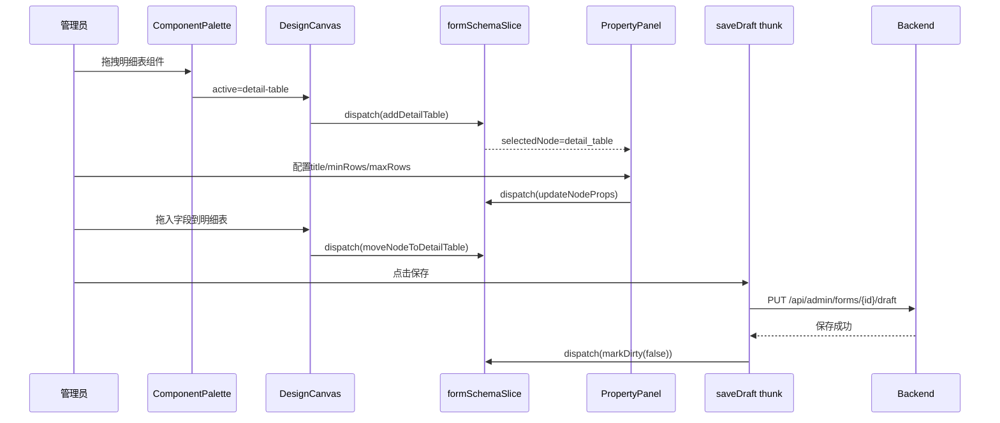
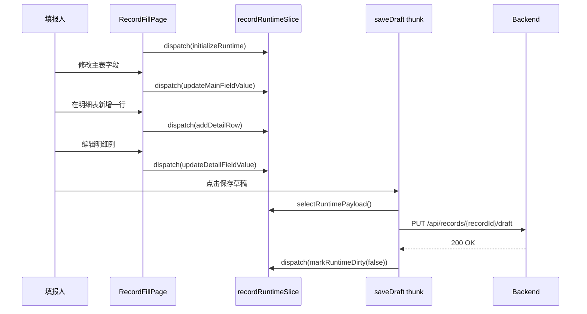
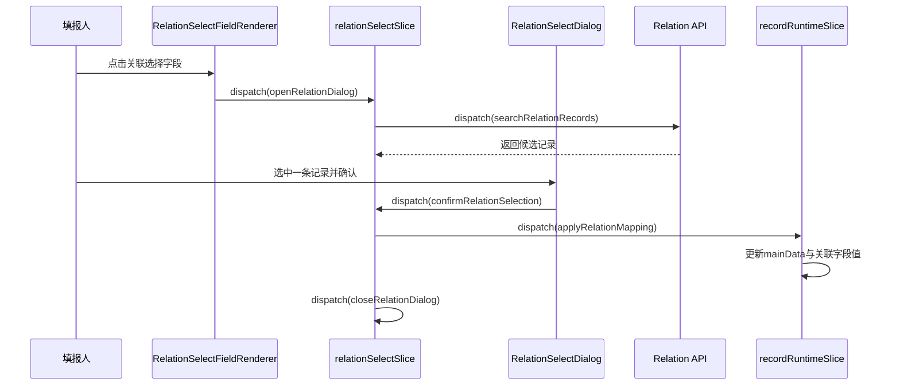

# 多表单扩展前端设计

## 1. 目标与范围

基于以下文档，设计多表单扩展一期的前端实现方案：

- [需求拆分.md](/Users/techbosch/Documents/projects/dataapp/docs/需求/03-多表单扩展/需求拆分.md)
- [需求拆分二期.md](/Users/techbosch/Documents/projects/dataapp/docs/需求/03-多表单扩展/需求拆分二期.md)
- [主表明细表后端设计.md](/Users/techbosch/Documents/projects/dataapp/docs/设计/03-多表单扩展/后端设计方案/主表明细表后端设计.md)
- [表单编辑器前端设计.md](/Users/techbosch/Documents/projects/dataapp/docs/设计/01-单表单编辑器/表单编辑器前端设计.md)
- [组件树设计.md](/Users/techbosch/Documents/projects/dataapp/docs/设计/01-单表单编辑器/前端方案设计/组件树设计.md)

本方案只覆盖一期能力：

- 编辑器中新增明细表组件
- 编辑器中新增关联选择组件
- 填报端支持主表 + 明细表统一编辑、保存、提交
- 填报端支持关联选择弹出查询、选中、回填

本方案不展开二期能力：

- 字段联动
- 计算规则
- 唯一性校验
- 生命周期规则

## 2. 设计原则

| 原则 | 说明 |
|---|---|
| 单一节点树 | 编辑态继续沿用 `page -> childrenIds` 的统一节点树，不为明细表单独引入第二套 schema |
| 运行态双层数据 | 填报数据升级为 `mainData + detailTables`，避免把明细表继续塞进单层字段字典 |
| 编辑态与运行态分层 | 编辑器负责结构编排，填报页负责数据录入，关联选择负责外部记录查询与回填 |
| 领域边界前置 | 前端 store、组件树、接口 DTO 与后端 `mainData/detailTables` 契约保持一致 |
| 渐进落地 | 优先复用当前编辑器、预览页、填报页骨架，在现有架构上增量扩展 |

## 3. 总体结论

### 3.1 编辑态

编辑器继续维护一棵统一节点树，但在节点类型和组件属性上增加两类能力：

- `detail_table` 节点：表达明细表容器
- `relation-select` 组件：表达关联选择字段

关键结论：

- 明细表是“可承载子列字段的特殊容器节点”
- 明细列依旧是 `field` 节点，只是 `parentId` 指向明细表节点
- 关联选择仍是 `field` 节点，通过 `props` 描述来源表单、展示字段、筛选条件和回填映射

### 3.2 填报态

填报页不再只维护单个 `data: Record<string, unknown>`，而是维护：

```ts
type RecordRuntimeData = {
  mainData: Record<string, unknown>;
  detailTables: Record<string, Array<Record<string, unknown>>>;
};
```

关键结论：

- 主表字段直接读写 `mainData`
- 明细表通过 `detailTables[detailTableKey][rowIndex][fieldKey]` 读写
- 关联选择选中后，先写入自身字段值，再根据映射写入主表字段或明细行字段

### 3.3 交互侧

前端需要补三类视图层模块：

- 编辑器里的明细表编排模块
- 填报页里的明细表录入模块
- 关联选择的查询弹层模块

## 4. 组件树设计

## 4.1 编辑态组件树

```text
MultiFormEditorModule（多表单编辑模块）
├── FormEditorPage（编辑页入口）
│   └── EditorShell（编辑器骨架）
│       ├── TopToolbar（保存/预览/发布）
│       ├── ComponentPalette（组件面板）
│       │   ├── BasicFieldGroup（基础字段）
│       │   ├── OptionFieldGroup（选项字段）
│       │   ├── ContainerGroup（容器类组件）
│       │   │   ├── ContainerPaletteItem（普通容器）
│       │   │   └── DetailTablePaletteItem（明细表组件）
│       │   └── RelationGroup（选择类组件）
│       │       └── RelationSelectPaletteItem（关联选择组件）
│       ├── FormEditorRenderer（编辑态节点渲染器）
│       │   ├── PageRootNode（页面根节点）
│       │   ├── EditorNodeWrapper（普通节点包装）
│       │   ├── ContainerEditorWrapper（普通容器包装）
│       │   ├── DetailTableEditorWrapper（明细表包装）
│       │   │   ├── DetailTableHeader（标题/行约束/操作区）
│       │   │   ├── DetailTableColumnToolbar（列操作区）
│       │   │   ├── DetailTableColumnList（列列表）
│       │   │   │   └── DetailColumnEditorCell（列头与列配置入口）
│       │   │   └── DetailTableDropZone（明细列拖入落点）
│       │   └── RuntimeNodeRenderer（真实组件内容）
│       │       ├── FieldRenderer（普通字段）
│       │       ├── RelationSelectEditorPreview（关联选择预览态）
│       │       └── UnsupportedEditorNode（未支持节点占位）
│       └── PropertyPanel（属性面板）
│           ├── PropertySchemaResolver（按节点类型分派配置）
│           ├── DetailTablePropertyGroup（明细表属性）
│           ├── DetailColumnPropertyGroup（明细列属性）
│           ├── RelationSelectPropertyGroup（关联选择属性）
│           ├── MappingEditor（回填映射编辑器）
│           └── FilterRuleEditor（筛选条件编辑器）
└── FormPreviewPage（预览页入口）
    └── FormPreviewRenderer（预览态渲染器）
        ├── DetailTablePreviewBlock（明细表预览）
        └── RelationSelectPreviewField（关联选择预览）
```

## 4.2 填报态组件树

```text
RecordFillModule（多表单填报模块）
├── RecordFillPage（填报页入口）
│   ├── RecordHeaderBar（记录状态/保存/提交）
│   ├── RecordFormCanvas（主表画布）
│   │   ├── RuntimeFillNode（递归渲染节点）
│   │   │   ├── MainFieldRenderer（主表字段渲染）
│   │   │   ├── DetailTableRuntimeBlock（明细表运行态容器）
│   │   │   │   ├── DetailTableToolbar（新增行/批量删除/行数提示）
│   │   │   │   ├── DetailTableGrid（表格主体）
│   │   │   │   │   ├── DetailTableHeaderRow（列头）
│   │   │   │   │   ├── DetailTableBodyRow（单行渲染）
│   │   │   │   │   │   ├── DetailRowActionCell（删除行/复制行）
│   │   │   │   │   │   ├── DetailFieldCell（明细列字段）
│   │   │   │   │   │   └── RelationSelectCellTrigger（行内关联选择入口）
│   │   │   │   └── DetailTableEmptyState（空态）
│   │   │   └── RelationSelectFieldRenderer（主表关联选择字段）
│   ├── RecordValidationSummary（校验汇总）
│   └── RelationSelectDialogHost（关联选择弹层宿主）
│       └── RelationSelectDialog（关联选择弹窗）
│           ├── RelationSelectSearchBar（关键字搜索）
│           ├── RelationSelectFilterPanel（筛选项）
│           ├── RelationRecordTable（目标记录列表）
│           ├── RelationRecordPreview（选中记录预览）
│           └── RelationSelectFooter（确认/取消）
└── RecordReadonlyPage（只读详情页）
    └── RecordReadonlyRenderer（只读渲染）
```

## 4.3 组件职责划分

| 组件 | 职责 | 不负责 |
|---|---|---|
| `DetailTableEditorWrapper` | 明细表在编辑器中的结构展示、列拖入、列顺序显示 | 不负责保存接口、不负责运行时行数据 |
| `DetailTablePropertyGroup` | 编辑明细表标题、最小行数、最大行数、增删行权限 | 不负责列数据校验 |
| `RelationSelectPropertyGroup` | 编辑来源表单、展示字段、筛选条件、回填映射 | 不负责真实数据查询 |
| `RecordFormCanvas` | 组织主表字段和明细表运行态渲染 | 不直接维护请求状态 |
| `DetailTableRuntimeBlock` | 明细表行数据增删改、行级错误展示 | 不负责跨表查询 |
| `RelationSelectDialog` | 查询外部记录、选中目标记录、返回确认结果 | 不直接写 Redux，统一通过 action 派发 |
| `RelationSelectDialogHost` | 管理弹层打开上下文，如作用域、目标字段、当前行 | 不负责业务校验 |

## 5. 节点模型设计

## 5.1 节点类型扩展

现有 `NodeType` 建议从：

```ts
type NodeType = "page" | "container" | "field" | "text";
```

扩展为：

```ts
type NodeType = "page" | "container" | "detail_table" | "field" | "text";
```

说明：

- `detail_table` 单独建模，避免继续把它等同于普通 `container`
- 普通字段与明细列仍共用 `field`
- 关联选择不新增节点类型，使用 `field + props.component === "relation-select"` 表达

## 5.2 节点示例

```ts
type Node = {
  id: string;
  serverId: string | null;
  type: "page" | "container" | "detail_table" | "field" | "text";
  parentId: string | null;
  childrenIds: string[];
  props: Record<string, unknown>;
  layout: {
    span?: number;
    order?: number;
  };
};
```

明细表节点示例：

```json
{
  "id": "detail_1",
  "serverId": "dt_order_items",
  "type": "detail_table",
  "parentId": "page_root",
  "childrenIds": ["field_11", "field_12"],
  "props": {
    "component": "detail-table",
    "title": "订单明细",
    "minRows": 1,
    "maxRows": 200,
    "allowAddRow": true,
    "allowDeleteRow": true
  },
  "layout": {
    "order": 3
  }
}
```

关联选择节点示例：

```json
{
  "id": "field_20",
  "serverId": "fld_customer_ref",
  "type": "field",
  "parentId": "page_root",
  "childrenIds": [],
  "props": {
    "component": "relation-select",
    "label": "关联客户",
    "sourceFormId": "form_customer",
    "displayFields": ["customer_name", "customer_code"],
    "filters": [
      {
        "fieldKey": "status",
        "operator": "eq",
        "value": "ENABLED"
      }
    ],
    "mappings": [
      {
        "targetFieldKey": "customer_name",
        "currentFieldKey": "fld_customer_name"
      }
    ]
  },
  "layout": {
    "span": 12
  }
}
```

## 5.3 节点约束

| 约束 | 说明 |
|---|---|
| `detail_table` 可包含子节点 | 其 `childrenIds` 只允许 `field` 节点 |
| 明细列不可出现在页面根层 | `field.parentId` 若指向 `detail_table`，则视为明细列 |
| 关联选择可出现在主表或明细列 | 若 `parentId` 是 `detail_table`，则回填作用域需要落在当前行 |
| `page/container/detail_table` 才允许有 `childrenIds` | 其他节点必须为空数组 |

## 6. Store 设计

## 6.1 Store 拆分建议

| Slice | 作用域 | 职责 |
|---|---|---|
| `formSchemaSlice` | 编辑态 | 维护节点树、选中节点、结构脏状态 |
| `recordRuntimeSlice` | 填报态 | 维护 `mainData/detailTables`、运行态错误、提交状态 |
| `relationSelectSlice` | 填报态 | 维护关联选择弹层、列表结果、当前选中上下文 |
| `editorHistorySlice` | 编辑态 | 维护撤销重做 |

## 6.2 `formSchemaSlice` 设计

```ts
type FormSchemaState = {
  formId: string | null;
  nodesById: Record<string, Node>;
  selectedNodeKey: string | null;
  dirty: boolean;
};
```

### 主要 action

| Action | 输入 | 说明 |
|---|---|---|
| `addNode` | `type/targetParentId/targetIndex/props/layout` | 新增普通节点 |
| `addDetailTable` | `targetParentId/index/defaultProps` | 新增明细表节点 |
| `moveNode` | `nodeId/targetParentId/targetIndex` | 普通节点移动 |
| `moveNodeToDetailTable` | `nodeId/detailTableId/index` | 字段拖入明细表，自动校验可拖入性 |
| `reorderDetailColumns` | `detailTableId/sourceIndex/targetIndex` | 明细列排序 |
| `updateNodeProps` | `nodeId/patch` | 更新节点属性 |
| `deleteNodeCascade` | `nodeId` | 级联删除节点 |
| `selectNode` | `nodeId` | 更新选中态 |
| `markDirty` | `boolean` | 脏标记 |

### 关键派生 selector

| Selector | 说明 |
|---|---|
| `selectPageChildren` | 获取页面根节点列表 |
| `selectDetailTableColumns(detailTableId)` | 获取某个明细表的列定义 |
| `selectFieldScope(nodeId)` | 判定节点位于主表还是明细表 |
| `selectRelationSelectNodes` | 获取所有关联选择字段 |

## 6.3 `recordRuntimeSlice` 设计

```ts
type RuntimeErrorMap = Record<string, string[]>;

type RecordRuntimeState = {
  recordId: string | null;
  formId: string | null;
  formVersionId: string | null;
  status: "idle" | "loading" | "saving" | "submitting" | "submit_success" | "error";
  mainData: Record<string, unknown>;
  detailTables: Record<string, Array<Record<string, unknown>>>;
  validationErrors: RuntimeErrorMap;
  dirty: boolean;
  readonly: boolean;
};
```

### 主要 action

| Action | 输入 | 说明 |
|---|---|---|
| `initializeRuntime` | `record/form/schema` | 初始化填报态 |
| `updateMainFieldValue` | `fieldKey/value` | 更新主表字段 |
| `addDetailRow` | `detailTableKey/defaultRow?` | 在明细表末尾新增一行 |
| `insertDetailRow` | `detailTableKey/index/defaultRow?` | 在指定位置插入一行 |
| `updateDetailFieldValue` | `detailTableKey/rowIndex/fieldKey/value` | 更新某行某列 |
| `removeDetailRow` | `detailTableKey/rowIndex` | 删除行 |
| `replaceDetailRows` | `detailTableKey/rows` | 导入/批量覆盖时使用 |
| `applyRelationMapping` | `scope/detailTableKey?/rowIndex?/mappings/selectedRecord` | 将关联选择结果回填到主表或明细行 |
| `setValidationErrors` | `RuntimeErrorMap` | 写入字段级错误 |
| `clearValidationError` | `path` | 清理单个错误 |
| `markRuntimeDirty` | `boolean` | 运行态脏标记 |

### 关键派生 selector

| Selector | 说明 |
|---|---|
| `selectMainFieldValue(fieldKey)` | 获取主表字段值 |
| `selectDetailRows(detailTableKey)` | 获取明细表所有行 |
| `selectDetailCellValue(detailTableKey,rowIndex,fieldKey)` | 获取某个单元格值 |
| `selectRuntimePayload` | 输出后端请求体 `{ mainData, detailTables }` |
| `selectFieldError(path)` | 获取字段错误 |

## 6.4 `relationSelectSlice` 设计

```ts
type RelationSelectScope =
  | { scope: "MAIN"; fieldKey: string }
  | { scope: "DETAIL"; detailTableKey: string; rowIndex: number; fieldKey: string };

type RelationSelectState = {
  visible: boolean;
  loading: boolean;
  keyword: string;
  records: Array<Record<string, unknown>>;
  selectedRecord: Record<string, unknown> | null;
  context: {
    sourceFormId: string | null;
    displayFields: string[];
    filters: Array<Record<string, unknown>>;
    mappings: Array<{ targetFieldKey: string; currentFieldKey: string }>;
    target: RelationSelectScope | null;
  };
  pagination: {
    pageNo: number;
    pageSize: number;
    total: number;
  };
};
```

### 主要 action

| Action | 输入 | 说明 |
|---|---|---|
| `openRelationDialog` | `context` | 打开关联选择弹窗 |
| `closeRelationDialog` | - | 关闭弹窗并清理上下文 |
| `setRelationKeyword` | `keyword` | 更新检索关键字 |
| `setRelationRecords` | `records/total` | 更新查询结果 |
| `setRelationSelectedRecord` | `record` | 选中一条目标记录 |
| `setRelationLoading` | `boolean` | 查询态 |
| `setRelationPagination` | `pageNo/pageSize` | 翻页 |

### 异步 thunk

| Thunk | 触发场景 | 说明 |
|---|---|---|
| `searchRelationRecords` | 打开弹窗、切换页码、搜索关键字 | 请求目标表单记录列表 |
| `confirmRelationSelection` | 用户确认关联记录 | 将结果派发给 `recordRuntimeSlice.applyRelationMapping` |

## 6.5 Store 之间的协作关系

| 协作链路 | 说明 |
|---|---|
| `formSchemaSlice -> recordRuntimeSlice` | 填报页初始化时，根据 schema 判定主表字段和明细表结构 |
| `recordRuntimeSlice -> relationSelectSlice` | 点击关联选择字段时，传入来源表单和映射规则 |
| `relationSelectSlice -> recordRuntimeSlice` | 选中外部记录后，统一回填运行态数据 |

## 6.6 关联选择状态归属原则

关联选择相关状态不建议全部放在单个字段组件中，也不建议把所有 UI 细节都提升到 Redux。推荐采用“业务状态进 store，瞬时 UI 状态留本地”的分层方案。

### 状态分层结论

| 状态类型 | 推荐归属 | 原因 |
|---|---|---|
| 当前弹层作用目标 | `relationSelectSlice` | 需要明确是主表字段还是某个明细行字段，具有业务语义 |
| 来源表单、筛选条件、分页参数 | `relationSelectSlice` | 会驱动列表查询，且可能被翻页、搜索、重试复用 |
| 列表结果、总数、loading、选中记录 | `relationSelectSlice` | 属于查询业务状态，不应散落在字段组件内部 |
| 最终回填结果 | `recordRuntimeSlice` | 回填后应直接进入表单运行时事实数据 |
| 弹层显隐 | `relationSelectSlice` 或 `RelationSelectDialogHost` | 该弹层为跨字段复用的页面级资源，不宜只挂在单个字段组件本地 |
| 输入框即时值、hover 行、局部折叠态 | `RelationSelectDialog` 本地状态 | 展示瞬时态，无需跨组件共享 |
| 动画中状态、表格列 hover、高亮索引 | `RelationSelectDialog` 本地状态 | 纯 UI 状态，不属于业务事实 |

### 推荐职责划分

| 模块 | 职责 | 不负责 |
|---|---|---|
| `relationSelectSlice` | 管理关联选择弹层的业务上下文、查询参数、结果集、确认动作 | 不负责 hover、动画、局部输入法中间态 |
| `RelationSelectDialogHost` | 作为页面级弹层宿主，决定何时打开/关闭弹层并绑定上下文 | 不直接维护最终填报数据 |
| `RelationSelectDialog` | 渲染搜索栏、结果表格、预览区、按钮区，维护局部 UI 状态 | 不直接改写 `mainData/detailTables` |
| `recordRuntimeSlice` | 承接最终确认后的回填结果，写入主表或明细行 | 不负责外部记录查询 |

### 为什么不建议全部放在字段组件里

| 问题 | 说明 |
|---|---|
| 主表和明细行都要复用 | 若状态都在字段组件内部，主表字段与明细行字段会各自维护一套弹层逻辑 |
| 页面级弹层难协调 | 弹层通常挂在页面根部或 host 内，组件本地状态不利于统一调度 |
| 回填逻辑易与 UI 耦合 | 查询、选择、确认、回填会混在一个字段组件里，职责边界变差 |
| 错误定位与重开弹层困难 | 若后续需要根据字段错误重新打开弹层，本地状态模型不稳定 |

### 为什么也不建议把所有细节都放进 store

| 问题 | 说明 |
|---|---|
| 纯 UI 噪音过多 | hover、动画、输入中间态进入 store 会让 action 和 state 变得嘈杂 |
| 渲染链路变重 | 高频 UI 状态变化进入全局 store，容易造成不必要刷新 |
| 可维护性下降 | 业务状态与展示状态混杂，后续难以判断哪些状态真正需要持久和共享 |

### 推荐实现方式

1. 点击主表或明细行中的关联选择字段时，先由字段组件派发 `openRelationDialog(context)`。
2. `relationSelectSlice` 保存业务上下文，包括 `scope/sourceFormId/displayFields/filters/mappings`。
3. `RelationSelectDialogHost` 监听 `visible/context` 后打开统一弹层。
4. `RelationSelectDialog` 内部只维护输入框临时值、hover 行、高亮态等局部 UI 状态。
5. 用户确认后，由 `confirmRelationSelection` 统一派发到 `recordRuntimeSlice.applyRelationMapping`。
6. 回填完成后关闭弹层，并清理 `relationSelectSlice` 的上下文。

### 结论

关联选择是一种“跨主表字段和明细行字段复用的业务弹层”，因此：

- 查询上下文、列表结果、确认结果应进入 store
- 页面级弹层开关建议由 `relationSelectSlice + RelationSelectDialogHost` 协同管理
- 输入框即时值、hover、动画等纯 UI 状态保留在 `RelationSelectDialog` 本地

这样既能保证跨组件复用和业务一致性，也能避免 store 被短生命周期 UI 状态污染。

## 6.7 多个关联选择组件时的 Store 存储模型

页面中可能同时存在多个关联选择组件，例如：

- 主表中的“关联客户”
- 主表中的“关联供应商”
- 明细表每一行中的“关联商品”

这类场景下，不建议为每个关联选择组件长期维护一份独立的弹层状态。推荐采用“多个触发器，共用一个弹层会话状态机”的模型。

### 核心结论

| 维度 | 设计结论 |
|---|---|
| 组件角色 | 每个关联选择组件只是一个触发入口 |
| 弹层状态 | `relationSelectSlice` 只维护“当前正在操作的那个关联选择上下文” |
| 最终结果 | 所有关联选择结果统一写回 `recordRuntimeSlice.mainData/detailTables` |
| 是否为每个组件存一份列表结果 | 一期不需要 |

### 组件与 Store 的关系

```text
RelationSelectFieldRenderer（某个关联选择组件）
  -> dispatch(openRelationDialog(context))
  -> relationSelectSlice 保存当前会话上下文
  -> RelationSelectDialogHost 打开统一弹层
  -> RelationSelectDialog 查询外部记录并确认选择
  -> dispatch(confirmRelationSelection)
  -> recordRuntimeSlice.applyRelationMapping 回填表单数据
  -> dispatch(closeRelationDialog)
```

说明：

- 每个关联选择组件本身不持有完整的候选列表和分页结果
- `relationSelectSlice` 负责“当前弹层查什么、给谁回填”
- `recordRuntimeSlice` 负责“最终表单里存了什么值”

### 为什么不为每个组件各存一份弹层状态

| 问题 | 说明 |
|---|---|
| 状态冗余 | 同一时刻通常只会打开一个关联选择弹层 |
| 结构复杂 | 主表字段和明细行字段都要建独立槽位，维护成本高 |
| 回填链路分散 | 每个组件自己维护列表结果，确认逻辑容易散落 |
| 一期收益有限 | 一期重点是跑通统一选择与回填，不是做多弹层并行会话 |

### `relationSelectSlice` 的推荐存法

推荐只维护“当前会话”：

```ts
type RelationSelectScope =
  | { scope: "MAIN"; fieldKey: string }
  | { scope: "DETAIL"; detailTableKey: string; rowIndex: number; fieldKey: string };

type RelationSelectState = {
  visible: boolean;
  loading: boolean;
  keyword: string;
  records: Array<Record<string, unknown>>;
  selectedRecord: Record<string, unknown> | null;
  context: {
    componentKey: string | null;
    sourceFormId: string | null;
    displayFields: string[];
    filters: Array<Record<string, unknown>>;
    mappings: Array<{ targetFieldKey: string; currentFieldKey: string }>;
    target: RelationSelectScope | null;
  };
  pagination: {
    pageNo: number;
    pageSize: number;
    total: number;
  };
};
```

这里的关键点是：

- `componentKey` 用于标识当前是哪一个关联选择组件触发的
- `target` 用于标识回填目标是主表字段还是某个明细行字段
- `records/selectedRecord/pagination` 只属于当前正在打开的弹层

### `recordRuntimeSlice` 的存法

关联选择组件的最终结果不单独存一份“关联结果仓库”，而是直接写回运行时表单数据：

```ts
type RecordRuntimeState = {
  mainData: Record<string, unknown>;
  detailTables: Record<string, Array<Record<string, unknown>>>;
  validationErrors: Record<string, string[]>;
};
```

主表示例：

```ts
mainData = {
  fld_customer_ref: "rec_customer_1",
  fld_customer_name: "A公司",
  fld_supplier_ref: "rec_supplier_9"
};
```

明细表示例：

```ts
detailTables = {
  dt_order_items: [
    {
      fld_product_ref: "rec_product_3",
      fld_product_name: "商品3",
      fld_price: 100
    }
  ]
};
```

说明：

- 关联选择字段本身的值，如 `fld_customer_ref`、`fld_product_ref`，也属于表单运行时数据
- 由回填映射带出来的字段，如 `fld_customer_name`、`fld_price`，同样直接进入运行时数据
- 前端不需要额外再维护一个“relationResultsByFieldKey”作为主事实源

### 多个组件如何区分

多个关联选择组件的差异主要通过 `context` 来区分，而不是在 store 中开很多并列字段。

主表中的“关联客户”示例：

```ts
context = {
  componentKey: "fld_customer_ref",
  sourceFormId: "form_customer",
  target: { scope: "MAIN", fieldKey: "fld_customer_ref" },
  mappings: [
    { targetFieldKey: "customer_name", currentFieldKey: "fld_customer_name" }
  ]
};
```

明细第 3 行中的“关联商品”示例：

```ts
context = {
  componentKey: "dt_order_items.fld_product_ref",
  sourceFormId: "form_product",
  target: {
    scope: "DETAIL",
    detailTableKey: "dt_order_items",
    rowIndex: 2,
    fieldKey: "fld_product_ref"
  },
  mappings: [
    { targetFieldKey: "product_name", currentFieldKey: "fld_product_name" },
    { targetFieldKey: "price", currentFieldKey: "fld_price" }
  ]
};
```

### 一期是否需要做组件级缓存

一期建议不做。

如果后续需要增强体验，例如：

- 每个关联选择组件记住上次搜索关键字
- 每个组件记住上次分页位置
- 每个组件记住最近选择记录

可以新增可选缓存结构：

```ts
type RelationQueryCache = Record<
  string,
  {
    keyword: string;
    pageNo: number;
    pageSize: number;
    lastSelectedRecordId?: string;
  }
>;
```

缓存 key 建议：

- 主表字段：`MAIN:fld_customer_ref`
- 明细字段：`DETAIL:dt_order_items:fld_product_ref`

但这属于体验增强，不作为一期主设计。

### 结论

多个关联选择组件场景下，推荐采用以下模式：

- 每个关联选择组件只是触发器
- `relationSelectSlice` 只存当前打开弹层的会话状态
- `recordRuntimeSlice` 存所有最终回填后的表单数据
- 不为每个组件长期保存一份独立的列表结果和分页状态

这样既能支撑主表和明细行复用统一弹层，也能保持 store 结构清晰、实现复杂度可控。

## 7. 主要功能的端到端执行流程

## 7.1 编辑器：新增明细表并配置列

### 流程说明

1. 管理员从组件面板拖拽“明细表组件”
2. `formSchemaSlice.addDetailTable` 在 `page_root.childrenIds` 中插入 `detail_table` 节点
3. 属性面板切换到 `DetailTablePropertyGroup`
4. 管理员配置标题、最小行数、最大行数、增删行权限
5. 管理员继续从字段区拖入文本、数字、关联选择等字段到明细表
6. `moveNodeToDetailTable` 更新子列 `parentId` 和明细表 `childrenIds`
7. 列顺序变化时通过 `reorderDetailColumns` 维护 `childrenIds`
8. 点击保存后，前端序列化节点树并调用草稿保存接口

### 时序图



## 7.2 编辑器：配置关联选择组件

### 流程说明

1. 管理员拖入“关联选择组件”
2. 属性面板展示来源表单、展示字段、筛选条件、回填映射配置
3. 管理员选择来源表单后，前端请求可用表单字段清单
4. `RelationSelectPropertyGroup` 渲染目标字段候选项
5. 管理员编辑 `mappings`
6. 保存时统一落入节点 `props`

### 关键前端约束

- 未选择来源表单时，展示字段和回填映射编辑区置灰
- 映射项必须是“目标字段 -> 当前字段”
- 若当前字段位于明细表中，映射目标默认限定为“当前明细行可写字段”

## 7.3 填报端：主表 + 明细表保存草稿

### 流程说明

1. 页面加载发布版 schema 与已有记录详情
2. `recordRuntimeSlice.initializeRuntime` 初始化 `mainData/detailTables`
3. 用户编辑主表字段时，派发 `updateMainFieldValue`
4. 用户在明细表中新增行时，派发 `addDetailRow`
5. 用户编辑明细单元格时，派发 `updateDetailFieldValue`
6. 用户点击保存草稿
7. `selectRuntimePayload` 输出 `{ mainData, detailTables }`
8. 调用 `PUT /api/records/{recordId}/draft`
9. 成功后 `dirty=false`

### 时序图



## 7.4 填报端：关联选择并回填主表字段

### 流程说明

1. 用户点击主表中的关联选择字段
2. `relationSelectSlice.openRelationDialog` 写入上下文
3. 弹窗打开后触发 `searchRelationRecords`
4. 用户筛选并选中外部记录
5. 点击确认后执行 `confirmRelationSelection`
6. 先把关联字段自身值写入主表
7. 再根据 `mappings` 把目标字段值回填到 `mainData`
8. 关闭弹窗

### 时序图



## 7.5 填报端：关联选择并回填明细行字段

### 流程说明

1. 用户点击明细表某一行中的关联选择列
2. 打开弹窗时记录 `detailTableKey + rowIndex + fieldKey`
3. 用户选中目标记录
4. `applyRelationMapping` 只更新当前行
5. 不影响其他明细行

### 关键约束

- 行内回填只能作用于当前行
- 若字段位于明细表中，错误路径使用 `detailTableKey[rowIndex].fieldKey`
- 用户切换行后再次打开关联选择，需要重新绑定上下文

## 7.6 填报端：统一提交

### 流程说明

1. 用户点击提交
2. `recordRuntimeSlice` 输出 `{ mainData, detailTables }`
3. 调用 `POST /api/records/{recordId}/submit`
4. 后端返回成功时，页面切换为只读或提交成功态
5. 后端返回字段级错误时，前端将错误写入 `validationErrors`
6. 主表字段错误和明细单元格错误分别高亮

### 错误映射约定

| 后端错误路径 | 前端定位方式 |
|---|---|
| `fld_customer_name` | 主表字段错误 |
| `dt_order_items` | 明细表整体错误 |
| `dt_order_items[0].fld_item_name` | 明细表第 1 行某列错误 |

## 8. 接口契约对齐建议

## 8.1 填报请求体

```json
{
  "mainData": {
    "fld_customer_name": "A公司",
    "fld_customer_ref": "9001"
  },
  "detailTables": {
    "dt_order_items": [
      {
        "fld_item_name": "商品1",
        "fld_qty": 2
      }
    ]
  }
}
```

## 8.2 填报响应体

```json
{
  "id": "record_1",
  "formId": "form_1",
  "formVersionId": "version_3",
  "status": "DRAFT",
  "mainData": {},
  "detailTables": {}
}
```

## 9. 分阶段落地建议

| 阶段 | 前端产出 | 目标 |
|---|---|---|
| Phase 1 | 编辑器识别 `detail_table` 和 `relation-select` 节点 | 结构可设计、可保存、可预览 |
| Phase 2 | `recordRuntimeSlice` 升级为 `mainData/detailTables` | 填报链路可跑通 |
| Phase 3 | 明细表运行态组件 + 关联选择弹层 | 主表/明细/关联选择统一填报 |
| Phase 4 | 错误定位、空态、权限禁用、只读展示优化 | 补齐可用性 |

## 10. 风险与对策

| 风险 | 影响 | 对策 |
|---|---|---|
| 明细表继续复用普通容器会导致语义混乱 | 编辑态与填报态约束难统一 | 单独引入 `detail_table` 节点类型 |
| 填报端仍使用单层 `data` | 明细表和关联回填难以维护 | 统一升级为 `mainData/detailTables` |
| 关联选择回填作用域不清晰 | 主表和明细行值可能串写 | 打开弹窗时显式记录 `scope` |
| 错误路径无法映射到单元格 | 用户无法定位提交错误 | 前后端统一 `detailTableKey[rowIndex].fieldKey` 路径格式 |

## 11. 结论

多表单扩展一期前端应在现有单表单架构上做三项关键演进：

1. 编辑态引入 `detail_table` 节点和 `relation-select` 组件配置模型
2. 填报态将运行时数据升级为 `mainData + detailTables`
3. 新增关联选择弹层与明细表运行态模块，打通主表、明细表、关联回填的统一保存与提交链路

这样可以在不推翻当前编辑器与 Redux 架构的前提下，和后端一期模型保持一致，并为二期字段联动与计算规则预留稳定扩展点。
