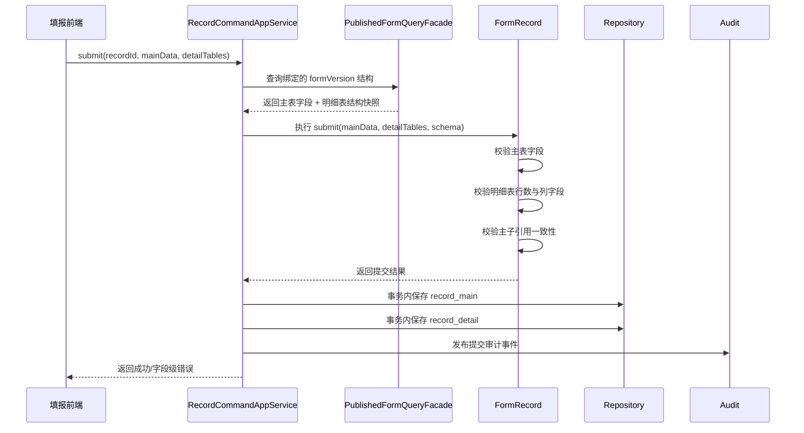

# 主表明细表后端设计

## 1. 目标与范围

基于 [阶段需求.md](../../../需求/03-多表单扩展/阶段需求.md)、[后端架构.md](../../后端架构.md) 和 [单表单填报后端技术设计.md](../../02-单表单填报/后端设计/单表单填报后端技术设计.md)，本文聚焦多表单扩展一期中的两个核心问题：

1. 主表和明细表的一对多关系如何建模与持久化
2. 编辑态和填报态在明细表场景下如何分层处理

本文只覆盖“一期：关联表扩展”范围内的主表、明细表、关联选择相关设计，不展开二期规则引擎与复杂联动执行链路。

## 2. 设计结论

### 2.1 总体结论

主表和明细表不建议建模为两个平级业务单据，也不建议在一期直接引入“主记录 + 多个独立子记录聚合”的重模型。更稳妥的方式是：

- 在表单设计上下文中，将明细表视为一种特殊容器组件
- 在数据采集上下文中，将明细表数据视为主记录聚合下的多行子实体集合
- 在数据库层面，采用“结构快照 + 字段索引 + 主记录 + 明细行”的组合模型

简化理解：

- 编辑态解决“长成什么样”
- 填报态解决“填了什么数据”
- 发布版表单结构解决“数据应当如何被解释”

### 2.2 为什么不把明细表当独立表单实例

一期需求里，明细表的核心语义是“主表中的可重复录入子结构”，而不是独立业务单据。若过早将其建成独立表单实例，会带来以下问题：

- 主表与明细表统一保存、统一提交、统一回滚变复杂
- 提交校验会跨多个聚合，增加事务编排成本
- 前端编辑器中的明细表列配置与后端持久化结构容易脱节
- 后续审批、导出、打印更难以主记录为中心展开

因此，一期更适合采用：

- 设计态：明细表是主表结构中的一个容器节点
- 运行态：明细行是主记录聚合中的子实体

## 3. DDD 领域建模建议

### 3.1 限界上下文职责

| 限界上下文 | 职责 | 一期结论 |
|---|---|---|
| `Form Design` | 定义主表字段、明细表容器、明细列结构、关联选择配置 | 继续作为结构事实源 |
| `Data Collection` | 保存主表数据、明细行数据、关联结果，执行统一校验和统一提交 | 继续作为运行时事实源 |
| `Identity & Access` | 用户、角色、数据权限、字段权限 | 为主表字段和明细列字段统一提供权限判断 |
| `Audit` | 记录主表/明细表保存与提交行为 | 按主记录维度留痕 |

### 3.2 聚合建模

#### 表单设计上下文

建议继续以 `FormDefinition` 为聚合根，并在 `FormSchema` 中引入明细表容器节点概念。

| 对象 | 类型 | 职责 |
|---|---|---|
| `FormDefinition` | 聚合根 | 维护表单头信息、草稿、版本发布 |
| `FormSchema` | 值对象 | 维护主表字段、明细表容器、关联选择组件的结构约束 |
| `DetailTableSchema` | 值对象 | 描述一个明细表容器的配置 |
| `DetailColumnSchema` | 值对象 | 描述明细表中的列字段定义 |

#### 数据采集上下文

建议仍以 `FormRecord` 为聚合根，不额外拆出独立“子表记录聚合”。

| 对象 | 类型 | 职责 |
|---|---|---|
| `FormRecord` | 聚合根 | 管理主记录、状态、版本绑定、统一提交 |
| `RecordMainData` | 值对象 | 保存主表字段数据 |
| `DetailTableEntry` | 实体 | 表示一个明细表数据区，如 `order_items` |
| `DetailRow` | 实体 | 表示一行明细数据 |
| `DetailRowData` | 值对象 | 保存某一行的列值集合 |

### 3.3 聚合边界结论

一期建议将“主表 + 所有明细行”纳入同一个 `FormRecord` 聚合的一致性边界内：

- 草稿保存时统一保存
- 提交时统一校验
- 任一明细行失败则整单失败
- 成功后统一发布领域事件

这与需求中的“统一保存与提交”“任一子项失败时整体回滚”完全一致。

## 4. 主表和明细表的一对多关系设计

### 4.1 结构层关系

在表单结构层，明细表不是一张独立表，而是主表 schema 内的容器节点。建议在 `fields_json` 中引入类似如下结构：

```json
{
  "fields": {
    "customer_name": {
      "id": "n_1",
      "fieldKey": "fld_main_customer_name",
      "nodeType": "field",
      "componentType": "input"
    },
    "order_items": {
      "id": "n_10",
      "fieldKey": "dt_order_items",
      "nodeType": "detail_table",
      "componentType": "detail-table",
      "props": {
        "title": "订单明细",
        "minRows": 1,
        "maxRows": 200
      },
      "childrenIds": ["n_11", "n_12"]
    },
    "item_name": {
      "id": "n_11",
      "fieldKey": "fld_detail_item_name",
      "parentFieldKey": "dt_order_items",
      "nodeType": "field",
      "componentType": "input"
    }
  }
}
```

关键点：

- 明细表节点本身拥有独立 `fieldKey`
- 明细列字段通过 `parentFieldKey` 归属于某个明细表容器
- 主表字段与明细字段在同一份 schema 快照中统一发布

### 4.2 运行时数据关系

在数据层，主表和明细表是一条主记录和多条明细行的关系。

建议请求模型采用显式分层结构：

```json
{
  "mainData": {
    "customer_name": "A公司",
    "customer_code": "C001"
  },
  "detailTables": {
    "dt_order_items": [
      {
        "item_name": "商品1",
        "qty": 2,
        "price": 100
      },
      {
        "item_name": "商品2",
        "qty": 5,
        "price": 80
      }
    ]
  }
}
```

建议持久化时使用：

- `record_main.main_data_json`
- `record_detail.row_data_json`

这样主表/明细表的一对多关系可以稳定落到关系模型中。

## 5. 编辑态如何处理明细表

### 5.1 编辑态职责

编辑态只负责结构定义，不负责行数据管理。明细表在编辑态中承担的是“可重复子结构容器”的职责。

后端在编辑态需要处理以下内容：

- 明细表容器的新增、删除、排序
- 明细表列字段的拖入、删除、重排
- 明细表属性配置
- 明细列字段合法性校验
- 结构快照持久化与字段索引同步

### 5.2 编辑态保存内容

建议明细表编辑态保存以下信息：

| 类别 | 字段示例 | 说明 |
|---|---|---|
| 容器属性 | `title` `fieldKey` `minRows` `maxRows` | 明细表级配置 |
| 展示属性 | `columnWidth` `columnOrder` | 明细列展示配置 |
| 行级策略 | `allowAddRow` `allowDeleteRow` `defaultRowCount` | 填报态行为约束 |
| 字段结构 | `componentType` `fieldCode` `fieldName` `required` | 列字段定义 |
| 关系配置 | `parentFieldKey` `bindingMode` `sourceFieldKey` | 主子引用与映射基础 |

### 5.3 编辑态合法性校验

发布前建议补以下校验：

- 明细表容器至少有一个有效列
- 明细列 `fieldKey` 在整张表单内唯一
- 列字段不能同时出现在主表根层和明细表容器内
- `minRows <= maxRows`
- 列宽、列顺序、列标题配置合法
- 跨表引用和回填映射配置完整

## 6. 填报态如何处理明细表

### 6.1 填报态职责

填报态不再关心组件拖拽和列编排，而是关心：

- 主表数据录入
- 明细行新增、编辑、删除
- 主表与明细表统一暂存
- 主表与明细表统一提交
- 关联选择回填后的结果持久化

### 6.2 草稿保存

草稿保存阶段采用弱校验，但明细表仍需做基础结构校验：

- 明细表 key 必须存在于绑定的 `form_version`
- 每行字段 key 必须属于该明细表
- 行数据中不能混入主表字段
- 明细行数不能超过 `maxRows`
- 删除行采用显式删除标记或覆盖式保存

### 6.3 提交校验

提交阶段采用强校验，并且必须以绑定的 `form_version` 为唯一校验事实源：

- 主表字段按主表字段 schema 校验
- 每个明细表按容器配置校验最小/最大行数
- 每行按列字段 schema 校验必填、类型、枚举、范围
- 子表字段引用主表关键字段时校验其一致性
- 任一明细表失败则整体提交失败

### 6.4 历史数据处理

历史记录仍遵循既有原则：

- 记录绑定 `form_version_id`
- 查看历史记录时，始终使用记录绑定的发布版结构解释主表和明细表数据
- 新版本发布不会影响旧记录中明细表数据的展示与解释

## 7. 推荐数据库设计

### 7.1 元数据侧

建议在现有表单结构设计基础上扩展以下表达能力。

#### `form_version`

继续保存完整结构快照：

- `fields_json`

说明：

- 快照中同时包含主表字段、明细表容器、明细列字段
- 仍然是运行时校验与历史解释的唯一结构事实源

#### `form_version_field`

建议增加以下字段：

- `scope_type`
  - 取值示例：`MAIN`、`DETAIL`
- `detail_table_key`
  - 当字段属于明细表时保存所属明细表 key
- `parent_field_key`
  - 表达字段归属关系
- `binding_mode`
  - 预留主子字段绑定、回填映射
- `source_field_key`
  - 预留跨表引用来源字段

说明：

- `form_version_field` 负责做字段治理索引
- `scope_type + detail_table_key` 可以明确区分主表字段和明细列字段

### 7.2 数据侧

建议将单表单填报的一条记录拆成“主记录 + 明细行”两层表。

#### `record_main`

建议字段：

- `id`
- `tenant_id`
- `form_id`
- `form_version_id`
- `status`
- `main_data_json`
- `created_by` `created_at`
- `updated_by` `updated_at`
- `version`

职责：

- 保存主表字段数据
- 作为整单状态和提交事实的锚点

#### `record_detail`

建议字段：

- `id`
- `tenant_id`
- `record_id`
- `detail_table_key`
- `row_no`
- `row_data_json`
- `created_at`
- `updated_at`
- `deleted`

约束建议：

- `(record_id, detail_table_key, row_no)` 唯一索引
- `record_id` 外键关联主记录

职责：

- 保存某个明细表下的每一行数据
- 支撑主记录下一对多明细行结构

### 7.3 为什么不用“一张大 JSON 表”解决一切

如果继续只在 `record_main` 中保存一份包含主表和所有明细行的大 JSON，短期能跑通，但会带来这些问题：

- 明细导入导出更难做行级定位
- 明细行权限、明细行审计、明细行对比不方便
- 明细表后续扩展到大数据量时查询与更新不灵活
- 批量替换整份 JSON 的并发冲突会更明显

因此，一期建议至少把运行时数据拆为：

- 主表一条记录
- 明细表多条行记录

## 8. 统一提交时序



事务原则：

- `record_main` 和 `record_detail` 在同一个本地事务内提交
- 任一明细表失败，整体回滚
- 审计事件在事务提交后异步消费

## 9. 接口设计建议

### 9.1 编辑态接口

建议继续沿用“表单头信息 + fields 结构”的风格，但在 `fields` 中纳入明细表节点。

- `POST /api/admin/forms`
- `PUT /api/admin/forms/{formId}/draft`
- `POST /api/admin/forms/{formId}/publish`
- `GET /api/admin/forms/{formId}`

返回内容需要包含：

- 主表字段结构
- 明细表容器配置
- 明细列字段结构

### 9.2 填报态接口

建议将请求体升级为“主表数据 + 明细表数据”双层结构。

- `POST /api/records`
- `PUT /api/records/{recordId}/draft`
- `POST /api/records/{recordId}/submit`
- `GET /api/records/{recordId}`

请求 DTO 建议：

```json
{
  "mainData": {},
  "detailTables": {}
}
```

返回 DTO 建议：

```json
{
  "recordId": "xxx",
  "status": "DRAFT",
  "formVersionId": "xxx",
  "mainData": {},
  "detailTables": {}
}
```

## 10. 演进建议

### 10.1 一期推荐落地策略

一期建议优先落地以下能力：

1. `form_version.fields_json` 中支持明细表节点
2. `form_version_field` 支持 `scope_type/detail_table_key`
3. `record_main + record_detail` 运行时数据模型
4. `FormRecord` 聚合内统一保存与统一提交
5. 历史记录继续绑定 `form_version_id`

### 10.2 二期可演进方向

后续当规则、报表、打印进一步增强后，可继续演进：

- 增加 `record_detail_field` 级别投影索引
- 增加明细表导入任务与错误定位模型
- 增加跨表引用、字段联动、公式计算服务
- 增加明细行级权限和脱敏能力

## 11. 结论

主表和明细表的一对多关系，建议在运行态落为“主记录 + 多行明细”的聚合内关系，而不是多个平级记录聚合；编辑态和填报态要严格分层：

- 编辑态：明细表是结构容器，管理列定义和配置
- 填报态：明细表是数据集合，管理行数据和统一提交

这样既符合当前 DDD 和模块化单体架构，也能为后续字段权限、规则扩展、审批、导出和微服务拆分保留稳定演进空间。
