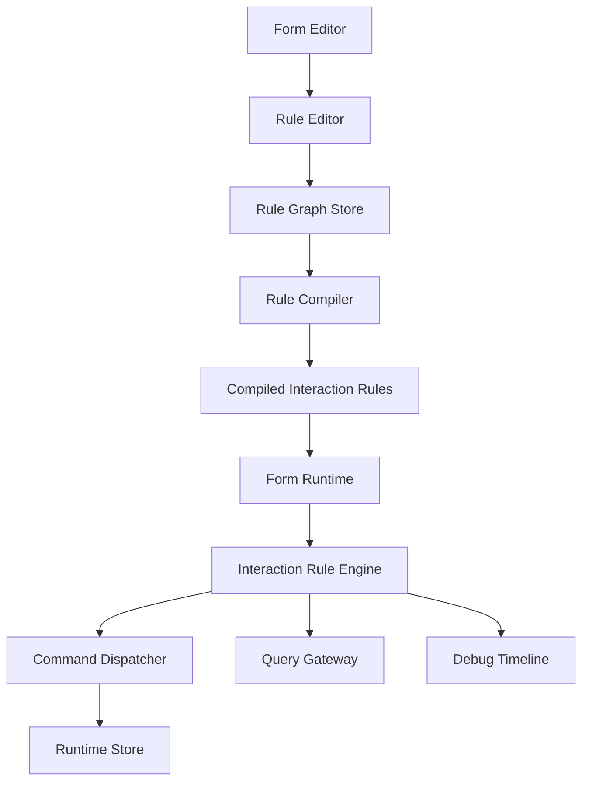
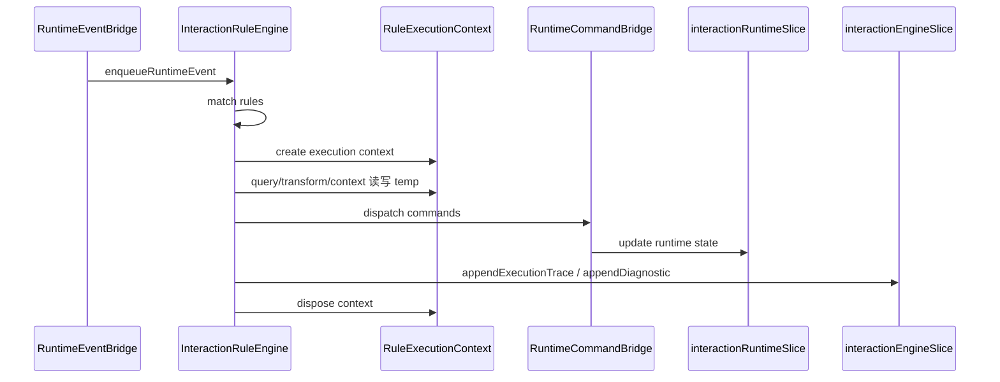
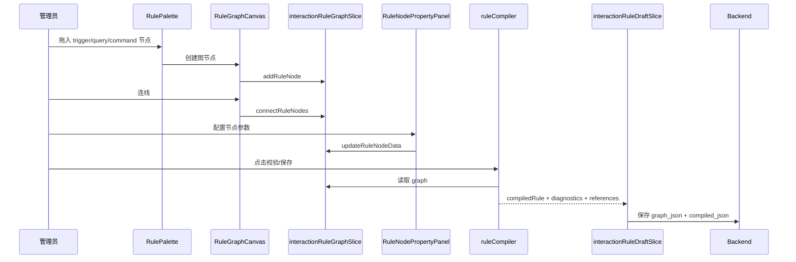
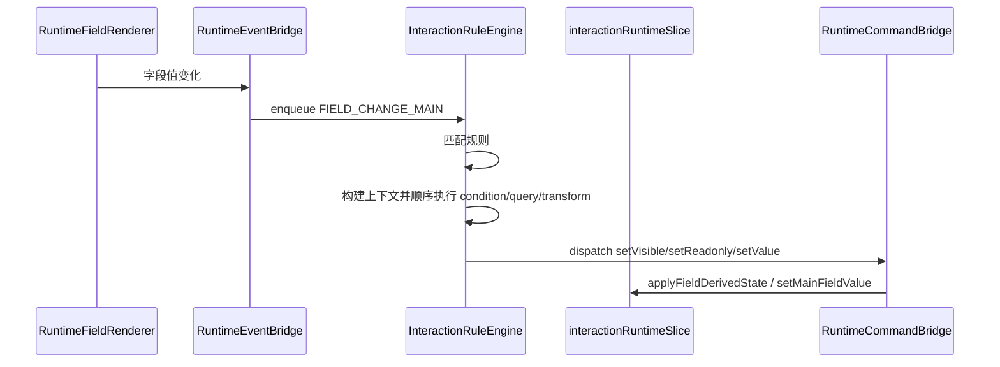
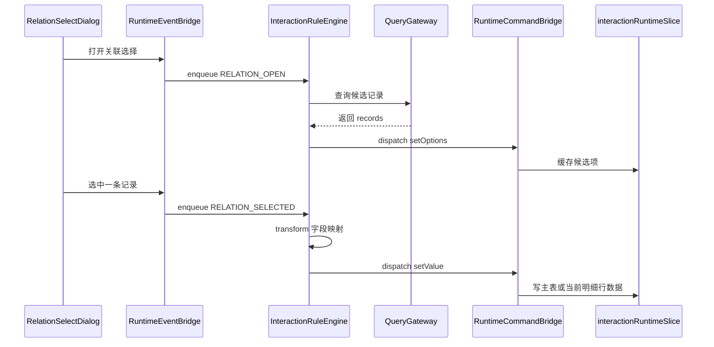

# 交互规则前端设计

## 1. 设计目标

本文只聚焦规则体系第一阶段中的“交互规则前端架构设计”，明确以下边界：

- 负责当前表单内的联动、回填、筛选、汇总、提示、提交前预校验
- 负责交互规则的编辑、预编译、预览调试和前端运行时执行
- 不负责跨表单事务写入、库存扣减、状态推进、幂等、补偿

设计依据：

- [交互规则引擎](/Users/techbosch/Documents/projects/dataapp/docs/需求/04-规则体系搭建/交互规则引擎.md)
- [规则体系总览](/Users/techbosch/Documents/projects/dataapp/docs/需求/04-规则体系搭建/规则体系总览.md)
- [规则体系前端设计](/Users/techbosch/Documents/projects/dataapp/docs/设计/04-规则体系搭建/前端设计/规则体系前端设计.md)
- [规则体系后端架构设计](/Users/techbosch/Documents/projects/dataapp/docs/设计/04-规则体系搭建/后端设计/规则体系后端架构设计.md)
- [运行时模型对象设计](/Users/techbosch/Documents/projects/dataapp/docs/设计/04-规则体系搭建/前端设计/运行时模型对象设计.md)
- [命令协议设计](/Users/techbosch/Documents/projects/dataapp/docs/设计/04-规则体系搭建/前端设计/命令协议设计.md)
- [执行节点协议设计](/Users/techbosch/Documents/projects/dataapp/docs/设计/04-规则体系搭建/前端设计/执行节点协议设计.md)

核心结论：

1. 交互规则前端是“当前表单运行时平台”，不是事务引擎
2. 前端负责图形化编排、即时执行和体验反馈
3. 后端负责规则版本治理、标准化、关键规则重放和最终裁决

## 2. 总体架构



分层职责：

| 层级 | 职责 |
|---|---|
| 规则编辑层 | 交互规则画布、节点配置、校验、预编译 |
| 规则编译层 | 图模型转规则 DSL，产出前端预编译结果和引用摘要 |
| 规则运行层 | 事件捕获、规则匹配、上下文构建、执行节点调度 |
| 状态承载层 | 保存事实数据、派生状态、关联候选项、执行日志 |

补充说明：

- 组件运行时行为封装见 [运行时模型对象设计](/Users/techbosch/Documents/projects/dataapp/docs/设计/04-规则体系搭建/前端设计/运行时模型对象设计.md)
- 规则引擎与运行时之间的标准命令协议见 [命令协议设计](/Users/techbosch/Documents/projects/dataapp/docs/设计/04-规则体系搭建/前端设计/命令协议设计.md)
- 各类执行节点的输入输出和执行器实现边界见 [执行节点协议设计](/Users/techbosch/Documents/projects/dataapp/docs/设计/04-规则体系搭建/前端设计/执行节点协议设计.md)

## 3. 组件树结构与职责划分

## 3.1 编辑态组件树

```text
InteractionRuleEditorModule
├── InteractionRulePage
│   └── InteractionRuleShell
│       ├── RuleHeaderBar
│       │   ├── RuleMetaForm
│       │   ├── RuleVersionBadge
│       │   ├── SaveDraftButton
│       │   ├── ValidateButton
│       │   └── PublishButton
│       ├── RulePalette
│       │   ├── TriggerNodeItem
│       │   ├── ConditionNodeItem
│       │   ├── QueryNodeItem
│       │   ├── TransformNodeItem
│       │   ├── CommandNodeItem
│       │   ├── ContextNodeItem
│       │   └── NoticeNodeItem
│       ├── RuleGraphCanvas
│       │   ├── RuleFlowViewport
│       │   ├── RuleGraphNodeRenderer
│       │   │   ├── TriggerNodeCard
│       │   │   ├── ConditionNodeCard
│       │   │   ├── QueryNodeCard
│       │   │   ├── TransformNodeCard
│       │   │   ├── CommandNodeCard
│       │   │   ├── ContextNodeCard
│       │   │   └── NoticeNodeCard
│       │   ├── RuleEdgeRenderer
│       │   └── RuleGraphEmptyState
│       ├── RuleNodePropertyPanel
│       │   ├── TriggerConfigPanel
│       │   ├── ConditionConfigPanel
│       │   ├── QueryConfigPanel
│       │   ├── TransformConfigPanel
│       │   ├── CommandConfigPanel
│       │   ├── ContextConfigPanel
│       │   └── NoticeConfigPanel
│       └── RuleDiagnosticsPanel
│           ├── RuleErrorList
│           ├── RuleReferenceSummary
│           └── RuleDependencyPreview
└── InteractionRulePreviewDrawer
    ├── PreviewInputPanel
    ├── PreviewExecutionTimeline
    └── PreviewResultPanel
```

## 3.2 运行态组件树

```text
InteractionRuntimeModule
├── RecordFillPage
│   ├── RecordHeaderBar
│   ├── RecordFormCanvas
│   │   ├── RuntimeFieldRenderer
│   │   ├── RuntimeContainerRenderer
│   │   ├── RuntimeDetailTableRenderer
│   │   └── RuntimeRelationSelectRenderer
│   ├── RelationSelectDialogHost
│   ├── RuleDebugPanel
│   │   ├── RuleExecutionList
│   │   ├── RuleExecutionDetail
│   │   └── RuntimeStateDiff
│   └── ValidationSummary
└── InteractionRuntimeProvider
    ├── RuntimeEventBridge
    ├── InteractionRuleEngineProvider
    └── RuntimeCommandBridge
```

## 3.3 组件职责划分

| 组件 | 职责 | 不负责 |
|---|---|---|
| `InteractionRuleShell` | 组织规则编辑器整体布局、保存、校验、发布入口 | 不直接处理图编译细节 |
| `RulePalette` | 提供可拖入的执行节点模板 | 不持有规则状态 |
| `RuleGraphCanvas` | 展示节点图、连线、选中态、拖拽排序 | 不负责业务校验 |
| `RuleNodePropertyPanel` | 编辑当前节点配置 | 不负责图拓扑关系 |
| `RuleDiagnosticsPanel` | 展示预编译错误、引用摘要、依赖图 | 不直接写图模型 |
| `InteractionRulePreviewDrawer` | 在编辑态模拟输入并回放规则执行链路 | 不写正式运行数据 |
| `InteractionRuntimeProvider` | 在填报页挂载规则引擎、事件桥和命令桥 | 不渲染字段 UI |
| `RuntimeEventBridge` | 把字段变化、明细行事件、关联选择事件转成标准事件 | 不执行规则 |
| `InteractionRuleEngineProvider` | 匹配规则、构建上下文、调度执行节点 | 不直接操作 React 组件 |
| `RuntimeCommandBridge` | 将标准命令写入 runtime store | 不做业务判断 |
| `RuleDebugPanel` | 展示执行日志、耗时、节点输入输出 | 不参与正式交互 |

## 4. Store 设计

交互规则前端建议拆成 4 个核心 slice：

| Slice | 范围 | 职责 |
|---|---|---|
| `interactionRuleGraphSlice` | 编辑态 | 保存规则图、选中节点、引用摘要、预编译诊断 |
| `interactionRuleDraftSlice` | 编辑态 | 保存规则元信息、草稿版本、发布态、保存状态 |
| `interactionRuntimeSlice` | 运行态 | 保存运行数据、组件派生状态、候选项缓存 |
| `interactionEngineSlice` | 运行态 | 保存事件队列、执行状态、日志、调试轨迹 |

## 4.1 `interactionRuleGraphSlice`

```ts
type RuleNodeType =
  | "trigger"
  | "condition"
  | "query"
  | "transform"
  | "command"
  | "context"
  | "notice";

type RuleGraphNode = {
  id: string;
  type: RuleNodeType;
  position: { x: number; y: number };
  data: Record<string, unknown>;
};

type RuleGraphEdge = {
  id: string;
  source: string;
  target: string;
  branch?: "success" | "failure" | "true" | "false" | "empty" | "nonEmpty";
};

type RuleGraphDiagnostic = {
  id: string;
  level: "error" | "warning";
  nodeId?: string;
  edgeId?: string;
  code: string;
  message: string;
};

type RuleReferenceSummary = {
  fields: string[];
  detailTables: string[];
  forms: string[];
  events: string[];
};

type InteractionRuleGraphState = {
  formId: string | null;
  formVersionId: string | null;
  ruleId: string | null;
  graph: {
    nodes: RuleGraphNode[];
    edges: RuleGraphEdge[];
    viewport: { x: number; y: number; zoom: number };
  };
  selectedNodeId: string | null;
  diagnostics: RuleGraphDiagnostic[];
  references: RuleReferenceSummary;
  dirty: boolean;
};
```

核心 action：

| Action | 说明 |
|---|---|
| `initializeRuleGraph` | 初始化图模型和元信息 |
| `addRuleNode` | 新增执行节点 |
| `updateRuleNodeData` | 更新节点配置 |
| `moveRuleNode` | 拖拽节点位置 |
| `removeRuleNode` | 删除节点及相关边 |
| `connectRuleNodes` | 创建连线 |
| `removeRuleEdge` | 删除连线 |
| `selectRuleNode` | 更新当前选中节点 |
| `setRuleDiagnostics` | 写入预编译诊断 |
| `setRuleReferences` | 写入引用摘要 |
| `markRuleGraphDirty` | 设置脏标记 |

## 4.2 `interactionRuleDraftSlice`

```ts
type InteractionRuleMeta = {
  ruleId: string | null;
  ruleCode: string;
  ruleName: string;
  eventType: string;
  scopeType: "FORM" | "FORM_VERSION";
  priority: number;
  description: string;
  enabled: boolean;
  compilerVersion: string;
};

type CompiledInteractionRule = {
  ruleId: string;
  eventType: string;
  triggerScope: "MAIN_FIELD" | "DETAIL_ROW" | "RECORD" | "GLOBAL";
  triggerTarget?: string;
  priority: number;
  steps: CompiledExecutionNode[];
  failurePolicy: "interrupt" | "continue" | "fallback";
  references: RuleReferenceSummary;
};

type InteractionRuleDraftState = {
  meta: InteractionRuleMeta;
  compiledRule: CompiledInteractionRule | null;
  saveStatus: "idle" | "saving" | "success" | "error";
  publishStatus: "idle" | "publishing" | "success" | "error";
  lastSavedAt: string | null;
  errorMessage: string | null;
};
```

核心 action：

| Action | 说明 |
|---|---|
| `initializeRuleDraft` | 初始化规则元信息 |
| `updateRuleMeta` | 更新规则名称、优先级、描述等 |
| `setCompiledRule` | 写入预编译结果 |
| `setRuleSaveStatus` | 保存状态变更 |
| `setRulePublishStatus` | 发布状态变更 |
| `setRuleDraftError` | 保存/发布异常 |

## 4.3 `interactionRuntimeSlice`

```ts
type RuntimeOption = {
  label: string;
  value: string;
  raw?: Record<string, unknown>;
};

type DetailRowRuntime = {
  __rowId: string;
  __version: number;
  __origin?: "default" | "manual" | "relation_fill" | "import";
  __status?: "ACTIVE" | "DELETED";
  values: Record<string, unknown>;
};

type BaseFieldState = {
  visible: boolean;
  readonly: boolean;
  required: boolean;
  disabled: boolean;
  hint?: string;
  loading?: boolean;
  winnerRuleIds: string[];
};

type InputFieldState = BaseFieldState & {
  componentType: "input" | "textarea" | "date";
};

type NumberFieldState = BaseFieldState & {
  componentType: "number";
  number?: {
    precision?: number;
    min?: number;
    max?: number;
  };
};

type SelectFieldState = BaseFieldState & {
  componentType: "select" | "radio" | "checkbox";
  select?: {
    options: RuntimeOption[];
  };
};

type RelationSelectFieldState = BaseFieldState & {
  componentType: "relation-select";
  relation: {
    options: RuntimeOption[];
    filter?: Record<string, unknown>;
    sourceFormId?: string;
    displayFields?: string[];
    selectedRecord?: Record<string, unknown>;
  };
};

type RuntimeFieldState =
  | InputFieldState
  | NumberFieldState
  | SelectFieldState
  | RelationSelectFieldState
  | BaseFieldState;

type InteractionRuntimeState = {
  data: {
    mainData: Record<string, unknown>;
    detailTables: Record<string, DetailRowRuntime[]>;
  };
  componentState: {
    fields: Record<string, RuntimeFieldState>;
    detailTables: Record<
      string,
      {
        visible: boolean;
        readonly: boolean;
        columns: Record<string, RuntimeFieldState>;
      }
    >;
  };
  queryCache: Record<
    string,
    {
      data: unknown;
      expiresAt: number;
    }
  >;
  validationErrors: Record<string, string[]>;
};
```

核心 action：

| Action | 说明 |
|---|---|
| `initializeInteractionRuntime` | 初始化主表/明细表数据和默认派生状态 |
| `setMainFieldValue` | 写主表字段事实值 |
| `setDetailFieldValue` | 写明细行字段事实值 |
| `appendDetailRow` | 追加明细行 |
| `insertDetailRow` | 插入明细行 |
| `removeDetailRow` | 删除明细行 |
| `replaceDetailRows` | 覆写明细数据 |
| `applyFieldDerivedState` | 更新字段派生状态 |
| `applyDetailColumnDerivedState` | 更新明细列派生状态 |
| `applyComponentExtensionState` | 更新组件特有状态，如关联选择 options |
| `setQueryCache` | 写查询缓存 |
| `setValidationErrors` | 写校验错误 |
| `clearValidationError` | 清理单个错误 |

### 4.3.1 状态分层原则

`interactionRuntimeSlice` 继续坚持“事实数据”和“组件状态”分层，但组件状态不再采用纯统一扁平结构，而是采用“统一基座 + 组件扩展状态”的模型。

分层如下：

| 层次 | 内容 | 说明 |
|---|---|---|
| `data` | `mainData`、`detailTables` | 当前表单事实数据，是提交的真实输入 |
| `componentState` | 字段与明细表运行态 | 组件派生状态与组件特有状态统一承载入口 |
| `queryCache` | 查询缓存 | 存放真正的查询结果缓存，不承担组件显示状态 |

设计原则：

1. 所有字段都必须具备统一的基础状态，如 `visible/readonly/required/disabled`
2. 组件专有状态挂在对应组件自己的扩展区，不再外挂到平级独立状态树
3. 只有跨组件复用的查询结果才进入 `queryCache`
4. 组件渲染优先从自己的 `componentState.fields[fieldKey]` 读取完整状态

### 4.3.2 为什么采用“统一基座 + 组件扩展状态”

相较于“统一通用状态 + 特殊状态外挂”，该方案更适合交互规则阶段：

| 方案 | 优点 | 问题 |
|---|---|---|
| 统一通用状态 + 特殊状态外挂 | 初期实现简单 | 一个组件的状态被拆散，调试和 selector 会越来越复杂 |
| 完全异构状态 | 组件状态聚合度最高 | 缺少统一协议，命令桥和调试面板会失控 |
| 统一基座 + 组件扩展状态 | 兼顾统一性和扩展性 | 需要在类型设计和命令桥分发上更严格 |

当前推荐采用第三种：

- 基础命令如 `setVisible/setReadonly/setRequired` 写统一基座
- 特殊命令如 `setOptions/setFilter` 写到对应组件扩展区
- 组件实例的完整运行态能集中查看和调试

### 4.3.3 关联选择状态如何承载

关联选择字段不再将可选项等状态外挂到独立的 `relationCache`，而是直接挂到字段自身状态中：

```ts
componentState.fields["fld_customer_ref"] = {
  componentType: "relation-select",
  visible: true,
  readonly: false,
  required: false,
  disabled: false,
  winnerRuleIds: [],
  relation: {
    options: [
      { label: "华东公司 / C001", value: "rec_1" }
    ],
    sourceFormId: "form_customer",
    displayFields: ["customer_name", "customer_code"],
    selectedRecord: {
      id: "rec_1",
      customer_name: "华东公司"
    }
  }
};
```

说明：

| 状态项 | 存放位置 |
|---|---|
| 组件显隐、只读、必填 | `BaseFieldState` |
| 关联选择候选项 | `RelationSelectFieldState.relation.options` |
| 关联来源表单 | `RelationSelectFieldState.relation.sourceFormId` |
| 当前选中记录 | `RelationSelectFieldState.relation.selectedRecord` |
| 真正的查询缓存 | `queryCache` |

### 4.3.4 命令桥如何写入组件状态

命令桥按“命令类型 + 组件类型”分发写入位置：

| 命令 | 写入位置 |
|---|---|
| `setVisible` | `BaseFieldState.visible` |
| `setReadonly` | `BaseFieldState.readonly` |
| `setRequired` | `BaseFieldState.required` |
| `setOptions` + `select/radio/checkbox` | `SelectFieldState.select.options` |
| `setOptions` + `relation-select` | `RelationSelectFieldState.relation.options` |
| `setFilter` + `relation-select` | `RelationSelectFieldState.relation.filter` |
| `setValue` | `data.mainData/detailTables` |

示例：

```ts
function applySetOptions(fieldState: RuntimeFieldState, options: RuntimeOption[]): RuntimeFieldState {
  if (fieldState.componentType === "relation-select") {
    return {
      ...fieldState,
      relation: {
        ...fieldState.relation,
        options,
      },
    };
  }

  if (fieldState.componentType === "select" || fieldState.componentType === "radio" || fieldState.componentType === "checkbox") {
    return {
      ...fieldState,
      select: {
        ...fieldState.select,
        options,
      },
    };
  }

  return fieldState;
}
```

## 4.4 `interactionEngineSlice`

```ts
type RuntimeEvent = {
  eventId: string;
  eventType:
    | "FIELD_CHANGE_MAIN"
    | "FIELD_CHANGE_DETAIL"
    | "DETAIL_ROW_ADDED"
    | "DETAIL_ROW_REMOVED"
    | "RELATION_OPEN"
    | "RELATION_SELECTED"
    | "FORM_INIT"
    | "FORM_SUBMIT_BEFORE";
  target?: string;
  scope?: "MAIN_FIELD" | "DETAIL_ROW" | "RECORD";
  payload: Record<string, unknown>;
  source: "user" | "rule" | "system";
  createdAt: number;
};

type ExecutionTrace = {
  executionId: string;
  ruleId: string;
  nodeId: string;
  nodeType: RuleNodeType;
  status: "running" | "success" | "failed" | "skipped";
  inputSummary?: string;
  outputSummary?: string;
  errorMessage?: string;
  startedAt: number;
  finishedAt?: number;
};

type InteractionEngineState = {
  pendingEvents: RuntimeEvent[];
  runningExecutions: Record<
    string,
    {
      ruleId: string;
      eventId: string;
      startedAt: number;
      status: "running" | "success" | "failed";
    }
  >;
  traces: ExecutionTrace[];
  diagnostics: Array<{
    code: string;
    message: string;
    ruleId?: string;
    eventId?: string;
  }>;
};
```

核心 action：

| Action | 说明 |
|---|---|
| `enqueueRuntimeEvent` | 入队标准事件 |
| `dequeueRuntimeEvent` | 出队事件 |
| `startRuleExecution` | 标记规则执行开始 |
| `finishRuleExecution` | 标记规则执行结束 |
| `appendExecutionTrace` | 追加节点级执行轨迹 |
| `appendEngineDiagnostic` | 记录运行诊断 |
| `clearRuntimeTraces` | 清理调试轨迹 |

## 4.5 规则执行上下文 `RuleExecutionContext`

除 Redux store 外，交互规则运行时还需要一份“单次执行上下文对象”，用于承载当前 execution 的临时数据和执行现场。该对象不作为长期状态存入 store，而是在规则引擎内存中随执行创建和释放。

```ts
type RuleExecutionContext = {
  executionId: string;
  ruleId: string;
  event: RuntimeEvent;
  page: {
    formId: string;
    formVersionId: string;
    mode: "create" | "edit" | "readonly";
  };
  user: {
    userId?: string;
    roleKeys: string[];
    orgId?: string;
  };
  runtimeSnapshot: {
    mainData: Record<string, unknown>;
    detailTables: Record<string, DetailRowRuntime[]>;
    componentState: InteractionRuntimeState["componentState"];
    validationErrors: Record<string, string[]>;
  };
  scope: {
    scopeType: "MAIN_FIELD" | "DETAIL_ROW" | "RECORD";
    fieldKey?: string;
    detailTableKey?: string;
    rowId?: string;
  };
  relationContext?: {
    sourceFormId?: string;
    selectedRecord?: Record<string, unknown>;
    options?: RuntimeOption[];
  };
  temp: Record<string, unknown>;
};
```

说明：

| 字段 | 作用 |
|---|---|
| `event` | 当前触发本次规则执行的标准事件 |
| `runtimeSnapshot` | 执行开始时读取到的运行态快照，作为节点求值输入 |
| `scope` | 标识当前规则运行在主表字段、明细当前行还是整表级别 |
| `relationContext` | 关联选择场景下的来源表单、已选记录、候选项等上下文 |
| `temp` | 单次执行过程中的临时变量区，供 `query/transform/context` 节点复用 |

上下文数据分层原则：

| 数据 | 存放位置 | 生命周期 |
|---|---|---|
| 主表/明细表事实数据 | `interactionRuntimeSlice.data` | 长期 |
| 字段派生状态、组件特有状态 | `interactionRuntimeSlice.componentState` | 长期 |
| 查询结果缓存 | `interactionRuntimeSlice.queryCache` | 中短期 |
| 当前执行过程中的中间结果 | `RuleExecutionContext.temp` | 单次 execution |
| 执行轨迹与诊断摘要 | `interactionEngineSlice` | 短期可观测 |

约束：

1. `RuleExecutionContext` 不直接持久化到 Redux
2. 节点执行时优先读 `runtimeSnapshot` 与 `temp`
3. 节点执行结果通过命令桥回写 `interactionRuntimeSlice`
4. 仅执行摘要写入 `interactionEngineSlice.traces`

### 4.5.1 `RuleExecutionContext` 创建与销毁时机

`RuleExecutionContext` 由规则引擎在“事件命中某条规则”时创建，在该条规则执行结束后销毁。

生命周期：

1. `RuntimeEventBridge` 发出标准事件
2. `InteractionRuleEngine` 根据事件匹配命中规则
3. 对每条命中规则创建一个独立的 `RuleExecutionContext`
4. 执行节点顺序读取和写入 `RuleExecutionContext.temp`
5. 命令节点通过 `RuntimeCommandBridge` 回写 store
6. 执行完成后，仅保留 `traces/diagnostics` 摘要，释放上下文对象

时序图：



设计约束：

| 约束 | 说明 |
|---|---|
| 单条规则单独上下文 | 同一事件命中多条规则时，不共享 `temp`，避免串数据 |
| 上下文只活在 execution 内 | 执行完成即释放，不做全局缓存 |
| 运行态快照只读 | 节点执行过程中不直接篡改 `runtimeSnapshot`，正式变更统一走命令桥 |
| 调试只保留摘要 | 避免把完整上下文长期堆在 store 中 |

### 4.5.2 执行节点如何读写上下文

执行节点与上下文的关系如下：

| 节点类型 | 读取来源 | 写入位置 |
|---|---|---|
| `trigger` | `event` | 不写入 |
| `condition` | `event` / `runtimeSnapshot` / `temp` | 不写入 |
| `query` | `event` / `runtimeSnapshot` / `scope` | `temp[saveAs]` |
| `transform` | `temp[input]` / `runtimeSnapshot` | `temp[output]` |
| `context` | `temp[valueFrom]` / `runtimeSnapshot` | `temp[saveAs]` |
| `command` | `temp[valueFrom]` / `runtimeSnapshot` | 不直接写上下文，走命令桥回写 store |
| `notice` | `temp` / `runtimeSnapshot` | 可选写执行轨迹，不写业务上下文 |

典型示例：

#### 示例 1：关联选择候选项加载

1. `trigger`
   读取 `eventType=RELATION_OPEN`
2. `query`
   查询目标表记录，写入 `temp.customerRecords`
3. `transform`
   将记录转成选项，写入 `temp.customerOptions`
4. `command`
   从 `temp.customerOptions` 取值，执行 `setOptions`

上下文变化示例：

```ts
temp = {
  customerRecords: [
    { id: "rec_1", customer_name: "华东公司", customer_code: "C001" }
  ],
  customerOptions: [
    { label: "华东公司 / C001", value: "rec_1" }
  ]
};
```

#### 示例 2：明细汇总到主表

1. `trigger`
   读取 `eventType=FIELD_CHANGE_DETAIL`
2. `query`
   从 `runtimeSnapshot.detailTables` 读取当前明细表全部行，写入 `temp.detailRows`
3. `transform`
   对 `temp.detailRows` 求和，写入 `temp.totalAmount`
4. `command`
   从 `temp.totalAmount` 取值，执行 `setValue(main.totalAmount)`

上下文变化示例：

```ts
temp = {
  detailRows: [
    { values: { fld_amount: 100 } },
    { values: { fld_amount: 300 } }
  ],
  totalAmount: 400
};
```

节点读写原则：

1. `query/transform/context` 是上下文变量的主要生产者
2. `condition/command/notice` 主要是上下文变量的消费者
3. 任何节点都不能直接修改 `interactionRuntimeSlice.data`
4. 业务状态变更必须通过 `command -> RuntimeCommandBridge -> store`

## 5. 执行节点定义

交互规则前端 P0 只保留 6 类节点，避免把业务规则阶段的事务处理器提前塞进前端。

## 5.1 触发节点 `trigger`

功能：

- 定义规则由什么事件触发
- 限定触发目标和触发作用域
- 作为规则链起点

配置项：

| 配置项 | 类型 | 说明 |
|---|---|---|
| `eventType` | enum | `FIELD_CHANGE_MAIN` / `FIELD_CHANGE_DETAIL` / `DETAIL_ROW_ADDED` / `RELATION_OPEN` / `FORM_INIT` / `FORM_SUBMIT_BEFORE` |
| `target` | string | 字段 key、明细表 key、组件 key，可为空 |
| `scope` | enum | `MAIN_FIELD` / `DETAIL_ROW` / `RECORD` |
| `debounceMs` | number | 防抖时间，默认 0 |
| `runWhenInit` | boolean | 是否初始化时立即执行 |

## 5.2 条件节点 `condition`

功能：

- 对当前上下文做布尔判断
- 决定走 `true` / `false` / `empty` / `nonEmpty` 分支

配置项：

| 配置项 | 类型 | 说明 |
|---|---|---|
| `leftOperand` | expression | 左操作数，支持字段、上下文变量、临时变量 |
| `operator` | enum | `eq` / `ne` / `gt` / `gte` / `lt` / `lte` / `contains` / `in` / `isEmpty` |
| `rightOperand` | expression | 右操作数，可空 |
| `logicalGroup` | array | 多条件组合，支持 `AND` / `OR` |
| `negate` | boolean | 是否取反 |

## 5.3 查询节点 `query`

功能：

- 查询当前表单、明细数据、关联表候选记录
- 为后续转换和命令节点提供原始数据

配置项：

| 配置项 | 类型 | 说明 |
|---|---|---|
| `sourceType` | enum | `current_form` / `detail_rows` / `relation_records` / `context` |
| `sourceFormId` | string | 仅 `relation_records` 使用 |
| `fieldSelection` | string[] | 需要返回的字段 |
| `filters` | array | 查询过滤条件 |
| `sorters` | array | 排序规则 |
| `pageSize` | number | 分页大小 |
| `saveAs` | string | 结果写入上下文变量名 |
| `cachePolicy` | enum | `none` / `session` / `ttl` |
| `ttlMs` | number | 仅 `ttl` 生效 |

## 5.4 转换节点 `transform`

功能：

- 字段映射、过滤、排序、聚合、公式计算
- 将查询结果转成组件可消费结构

配置项：

| 配置项 | 类型 | 说明 |
|---|---|---|
| `input` | string | 输入变量名 |
| `transformType` | enum | `field_mapping` / `filter` / `sort` / `aggregate` / `expression` / `option_mapping` |
| `mapping` | object | 字段映射配置 |
| `aggregateFn` | enum | `sum` / `count` / `max` / `min` / `avg` |
| `expression` | string | 表达式文本 |
| `output` | string | 输出变量名 |

## 5.5 命令节点 `command`

功能：

- 将规则结果落成标准命令
- 驱动运行态数据和派生状态更新

配置项：

| 配置项 | 类型 | 说明 |
|---|---|---|
| `commandType` | enum | `setValue` / `clearValue` / `setVisible` / `setReadonly` / `setRequired` / `setOptions` / `appendRow` / `updateRow` / `replaceTable` / `showMessage` |
| `targetType` | enum | `main_field` / `detail_field` / `detail_column` / `detail_table` |
| `target` | object | 目标信息，字段 key、rowId、detailTableKey 等 |
| `valueFrom` | string | 值来源变量 |
| `literalValue` | unknown | 直接字面量值 |
| `emitEventAfterCommand` | boolean | 执行后是否继续抛出规则事件 |
| `retainValueOnHide` | boolean | 仅展示控制类命令使用 |

## 5.6 上下文节点 `context`

功能：

- 将中间结果写入上下文
- 标准化临时变量命名，便于后续节点复用

配置项：

| 配置项 | 类型 | 说明 |
|---|---|---|
| `valueFrom` | string | 来源变量路径 |
| `saveAs` | string | 目标变量名 |
| `mergeStrategy` | enum | `replace` / `merge` / `append` |

## 5.7 反馈节点 `notice`

功能：

- 给用户提示
- 给调试面板输出说明

配置项：

| 配置项 | 类型 | 说明 |
|---|---|---|
| `level` | enum | `info` / `warning` / `error` |
| `messageTemplate` | string | 提示文案模板 |
| `visibleWhenSuccess` | boolean | 成功时是否展示 |
| `writeTrace` | boolean | 是否写入调试轨迹 |

## 5.8 节点能力边界

| 节点类型 | P0 是否支持 | 说明 |
|---|---|---|
| `trigger` | 支持 | 必选 |
| `condition` | 支持 | 基础分支控制 |
| `query` | 支持 | 关联选择、筛选、上下文读取必须依赖 |
| `transform` | 支持 | 回填映射和汇总计算必须依赖 |
| `command` | 支持 | 运行态变更唯一出口 |
| `context` | 支持 | 降低复杂规则重复取值 |
| `notice` | 支持 | 基础交互反馈 |
| `loop` | 不支持 | P1 再引入 |
| `script` | 不支持 | P1 再引入 |

## 6. 规则编译产物

交互规则前端在编辑态只做“预编译”和“预校验”，不承担最终标准化权威。

```ts
type CompiledExecutionNode =
  | TriggerExecutionNode
  | ConditionExecutionNode
  | QueryExecutionNode
  | TransformExecutionNode
  | CommandExecutionNode
  | ContextExecutionNode
  | NoticeExecutionNode;

type InteractionRuleCompileResult = {
  meta: {
    ruleId: string;
    ruleCode: string;
    eventType: string;
    triggerScope: string;
    triggerTarget?: string;
    priority: number;
    compilerVersion: string;
  };
  nodes: CompiledExecutionNode[];
  references: RuleReferenceSummary;
  diagnostics: RuleGraphDiagnostic[];
};
```

编译阶段处理：

1. 校验 trigger 是否唯一
2. 校验节点是否存在孤点和断链
3. 校验字段、表单、明细表引用是否合法
4. 生成线性执行计划和分支指针
5. 提取字段引用、外部表单引用、事件引用
6. 输出交给后端的 `graph_json + compiled_json + references`

## 7. 端到端执行流程

## 7.1 编辑态：创建并保存交互规则



执行说明：

1. 管理员拖入执行节点和连线
2. 配置节点参数和规则元信息
3. 前端进行预编译和预校验
4. 产出图模型、预编译结果和引用摘要
5. 调用后端保存草稿

## 7.2 运行态：字段联动



执行结果：

- 字段显示隐藏、只读、必填即时更新
- 需要时回填主表字段
- 产生执行轨迹

## 7.3 运行态：关联选择回填



执行结果：

- 候选项根据上下文动态刷新
- 回填结果只作用于主表或当前行
- 后续联动规则可继续由 `emitEventAfterCommand=true` 触发

## 7.4 运行态：明细汇总主表

流程：

1. 明细字段变化后，`RuntimeEventBridge` 发出 `FIELD_CHANGE_DETAIL`
2. 规则引擎匹配“明细 -> 主表汇总”规则
3. `query` 节点读取当前明细表全部行
4. `transform` 节点执行 `sum/count/max` 等聚合
5. `command` 节点执行 `setValue(main.totalAmount)`
6. 运行时 store 更新主表汇总字段

## 7.5 运行态：提交前预校验

流程：

1. 用户点击提交
2. 页面先发出 `FORM_SUBMIT_BEFORE`
3. 规则引擎执行提交前规则链
4. 若命中错误条件，则 `notice` + `setValidationErrors`
5. 前端阻断提交并展示定位信息
6. 若前端通过，则提交事实数据给后端，由后端重放关键规则做最终裁决

## 8. 关键设计约束

| 约束 | 说明 |
|---|---|
| 当前表单边界 | 交互规则只能影响当前表单状态，不允许跨表写入 |
| 统一事件模型 | 前端运行时使用后端对齐后的标准事件名 |
| 命令唯一出口 | 所有派生状态和规则写值都必须经过 `command bridge` |
| 行定位唯一键 | 明细行一律使用 `rowId`，不使用 `rowIndex` 作为稳定定位 |
| 后端重放关键规则 | 计算、唯一性、生命周期等关键规则必须允许后端重放 |
| 图编辑与最终标准化分离 | 前端只做预编译，后端负责最终标准化和发布版快照 |

## 9. 分阶段落地建议

| 阶段 | 目标 | 交付 |
|---|---|---|
| Phase 1 | 跑通基础交互规则 | trigger、condition、query、transform、command、notice；主表联动、关联选择回填、明细汇总 |
| Phase 2 | 完善调试和治理 | diagnostics、timeline、引用摘要、预览调试 |
| Phase 3 | 补强复杂规则能力 | 上下文节点增强、复杂表达式、失败兜底、批量命令 |

## 10. 结论

交互规则前端设计的核心不是“再做一个复杂编辑器”，而是建立一套稳定的交互运行时：

1. 编辑态用规则图描述触发器、执行节点和分支关系
2. store 将图模型、运行时状态和执行轨迹分层保存
3. 运行态通过标准事件、上下文和命令协议驱动页面变化
4. 端到端只覆盖当前表单内的体验与预校验，事务结果统一交给后端规则体系

这样可以把交互规则阶段控制在可落地的范围内，同时为后续业务规则阶段保留清晰边界。
