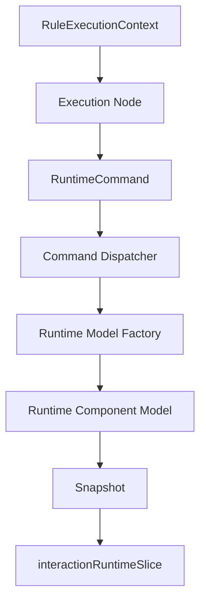
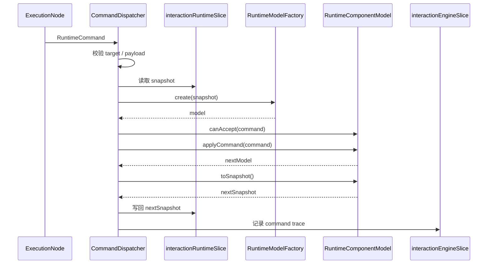

# 命令协议设计

## 1. 设计目标

交互规则引擎的执行结果不能直接操作 React 组件，也不能直接散落地修改 Redux state。规则引擎和运行时之间需要一层稳定、可扩展、可调试的标准命令协议。

本文定义：

- `RuntimeCommand` 的标准结构
- 命令目标定位规则
- 命令分类与参数约束
- 命令分发链路
- 与运行时模型对象和 store 的协作方式

相关文档：

- [交互规则前端设计](/Users/techbosch/Documents/projects/dataapp/docs/设计/04-规则体系搭建/前端设计/交互规则前端设计.md)
- [运行时模型对象设计](/Users/techbosch/Documents/projects/dataapp/docs/设计/04-规则体系搭建/前端设计/运行时模型对象设计.md)
- [执行节点协议设计](/Users/techbosch/Documents/projects/dataapp/docs/设计/04-规则体系搭建/前端设计/执行节点协议设计.md)

## 2. 命令协议定位

命令协议位于规则引擎与运行态之间：



职责边界：

| 层级 | 职责 |
|---|---|
| 执行节点 | 产生命令，不直接写 store |
| 命令分发器 | 路由命令、校验目标、恢复运行时模型、回写快照 |
| 运行时模型对象 | 处理命令的具体行为 |
| Redux store | 保存命令执行后的 JSON 快照 |

## 3. 设计原则

| 原则 | 说明 |
|---|---|
| 命令标准化 | 所有规则结果统一转成 `RuntimeCommand` |
| 目标显式化 | 命令必须明确操作哪个字段、明细列、明细表或记录 |
| 行为与状态分离 | 命令描述行为，不直接描述 reducer patch |
| 可追踪 | 每条命令都可写入 trace 和诊断 |
| 可校验 | 命令分发前可做目标合法性和能力白名单校验 |
| 组件自治 | 同一命令在不同组件上由对应运行时模型解释 |

## 4. 命令总体结构

```ts
type RuntimeCommand = {
  commandId: string;
  commandType: RuntimeCommandType;
  target: RuntimeCommandTarget;
  payload?: Record<string, unknown>;
  source: {
    ruleId: string;
    nodeId: string;
    executionId: string;
  };
  options?: {
    emitEventAfterCommand?: boolean;
    retainValueOnHide?: boolean;
    silent?: boolean;
  };
};
```

字段说明：

| 字段 | 说明 |
|---|---|
| `commandId` | 命令唯一标识，用于日志与调试 |
| `commandType` | 命令类型，如 `setValue`、`setOptions` |
| `target` | 命令操作目标 |
| `payload` | 命令参数 |
| `source` | 命令来源规则、节点、执行实例 |
| `options` | 命令附加策略，如是否继续触发事件 |

## 5. 目标定位模型

命令必须显式指向一个运行态目标。

```ts
type RuntimeCommandTarget =
  | {
      targetType: "main_field";
      fieldKey: string;
    }
  | {
      targetType: "detail_field";
      detailTableKey: string;
      rowId: string;
      fieldKey: string;
    }
  | {
      targetType: "detail_column";
      detailTableKey: string;
      fieldKey: string;
    }
  | {
      targetType: "detail_table";
      detailTableKey: string;
    }
  | {
      targetType: "record";
    };
```

说明：

| 目标类型 | 用途 |
|---|---|
| `main_field` | 主表字段 |
| `detail_field` | 明细当前行字段 |
| `detail_column` | 明细列级状态，如隐藏整列 |
| `detail_table` | 明细表整体，如追加行、替换整表 |
| `record` | 当前记录级动作，如全局提示 |

定位约束：

1. 明细行字段必须使用 `rowId` 定位，不允许用 `rowIndex` 作为稳定主键
2. `detail_column` 只能用于列级状态命令，不用于单元格值命令
3. `record` 级命令不允许携带字段值更新语义

## 6. 命令分类

## 6.1 属性类命令

用于修改组件派生状态：

```ts
type PropertyCommandType =
  | "setVisible"
  | "setReadonly"
  | "setRequired"
  | "setDisabled"
  | "setHint";
```

示例：

```ts
{
  commandType: "setVisible",
  target: { targetType: "main_field", fieldKey: "fld_supplier" },
  payload: { value: false }
}
```

## 6.2 数据类命令

用于修改事实数据：

```ts
type DataCommandType =
  | "setValue"
  | "clearValue"
  | "appendRow"
  | "insertRow"
  | "updateRow"
  | "replaceTable"
  | "removeRow";
```

示例：

```ts
{
  commandType: "setValue",
  target: { targetType: "detail_field", detailTableKey: "dt_items", rowId: "row_1", fieldKey: "fld_qty" },
  payload: { value: 10 }
}
```

## 6.3 选项类命令

用于修改组件特有状态：

```ts
type OptionCommandType =
  | "setOptions"
  | "setFilter";
```

示例：

```ts
{
  commandType: "setOptions",
  target: { targetType: "main_field", fieldKey: "fld_customer_ref" },
  payload: {
    options: [
      { label: "华东公司 / C001", value: "rec_1" }
    ]
  }
}
```

## 6.4 反馈类命令

```ts
type FeedbackCommandType =
  | "showMessage"
  | "setValidationError"
  | "clearValidationError";
```

示例：

```ts
{
  commandType: "showMessage",
  target: { targetType: "record" },
  payload: {
    level: "warning",
    message: "无可选库存"
  }
}
```

## 6.5 总命令枚举

```ts
type RuntimeCommandType =
  | PropertyCommandType
  | DataCommandType
  | OptionCommandType
  | FeedbackCommandType;
```

## 7. 常用命令定义

## 7.1 `setValue`

功能：

- 更新主表字段或明细字段事实值

payload：

```ts
{
  value: unknown
}
```

可作用目标：

- `main_field`
- `detail_field`

## 7.2 `clearValue`

功能：

- 清空字段值

可作用目标：

- `main_field`
- `detail_field`

## 7.3 `setVisible`

功能：

- 控制字段、列、明细表整体是否可见

payload：

```ts
{
  value: boolean
}
```

可作用目标：

- `main_field`
- `detail_column`
- `detail_table`

补充策略：

- 如果 `retainValueOnHide=false`，命令分发器可联动补发 `clearValue`

## 7.4 `setReadonly`

功能：

- 控制字段或列是否只读

可作用目标：

- `main_field`
- `detail_field`
- `detail_column`
- `detail_table`

## 7.5 `setOptions`

功能：

- 更新选择类组件、关联选择组件的可选项

payload：

```ts
{
  options: RuntimeOption[]
}
```

可作用目标：

- `main_field`
- `detail_field`

限制：

- 目标组件必须具备接收 `setOptions` 的能力
- 普通输入组件不允许接收该命令

## 7.6 `appendRow`

功能：

- 向明细表追加一行

payload：

```ts
{
  row: Record<string, unknown>
}
```

可作用目标：

- `detail_table`

分发要求：

- 追加时必须生成 `rowId`
- 默认补齐 `__version=1`
- 可写入 `__origin`

## 7.7 `replaceTable`

功能：

- 覆写整张明细表

payload：

```ts
{
  rows: Record<string, unknown>[]
}
```

可作用目标：

- `detail_table`

## 8. 命令白名单与能力校验

命令分发器在真正执行前必须校验：

1. 目标是否存在
2. 目标组件是否支持该命令
3. payload 是否完整
4. 目标类型和命令类型是否匹配

示例能力矩阵：

| 组件类型 | 支持命令 |
|---|---|
| `input` | `setVisible` `setReadonly` `setRequired` `setValue` `clearValue` |
| `number` | `setVisible` `setReadonly` `setRequired` `setValue` `clearValue` |
| `select/radio/checkbox` | 上述命令 + `setOptions` |
| `relation-select` | 上述命令 + `setOptions` `setFilter` |
| `detail-table` | `setVisible` `setReadonly` `appendRow` `insertRow` `updateRow` `replaceTable` `removeRow` |

校验失败处理：

| 场景 | 处理 |
|---|---|
| 目标不存在 | 记录诊断并跳过 |
| 组件不支持命令 | 记录诊断并跳过 |
| payload 缺失 | 记录诊断并标记当前节点失败 |

## 9. 命令分发流程



步骤说明：

1. 执行节点生成标准命令
2. 命令分发器做静态校验
3. 从 store 读取目标组件快照
4. 用工厂恢复运行时模型对象
5. 由模型对象处理命令
6. 输出新快照并写回 store
7. 记录执行轨迹

## 10. 与查询缓存和上下文的关系

命令协议不负责保存完整执行上下文。

边界如下：

| 数据 | 存放位置 |
|---|---|
| 节点中间结果 | `RuleExecutionContext.temp` |
| 查询结果缓存 | `interactionRuntimeSlice.queryCache` |
| 组件运行态 | `interactionRuntimeSlice.componentState` |
| 命令执行摘要 | `interactionEngineSlice.traces` |

也就是说：

- `query` 节点先将结果放入 `temp`
- `command` 节点从 `temp` 取值生成命令
- 命令桥只处理命令本身，不负责维护 temp

## 11. 与运行时模型对象的关系

命令协议和运行时模型对象是强关联的：

| 部分 | 作用 |
|---|---|
| 命令协议 | 定义规则引擎发出的标准动作 |
| 运行时模型对象 | 决定某种组件如何解释并执行这个动作 |

一句话总结：

- 命令协议回答“规则引擎想做什么”
- 运行时模型对象回答“某个组件具体怎么做”

## 12. 风险与约束

| 风险 | 对策 |
|---|---|
| 命令类型无限膨胀 | 严格区分 P0/P1，优先保留最小命令集 |
| 一个命令承担太多语义 | 通过 `commandType + target + payload` 拆分职责 |
| 命令绕开能力校验 | 分发器统一做白名单检查 |
| 目标定位不稳定 | 明细行一律基于 `rowId` |

必须遵守的约束：

1. 所有规则结果必须先转成 `RuntimeCommand`
2. 执行节点不直接修改 store
3. 命令分发器是写运行态状态的唯一入口
4. 命令必须可被 trace 和诊断系统记录

## 13. 结论

命令协议是交互规则前端架构中的“稳定中间层”。

推荐落地方式：

1. 规则引擎输出统一的 `RuntimeCommand`
2. `CommandDispatcher` 负责目标校验与路由
3. `RuntimeComponentModel` 负责解释和执行命令
4. `interactionRuntimeSlice` 保存最终 JSON 快照

一句话总结：

**规则节点不直接改状态，而是先发命令；命令不直接改 UI，而是通过运行时模型对象落成快照。**
