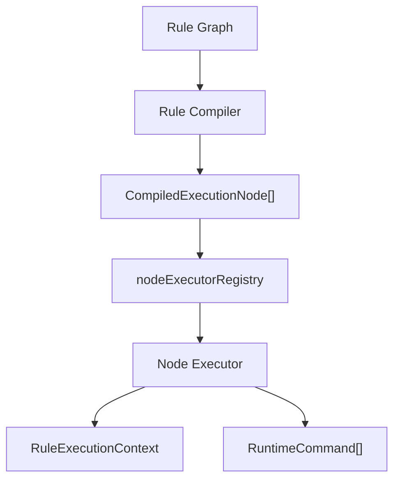
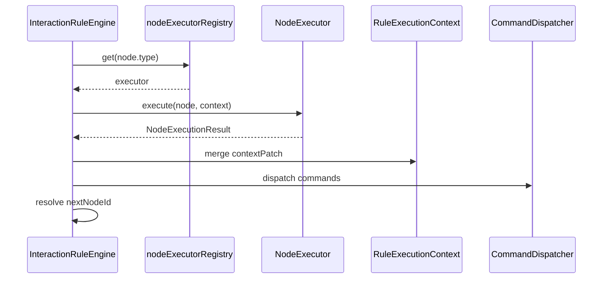

# 执行节点协议设计

## 1. 设计目标

交互规则引擎的规则图在运行时不会直接执行“图节点 UI”，而是执行一组标准化的执行节点。为了让规则编译层、规则运行层、命令协议层和调试链路稳定协作，需要单独定义执行节点协议。

本文定义：

- 执行节点的统一结构
- 各节点类型的输入、输出与配置
- `RuleExecutionContext.temp` 的读写规范
- `nodeExecutorRegistry` 的职责边界
- 执行结果与命令生成的关系

相关文档：

- [交互规则前端设计](/Users/techbosch/Documents/projects/dataapp/docs/设计/04-规则体系搭建/前端设计/交互规则前端设计.md)
- [命令协议设计](/Users/techbosch/Documents/projects/dataapp/docs/设计/04-规则体系搭建/前端设计/命令协议设计.md)
- [运行时模型对象设计](/Users/techbosch/Documents/projects/dataapp/docs/设计/04-规则体系搭建/前端设计/运行时模型对象设计.md)

## 2. 执行节点定位

执行节点位于：



职责边界：

| 层级 | 职责 |
|---|---|
| 规则图 | 编辑态编排结构 |
| 编译器 | 将图转换为线性/可分支执行节点 |
| 执行节点 | 运行时最小执行单元定义 |
| 节点执行器 | 真正执行某一类节点逻辑 |
| 命令协议 | 承接节点执行后的动作输出 |

## 3. 设计原则

| 原则 | 说明 |
|---|---|
| 原子化 | 每个执行节点只负责一类动作 |
| 标准输入输出 | 节点只通过 `RuleExecutionContext` 和标准结果交互 |
| 不直接改 store | 节点只能产生中间结果或命令 |
| 前后可追踪 | 节点执行必须能写 trace |
| 类型清晰 | 每类节点有独立配置结构和结果语义 |
| 可注册 | 新节点类型通过 registry 扩展，不修改主执行器骨架 |

## 4. 执行节点统一结构

```ts
type CompiledExecutionNode =
  | TriggerExecutionNode
  | ConditionExecutionNode
  | QueryExecutionNode
  | TransformExecutionNode
  | ContextExecutionNode
  | CommandExecutionNode
  | NoticeExecutionNode;

type BaseExecutionNode = {
  id: string;
  type: ExecutionNodeType;
  name?: string;
  next?: string;
  onFailure?: string;
  timeoutMs?: number;
  debug?: {
    enabled?: boolean;
    label?: string;
  };
};

type ExecutionNodeType =
  | "trigger"
  | "condition"
  | "query"
  | "transform"
  | "context"
  | "command"
  | "notice";
```

公共字段说明：

| 字段 | 说明 |
|---|---|
| `id` | 节点唯一标识 |
| `type` | 节点类型 |
| `next` | 默认下一节点 |
| `onFailure` | 失败分支节点 |
| `timeoutMs` | 执行超时时间 |
| `debug` | 调试标签和开关 |

## 5. 节点执行结果协议

所有节点执行器统一返回：

```ts
type NodeExecutionResult = {
  status: "success" | "failed" | "skipped";
  nextNodeId?: string;
  contextPatch?: Record<string, unknown>;
  commands?: RuntimeCommand[];
  diagnostics?: Array<{
    code: string;
    message: string;
  }>;
  trace?: {
    inputSummary?: string;
    outputSummary?: string;
  };
};
```

含义：

| 字段 | 作用 |
|---|---|
| `status` | 当前节点执行状态 |
| `nextNodeId` | 当前节点完成后跳转的下一个节点 |
| `contextPatch` | 要写入 `RuleExecutionContext.temp` 的补丁 |
| `commands` | 当前节点产出的命令 |
| `diagnostics` | 节点级诊断 |
| `trace` | 调试摘要 |

## 6. `RuleExecutionContext.temp` 读写规范

执行节点运行时不能随意写上下文，统一遵循如下规范。

## 6.1 写入规则

| 节点类型 | 是否允许写 `temp` | 写入方式 |
|---|---|---|
| `trigger` | 否 | 只读事件 |
| `condition` | 否 | 只输出布尔结果，不落 temp |
| `query` | 是 | 通过 `saveAs` 写入 |
| `transform` | 是 | 通过 `output` 写入 |
| `context` | 是 | 通过 `saveAs` 写入 |
| `command` | 否 | 产生命令，不写 temp |
| `notice` | 否 | 只产出 trace/diagnostic |

## 6.2 命名规则

建议统一使用驼峰命名：

- `selectedCustomer`
- `customerOptions`
- `detailRows`
- `totalAmount`

禁止：

- 使用带空格或特殊字符的 key
- 写入与系统字段冲突的 key，如 `event`、`runtimeSnapshot`

## 6.3 生命周期

`temp` 中的数据仅在当前 `execution` 内有效：

1. 执行开始时为空对象
2. 每个节点执行后可向 `temp` 追加数据
3. 整条规则结束后随 `RuleExecutionContext` 一起释放

## 7. 节点类型定义

## 7.1 触发节点 `trigger`

功能：

- 声明当前规则由哪个标准事件触发
- 作为规则链起点

定义：

```ts
type TriggerExecutionNode = BaseExecutionNode & {
  type: "trigger";
  eventType:
    | "FIELD_CHANGE_MAIN"
    | "FIELD_CHANGE_DETAIL"
    | "DETAIL_ROW_ADDED"
    | "DETAIL_ROW_REMOVED"
    | "RELATION_OPEN"
    | "RELATION_SELECTED"
    | "FORM_INIT"
    | "FORM_SUBMIT_BEFORE";
  target?: string;
  scope: "MAIN_FIELD" | "DETAIL_ROW" | "RECORD";
};
```

输入：

- `RuleExecutionContext.event`

输出：

- 不写 `temp`
- 只决定规则是否可进入正式执行链

## 7.2 条件节点 `condition`

功能：

- 对当前上下文做布尔判断
- 决定分支流向

定义：

```ts
type ConditionExecutionNode = BaseExecutionNode & {
  type: "condition";
  expression: RuntimeExpression;
  branches: {
    whenTrue?: string;
    whenFalse?: string;
    whenEmpty?: string;
    whenNonEmpty?: string;
  };
};
```

输入：

- `event`
- `runtimeSnapshot`
- `temp`

输出：

- 不写 `temp`
- `nextNodeId`

## 7.3 查询节点 `query`

功能：

- 查询当前表单、明细、关联表记录、上下文变量

定义：

```ts
type QueryExecutionNode = BaseExecutionNode & {
  type: "query";
  sourceType: "current_form" | "detail_rows" | "relation_records" | "context";
  sourceFormId?: string;
  fieldSelection?: string[];
  filters?: RuntimeFilterExpression[];
  sorters?: RuntimeSorter[];
  pageSize?: number;
  cachePolicy?: "none" | "session" | "ttl";
  ttlMs?: number;
  saveAs: string;
};
```

输入：

- `runtimeSnapshot`
- `scope`
- `temp`

输出：

- `contextPatch = { [saveAs]: queryResult }`

## 7.4 转换节点 `transform`

功能：

- 字段映射
- 结构转换
- 排序/过滤
- 聚合
- 表达式计算

定义：

```ts
type TransformExecutionNode = BaseExecutionNode & {
  type: "transform";
  input: string;
  transformType: "field_mapping" | "filter" | "sort" | "aggregate" | "expression" | "option_mapping";
  mapping?: Record<string, unknown>;
  aggregateFn?: "sum" | "count" | "max" | "min" | "avg";
  expression?: string;
  output: string;
};
```

输入：

- `temp[input]`
- 必要时读取 `runtimeSnapshot`

输出：

- `contextPatch = { [output]: transformedResult }`

## 7.5 上下文节点 `context`

功能：

- 对上下文变量做重命名、合并、追加
- 将复杂链路中的中间结果显式固化

定义：

```ts
type ContextExecutionNode = BaseExecutionNode & {
  type: "context";
  valueFrom: string;
  saveAs: string;
  mergeStrategy: "replace" | "merge" | "append";
};
```

输入：

- `temp`
- `runtimeSnapshot`

输出：

- `contextPatch = { [saveAs]: nextValue }`

## 7.6 命令节点 `command`

功能：

- 将上下文变量或字面量转成标准 `RuntimeCommand`

定义：

```ts
type CommandExecutionNode = BaseExecutionNode & {
  type: "command";
  commandType: RuntimeCommandType;
  target: RuntimeCommandTargetTemplate;
  valueFrom?: string;
  literalValue?: unknown;
  options?: {
    emitEventAfterCommand?: boolean;
    retainValueOnHide?: boolean;
  };
};
```

输入：

- `temp[valueFrom]`
- `runtimeSnapshot`

输出：

- `commands: RuntimeCommand[]`

说明：

- `command` 节点不直接修改 `temp`
- 如果需要组合多个命令，编译器应展开成多个 `command` 节点或一个节点输出多个命令

## 7.7 反馈节点 `notice`

功能：

- 用户提示
- 执行链路标注

定义：

```ts
type NoticeExecutionNode = BaseExecutionNode & {
  type: "notice";
  level: "info" | "warning" | "error";
  messageTemplate: string;
  writeTrace?: boolean;
};
```

输入：

- `temp`
- `runtimeSnapshot`

输出：

- 通常产出 `showMessage` 命令，或只写 `trace`

## 8. 节点执行器接口

每种节点类型对应一个执行器。

```ts
interface ExecutionNodeExecutor<T extends CompiledExecutionNode = CompiledExecutionNode> {
  readonly type: T["type"];

  execute(node: T, context: RuleExecutionContext): Promise<NodeExecutionResult> | NodeExecutionResult;
}
```

职责：

| 方法 | 作用 |
|---|---|
| `type` | 标识该执行器负责哪种节点类型 |
| `execute` | 执行节点逻辑，返回标准结果 |

## 9. `nodeExecutorRegistry`

为避免主执行器里堆积大量 `switch/case`，建议使用注册中心。

```ts
class NodeExecutorRegistry {
  private executors = new Map<ExecutionNodeType, ExecutionNodeExecutor>();

  register(executor: ExecutionNodeExecutor) {
    this.executors.set(executor.type, executor);
  }

  get(type: ExecutionNodeType) {
    return this.executors.get(type);
  }
}
```

职责：

- 维护节点类型到执行器的映射
- 在引擎运行时提供执行器解析
- 控制节点执行器扩展边界

注册关系示例：

| 节点类型 | 执行器 |
|---|---|
| `trigger` | `TriggerNodeExecutor` |
| `condition` | `ConditionNodeExecutor` |
| `query` | `QueryNodeExecutor` |
| `transform` | `TransformNodeExecutor` |
| `context` | `ContextNodeExecutor` |
| `command` | `CommandNodeExecutor` |
| `notice` | `NoticeNodeExecutor` |

## 10. 标准执行流程



步骤说明：

1. 引擎按节点 ID 取当前节点
2. 从 registry 找到对应执行器
3. 执行器读取上下文并输出结果
4. 引擎合并 `contextPatch`
5. 如有命令，交由命令分发器执行
6. 根据 `nextNodeId` 或默认 `next` 继续执行

## 11. 典型例子

## 11.1 关联选择候选项加载

规则链：

1. `trigger(RELATION_OPEN)`
2. `query(source=relation_records, saveAs=customerRecords)`
3. `transform(input=customerRecords, output=customerOptions, transformType=option_mapping)`
4. `command(commandType=setOptions, valueFrom=customerOptions)`

上下文演进：

```ts
temp = {}
temp.customerRecords = [...]
temp.customerOptions = [...]
```

最终输出：

- `setOptions(target=fld_customer_ref, options=customerOptions)`

## 11.2 明细汇总到主表

规则链：

1. `trigger(FIELD_CHANGE_DETAIL)`
2. `query(source=detail_rows, saveAs=detailRows)`
3. `transform(input=detailRows, transformType=aggregate, aggregateFn=sum, output=totalAmount)`
4. `command(commandType=setValue, target=main.totalAmount, valueFrom=totalAmount)`

最终输出：

- `setValue(main_field=fld_total_amount, value=400)`

## 12. 风险与约束

| 风险 | 对策 |
|---|---|
| 节点类型膨胀 | P0 只保留 7 类标准节点 |
| 节点执行器里混入业务逻辑 | 节点执行器只处理当前表单交互逻辑，不处理事务语义 |
| temp 被滥用成全局状态 | 严格限制 temp 生命周期为单次 execution |
| command 节点承担过多逻辑 | command 只负责产生命令，不做状态写入 |

必须遵守的约束：

1. 节点执行器不直接修改 Redux store
2. 节点执行器不直接操作 React 组件实例
3. 所有节点结果统一返回 `NodeExecutionResult`
4. 所有中间数据通过 `contextPatch -> temp` 写入
5. 所有动作通过 `RuntimeCommand` 落到运行时状态

## 13. 结论

执行节点协议是规则编译层和规则运行层之间的稳定契约。

推荐落地方式：

1. 编译器将规则图转换为 `CompiledExecutionNode[]`
2. 运行时通过 `nodeExecutorRegistry` 按类型执行节点
3. 节点只读写 `RuleExecutionContext` 和标准结果
4. 状态变更统一通过命令协议和命令分发器落地

一句话总结：

**规则图负责表达流程，执行节点负责表达运行契约，节点执行器负责真正做事。**
