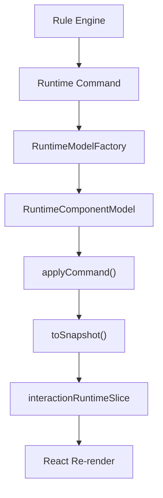
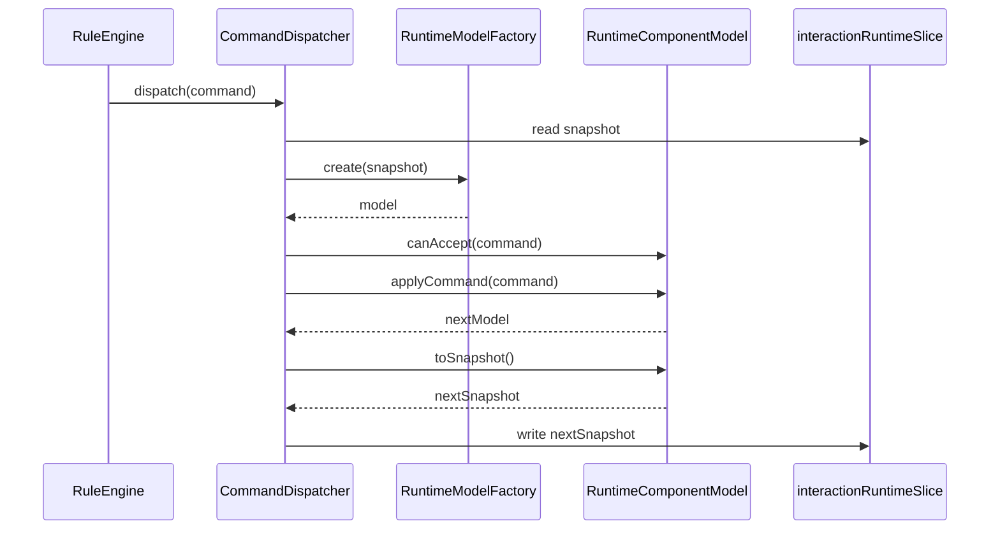

# 运行时模型对象设计

## 1. 设计目标

随着交互规则阶段的推进，前端运行态复杂度不再只是“字段值 + 通用状态”，而是逐渐演化为：

- 不同组件能接收不同命令
- 不同组件有自己的通用状态和扩展状态
- 不同组件对同一命令的处理方式不同
- 命令桥和 reducer 中的分支逻辑会持续膨胀

为了承载这部分复杂度，本文引入“运行时模型对象”设计，用对象封装组件运行时行为，但仍保持 Redux store 中只保存 JSON 快照。

相关文档：

- [交互规则前端设计](/Users/techbosch/Documents/projects/dataapp/docs/设计/04-规则体系搭建/前端设计/交互规则前端设计.md)
- [命令协议设计](/Users/techbosch/Documents/projects/dataapp/docs/设计/04-规则体系搭建/前端设计/命令协议设计.md)
- [执行节点协议设计](/Users/techbosch/Documents/projects/dataapp/docs/设计/04-规则体系搭建/前端设计/执行节点协议设计.md)

核心结论：

1. 可以使用面向对象方式封装组件运行时行为
2. 不建议把对象实例直接存入 Redux
3. 推荐采用“运行时对象负责行为，store 负责 JSON 快照”的模式

## 2. 适用范围与边界

运行时模型对象只负责当前表单内单个组件实例的运行时行为，不负责：

- 规则匹配
- 规则编排
- 业务事务判断
- 直接操作 Redux store
- 直接操作 React 组件实例

它的定位是：

| 层级 | 职责 |
|---|---|
| 规则引擎 | 决定触发哪条规则、产生什么命令 |
| 运行时模型对象 | 决定某个组件如何接受和处理命令 |
| Store | 保存处理后的状态快照 |
| React UI | 根据快照重新渲染 |

## 3. 为什么要引入运行时模型对象

当前基于 `slice + command bridge + 联合类型状态` 的方案是成立的，但随着组件数量增加，会遇到以下问题：

| 问题 | 影响 |
|---|---|
| 命令桥持续膨胀 | `switch/case` 越来越大，组件差异逻辑不断堆积 |
| 组件行为分散 | 初始化、命令处理、状态合并逻辑分散在 reducer、selector、渲染器中 |
| 特殊组件复杂度快速上升 | 关联选择、明细表、上传类组件很快超出简单 reducer 能力边界 |
| 测试粒度不理想 | 很难只针对某个组件的命令处理规则做独立测试 |

引入运行时模型对象后，可以把“某个组件如何响应命令”内聚到该组件对应的模型中。

## 4. 总体方案

推荐采用：

- store 中只保存组件运行态快照
- 命令执行时临时构造运行时模型对象
- 模型对象处理命令后输出新快照
- 再由命令桥将快照写回 store

整体链路如下：



这意味着：

- 行为由对象承载
- 状态持久化仍由 JSON 承载
- DevTools、序列化、回放能力不被破坏

## 5. 核心设计原则

| 原则 | 说明 |
|---|---|
| 行为与存储分离 | 对象负责行为，store 负责快照 |
| 不在 Redux 中存对象 | store 中只保留可序列化 JSON |
| 单组件自治 | 每种组件自己处理自己能接受的命令 |
| 统一命令协议 | 所有模型对象都基于统一 `RuntimeCommand` 工作，具体定义见[命令协议设计](/Users/techbosch/Documents/projects/dataapp/docs/设计/04-规则体系搭建/前端设计/命令协议设计.md) |
| 不可变输出 | 处理命令后返回新的快照，不直接改 store |
| 规则与组件解耦 | 规则引擎不关心组件内部状态结构 |

## 6. 核心接口设计

## 6.1 运行时快照结构

```ts
type RuntimeComponentSnapshot = {
  componentType: string;
  meta: Record<string, unknown>;
  value: unknown;
  state: Record<string, unknown>;
};
```

说明：

| 字段 | 作用 |
|---|---|
| `componentType` | 标识组件类型，如 `input`、`relation-select` |
| `meta` | 组件元信息，来源于 schema 编译结果 |
| `value` | 当前组件事实值 |
| `state` | 当前组件运行时状态，如 visible、options 等 |

## 6.2 运行时模型接口

```ts
interface RuntimeComponentModel {
  readonly componentType: string;

  canAccept(command: RuntimeCommand): boolean;

  applyCommand(command: RuntimeCommand): RuntimeComponentModel;

  getValue(): unknown;

  getState(): Record<string, unknown>;

  toSnapshot(): RuntimeComponentSnapshot;
}
```

接口说明：

| 方法 | 作用 |
|---|---|
| `canAccept` | 判断组件是否支持某类命令 |
| `applyCommand` | 应用命令，返回新的运行时模型对象 |
| `getValue` | 返回当前事实值 |
| `getState` | 返回当前运行时状态 |
| `toSnapshot` | 输出可持久化快照 |

## 6.3 基础抽象类

建议提供基础类，承载所有字段共享的通用状态逻辑：

```ts
abstract class BaseFieldRuntimeModel implements RuntimeComponentModel {
  abstract readonly componentType: string;

  constructor(
    protected meta: Record<string, unknown>,
    protected value: unknown,
    protected state: Record<string, unknown>
  ) {}

  canAccept(command: RuntimeCommand): boolean {
    return ["setVisible", "setReadonly", "setRequired", "setValue", "clearValue"].includes(command.commandType);
  }

  applyCommand(command: RuntimeCommand): RuntimeComponentModel {
    switch (command.commandType) {
      case "setVisible":
        return this.cloneWithState({ ...this.state, visible: command.value });
      case "setReadonly":
        return this.cloneWithState({ ...this.state, readonly: command.value });
      case "setRequired":
        return this.cloneWithState({ ...this.state, required: command.value });
      case "setValue":
        return this.cloneWithValue(command.value);
      case "clearValue":
        return this.cloneWithValue(undefined);
      default:
        return this;
    }
  }

  abstract cloneWithValue(value: unknown): RuntimeComponentModel;

  abstract cloneWithState(state: Record<string, unknown>): RuntimeComponentModel;

  getValue() {
    return this.value;
  }

  getState() {
    return this.state;
  }

  toSnapshot(): RuntimeComponentSnapshot {
    return {
      componentType: this.componentType,
      meta: this.meta,
      value: this.value,
      state: this.state,
    };
  }
}
```

## 7. 典型组件模型

## 7.1 关联选择组件

```ts
class RelationSelectRuntimeModel extends BaseFieldRuntimeModel {
  readonly componentType = "relation-select";

  canAccept(command: RuntimeCommand): boolean {
    if (super.canAccept(command)) {
      return true;
    }
    return ["setOptions", "setFilter"].includes(command.commandType);
  }

  applyCommand(command: RuntimeCommand): RuntimeComponentModel {
    if (super.canAccept(command)) {
      return super.applyCommand(command);
    }

    switch (command.commandType) {
      case "setOptions":
        return this.cloneWithState({
          ...this.state,
          relation: {
            ...(this.state.relation ?? {}),
            options: command.options,
          },
        });
      case "setFilter":
        return this.cloneWithState({
          ...this.state,
          relation: {
            ...(this.state.relation ?? {}),
            filter: command.filter,
          },
        });
      default:
        return this;
    }
  }

  cloneWithValue(value: unknown) {
    return new RelationSelectRuntimeModel(this.meta, value, this.state);
  }

  cloneWithState(state: Record<string, unknown>) {
    return new RelationSelectRuntimeModel(this.meta, this.value, state);
  }
}
```

适用命令：

- `setVisible`
- `setReadonly`
- `setRequired`
- `setValue`
- `clearValue`
- `setOptions`
- `setFilter`

## 7.2 普通选择组件

```ts
class SelectRuntimeModel extends BaseFieldRuntimeModel {
  readonly componentType = "select";

  canAccept(command: RuntimeCommand): boolean {
    if (super.canAccept(command)) {
      return true;
    }
    return command.commandType === "setOptions";
  }

  applyCommand(command: RuntimeCommand): RuntimeComponentModel {
    if (super.canAccept(command)) {
      return super.applyCommand(command);
    }

    if (command.commandType === "setOptions") {
      return this.cloneWithState({
        ...this.state,
        select: {
          ...(this.state.select ?? {}),
          options: command.options,
        },
      });
    }

    return this;
  }

  cloneWithValue(value: unknown) {
    return new SelectRuntimeModel(this.meta, value, this.state);
  }

  cloneWithState(state: Record<string, unknown>) {
    return new SelectRuntimeModel(this.meta, this.value, state);
  }
}
```

## 7.3 明细表组件

明细表的复杂度更高，建议单独模型对象承载：

```ts
class DetailTableRuntimeModel implements RuntimeComponentModel {
  readonly componentType = "detail-table";

  constructor(
    private meta: Record<string, unknown>,
    private value: unknown,
    private state: Record<string, unknown>
  ) {}

  canAccept(command: RuntimeCommand) {
    return [
      "setVisible",
      "setReadonly",
      "appendRow",
      "updateRow",
      "replaceTable",
      "setColumnVisible",
      "setRowState",
    ].includes(command.commandType);
  }

  applyCommand(command: RuntimeCommand) {
    return this;
  }

  getValue() {
    return this.value;
  }

  getState() {
    return this.state;
  }

  toSnapshot() {
    return {
      componentType: this.componentType,
      meta: this.meta,
      value: this.value,
      state: this.state,
    };
  }
}
```

说明：

- 明细表建议独立建模，不和普通字段共用同一个基类逻辑
- 明细表类更适合承载行级/列级命令处理

## 8. 工厂模式

为了让命令桥不直接依赖每个具体类，建议引入工厂：

```ts
class RuntimeModelFactory {
  static create(snapshot: RuntimeComponentSnapshot): RuntimeComponentModel {
    switch (snapshot.componentType) {
      case "relation-select":
        return new RelationSelectRuntimeModel(snapshot.meta, snapshot.value, snapshot.state);
      case "select":
      case "radio":
      case "checkbox":
        return new SelectRuntimeModel(snapshot.meta, snapshot.value, snapshot.state);
      case "detail-table":
        return new DetailTableRuntimeModel(snapshot.meta, snapshot.value, snapshot.state);
      default:
        return new GenericFieldRuntimeModel(snapshot.meta, snapshot.value, snapshot.state);
    }
  }
}
```

职责：

- 从 JSON 快照恢复运行时对象
- 将组件类型和具体实现解耦
- 为命令桥和 selector 提供统一入口

## 9. 命令执行链路

命令桥流程调整为：

1. 从 store 读取组件快照
2. 用 `RuntimeModelFactory` 构造对象
3. 调用 `canAccept(command)` 做命令白名单校验
4. 调用 `applyCommand(command)` 生成新的对象
5. 调用 `toSnapshot()` 生成新的 JSON 快照
6. 将快照写回 store

时序图：



## 10. 与当前交互规则架构的关系

运行时模型对象设计不是替代当前的 `interactionRuntimeSlice`，而是补充一层“行为模型层”。

关系如下：

| 层级 | 承载形式 |
|---|---|
| `interactionRuntimeSlice` | JSON 快照 |
| `RuleExecutionContext` | 单次执行上下文 |
| `RuntimeComponentModel` | 组件行为对象 |
| React 渲染层 | 读取快照渲染 UI |

也就是说：

- store 仍然是单一事实来源
- 对象只是命令处理时的中间行为载体
- UI 不直接持有对象实例

## 11. 与当前纯数据方案的对比

| 方案 | 优点 | 风险 |
|---|---|---|
| 纯 reducer / 纯数据分发 | 简单直接，易上手 | 命令桥和组件差异逻辑容易持续膨胀 |
| 对象直接入 store | 行为聚合度高 | 不可序列化、调试差、回放困难，不推荐 |
| 运行时对象 + JSON 快照 | 兼顾封装性和可观测性 | 需要多一层工厂和序列化转换 |

推荐结论：

- 不要在 Redux 中存对象实例
- 使用运行时模型对象承载组件命令处理复杂度
- 使用 JSON 快照继续承载全局状态

## 12. 适用性判断

适合引入运行时模型对象的场景：

- 组件类型持续增多
- 每类组件有不同命令白名单
- 每类组件拥有各自扩展状态
- 需要独立测试组件命令处理逻辑

不建议引入的场景：

- 只是简单 demo
- 组件类型极少
- 命令类型固定且差异很小

对当前项目的判断：

- 已经存在主表、明细表、关联选择、后续还会继续扩展
- 不同组件的状态和命令处理差异正在增加

因此，引入运行时模型对象是值得的。

## 13. 风险与约束

| 风险 | 对策 |
|---|---|
| 对象和 store 职责混淆 | 明确对象只处理命令，不直接操作 store |
| 模型对象成为另一套隐藏状态 | 所有对象必须可从 snapshot 完整恢复，并能回写 snapshot |
| 组件实现过度自由 | 使用统一接口、工厂和命令白名单约束 |
| 调试困难 | store 仍保留快照，execution trace 保留命令处理轨迹 |

必须遵守的约束：

1. Redux store 中只保存 JSON 快照
2. 模型对象不持有 store 引用
3. 模型对象不判断业务规则，只处理命令
4. 命令仍由规则引擎生成，模型对象只是执行命令

## 14. 结论

运行时模型对象设计是对当前交互规则前端架构的一次局部增强，而不是重构底座。

最终推荐方案是：

1. 保留 `interactionRuntimeSlice` 作为 JSON 快照状态容器
2. 新增 `RuntimeComponentModel` 体系承载组件行为
3. 通过 `RuntimeModelFactory` 在命令执行时恢复对象
4. 通过 `applyCommand -> toSnapshot` 将新状态写回 store

一句话总结：

**用面向对象模型承载组件运行时行为，用 JSON snapshot 承载全局状态。**
