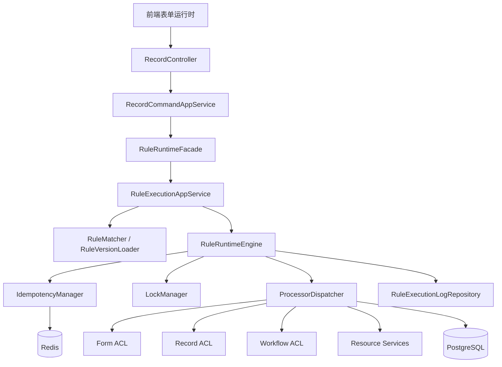
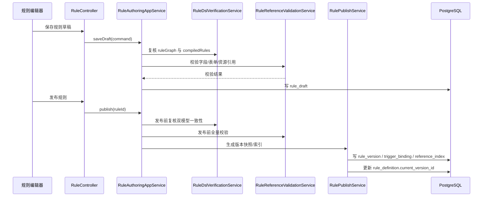
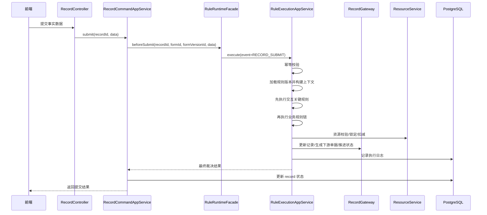
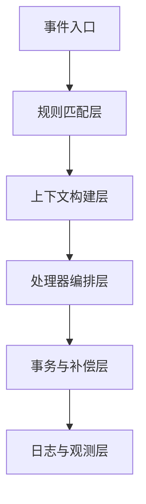

# 多表单规则体系后端架构设计

## 1. 设计目标

基于 `docs/需求/04-规则体系搭建` 下的需求，结合当前后端已落地的模块化单体架构，本阶段后端设计目标不是简单增加“规则表”，而是补齐一套可持续演进的规则中心与运行时体系，支撑多表单场景下的交互规则校验承接、服务端事务规则执行、规则版本治理、执行观测与失败补偿。

本设计严格沿用当前项目已形成的技术风格：

| 维度 | 现状 | 本次设计延续方式 |
|---|---|---|
| 架构形态 | Spring Boot 模块化单体 | 继续单体优先，保留后续拆分空间 |
| 领域组织 | `interfaces -> application -> domain -> infrastructure` | 规则中心按同样分层建设 |
| 核心模块 | `form`、`record` 已形成聚合与仓储 | 新增 `rule` 作为独立限界上下文 |
| 数据基座 | PostgreSQL + Flyway + Redis | 规则定义与执行日志落 PostgreSQL，运行态加 Redis |
| 数据模型 | 表单版本、记录版本快照已存在 | 规则定义与规则版本同样采用快照发布 |

## 2. 与现有架构的衔接原则

### 2.1 模块职责重新明确

| 模块 | 本阶段职责 | 不负责内容 |
|---|---|---|
| `dataapp-form` | 表单定义、字段索引、表单版本发布、字段引用合法性校验 | 不直接执行业务规则 |
| `dataapp-record` | 记录创建、草稿保存、事实数据提交、记录历史 | 不承载复杂跨表事务 |
| `dataapp-rule` | 规则定义、版本管理、运行时执行、幂等、补偿、执行日志 | 不管理表单设计器元信息 |
| `dataapp-workflow` | 审批流转 | 不负责规则编排与执行 |
| `dataapp-audit` | 操作审计 | 不负责规则运行链路明细 |

### 2.2 后端边界定义

| 规则类型 | 编辑态挂载位置 | 运行态入口 | 最终归属 |
|---|---|---|---|
| 交互规则 | 表单编辑器下按表单版本配置 | 草稿保存、提交前校验、导入校验时由后端重放关键规则 | `rule` 上下文 |
| 业务规则 | 规则中心或表单下业务规则入口 | 提交、状态变更、回调、定时补偿 | `rule` 上下文 |
| 基础字段校验 | 表单 schema 自身属性 | 草稿保存、提交 | `record` + `form` |

核心原则：前端负责“即时交互体验”，后端负责“最终裁决和事务结果”。后端不重复做所有前端 UI 动作，但必须重放关键联动、计算、唯一性和生命周期规则，保证提交结果可信。

## 3. 目标总体架构



### 3.1 推荐代码组织

```text
backend
├── dataapp-form
├── dataapp-record
├── dataapp-rule
│   └── src/main/java/com/dataapp/rule
│       ├── interfaces
│       │   ├── rest
│       │   └── dto
│       ├── application
│       │   ├── service
│       │   ├── command
│       │   └── facade
│       ├── domain
│       │   ├── model
│       │   │   ├── aggregate
│       │   │   ├── entity
│       │   │   ├── valueobject
│       │   │   └── event
│       │   ├── service
│       │   └── repository
│       └── infrastructure
│           ├── persistence
│           ├── runtime
│           ├── lock
│           └── gateway
└── dataapp-workflow
```

## 4. 表结构设计

本节分为两部分：

1. 在现有表基础上的保留与增强
2. 规则中心新增表结构

### 4.1 现有表复用关系

| 现有表 | 用途 | 在新架构中的角色 |
|---|---|---|
| `form_definition` | 表单定义主表 | 规则归属对象的主身份 |
| `form_version` | 表单发布版本 | 交互规则绑定的发布边界 |
| `form_field` | 表单当前字段索引 | 编辑态规则引用校验基础 |
| `form_version_field` | 发布版字段索引 | 运行态规则字段解析基础 |
| `record_main` | 记录主表 | 业务事件主载体 |
| `record_data` | 主表数据 JSON | 规则运行事实输入之一 |
| `record_detail` | 明细行数据 | 规则作用域计算基础 |
| `record_history` | 记录历史 | 规则执行后的业务轨迹补充审计 |

结合前端设计复检，现有 `record_detail` 只有 `row_no` 还不够。前端运行态已经明确要求明细行具备稳定 `rowId` 和行版本，否则删除、排序、异步回填后会出现错位。因此后端架构需要把明细行稳定标识纳入基础数据模型。

### 4.1.1 建议增强现有表 `record_detail`

| 字段 | 类型 | 约束 | 说明 |
|---|---|---|---|
| `row_id` | varchar(64) | not null | 明细行稳定标识，对齐前端 `__rowId` |
| `row_version` | integer | not null default 1 | 行版本号，用于异步结果校验和并发保护 |
| `row_origin` | varchar(32) | null | `default` / `manual` / `relation_fill` / `import` |
| `row_status` | varchar(32) | not null default 'ACTIVE' | `ACTIVE` / `DELETED` |

建议约束：

| 约束/索引 | 说明 |
|---|---|
| `uk_record_detail_row_id` | `(record_id, detail_table_key, row_id)` 唯一 |
| 保留 `row_no` | 继续作为展示排序字段，不再作为运行态唯一定位键 |

### 4.2 新增规则定义主表 `rule_definition`

用途：规则逻辑身份，不直接承载可执行内容，类似 `form_definition`。

| 字段 | 类型 | 约束 | 说明 |
|---|---|---|---|
| `id` | bigint | PK | 规则定义 ID |
| `tenant_id` | bigint | not null | 租户隔离 |
| `rule_code` | varchar(64) | not null | 规则编码，全局或租户内唯一 |
| `rule_name` | varchar(128) | not null | 规则名称 |
| `rule_type` | varchar(32) | not null | `INTERACTION` / `BUSINESS` |
| `biz_domain` | varchar(64) | not null | 业务域，如 `ORDER`、`PROJECT` |
| `form_id` | bigint | null | 交互规则归属表单；纯业务规则可为空 |
| `event_type` | varchar(64) | not null | 触发事件类型 |
| `scope_type` | varchar(32) | not null | `FORM` / `FORM_VERSION` / `GLOBAL` |
| `status` | varchar(32) | not null | `DRAFT` / `ACTIVE` / `INACTIVE` / `DELETED` |
| `current_version_id` | bigint | null | 当前生效版本 |
| `description` | varchar(512) | not null default '' | 说明 |
| `created_by` | bigint | not null | 创建人 |
| `created_at` | timestamptz | not null | 创建时间 |
| `updated_by` | bigint | not null | 更新人 |
| `updated_at` | timestamptz | not null | 更新时间 |
| `deleted` | boolean | not null default false | 逻辑删除 |

建议索引：

| 索引 | 字段 |
|---|---|
| `uk_rule_definition_code` | `(tenant_id, rule_code)` |
| `idx_rule_definition_form` | `(tenant_id, form_id, rule_type)` |
| `idx_rule_definition_event` | `(tenant_id, event_type, status)` |

### 4.3 规则草稿表 `rule_draft`

用途：与 `form_draft` 对齐，保存规则编排草稿。

| 字段 | 类型 | 约束 | 说明 |
|---|---|---|---|
| `id` | bigint | PK | 草稿 ID |
| `tenant_id` | bigint | not null | 租户 |
| `rule_id` | bigint | not null | 对应规则定义 |
| `draft_json` | jsonb | not null | 草稿完整配置 |
| `graph_json` | jsonb | not null | 流程图结构，便于编辑态回显 |
| `compiled_json` | jsonb | not null | 前端编译后的 DSL 快照 |
| `normalized_json` | jsonb | not null | 标准化后的执行结构 |
| `version` | integer | not null default 0 | 草稿版本号 |
| `checksum` | varchar(64) | not null | 用于乐观锁与幂等比较 |
| `compiler_version` | varchar(32) | not null default '' | 前端编译器版本 |
| `updated_by` | bigint | not null | 更新人 |
| `updated_at` | timestamptz | not null | 更新时间 |

约束：

| 约束 | 说明 |
|---|---|
| `uk_rule_draft_rule` | 每个 `rule_id` 仅一份当前草稿 |

### 4.4 规则发布版本表 `rule_version`

用途：规则发布后的不可变快照，是运行态唯一加载对象。

| 字段 | 类型 | 约束 | 说明 |
|---|---|---|---|
| `id` | bigint | PK | 版本 ID |
| `tenant_id` | bigint | not null | 租户 |
| `rule_id` | bigint | not null | 规则定义 ID |
| `version_no` | integer | not null | 版本号 |
| `rule_type` | varchar(32) | not null | 冗余加速查询 |
| `form_id` | bigint | null | 表单 ID |
| `form_version_id` | bigint | null | 若按表单版本发布则必填 |
| `event_type` | varchar(64) | not null | 触发事件 |
| `priority` | integer | not null default 100 | 执行优先级，建议与前端统一为“数值越大优先级越高” |
| `published_snapshot_json` | jsonb | not null | 完整发布快照 |
| `compiled_json` | jsonb | not null | 前端编译后的 DSL 快照 |
| `normalized_json` | jsonb | not null | 运行态标准结构 |
| `dependency_json` | jsonb | not null | 字段依赖图、资源依赖图 |
| `failure_policy` | jsonb | not null | 规则级失败策略 |
| `compiler_version` | varchar(32) | not null default '' | 编译器版本 |
| `published_by` | bigint | not null | 发布人 |
| `published_at` | timestamptz | not null | 发布时间 |
| `status` | varchar(32) | not null default 'ACTIVE' | `ACTIVE` / `INACTIVE` / `ROLLED_BACK` |

建议索引：

| 索引 | 字段 |
|---|---|
| `uk_rule_version_rule_no` | `(rule_id, version_no)` |
| `idx_rule_version_event` | `(tenant_id, rule_type, event_type, status)` |
| `idx_rule_version_form_event` | `(tenant_id, form_id, form_version_id, event_type, status)` |

### 4.5 规则触发器索引表 `rule_trigger_binding`

用途：避免运行时每次全表扫描版本 JSON。

| 字段 | 类型 | 约束 | 说明 |
|---|---|---|---|
| `id` | bigint | PK | 主键 |
| `tenant_id` | bigint | not null | 租户 |
| `rule_version_id` | bigint | not null | 规则版本 |
| `trigger_type` | varchar(64) | not null | 如 `RECORD_SUBMIT`、`STATUS_CHANGED` |
| `trigger_target` | varchar(128) | null | 字段、组件、按钮、状态等目标 |
| `trigger_scope` | varchar(32) | not null | `MAIN_FIELD` / `DETAIL_ROW` / `RECORD` / `GLOBAL` |
| `condition_expr` | varchar(1024) | null | 轻量过滤表达式摘要 |
| `sort_no` | integer | not null default 0 | 同触发器下执行顺序 |
| `created_at` | timestamptz | not null | 创建时间 |

建议索引：

| 索引 | 字段 |
|---|---|
| `idx_rule_trigger_match` | `(tenant_id, trigger_type, trigger_target, trigger_scope)` |
| `idx_rule_trigger_version` | `(rule_version_id)` |

前后端事件命名建议统一如下：

| 前端事件 | 后端标准事件 |
|---|---|
| `field.change` + `scope=MAIN` | `FIELD_CHANGE_MAIN` |
| `field.change` + `scope=DETAIL` | `FIELD_CHANGE_DETAIL` |
| `detail.row.added` | `DETAIL_ROW_ADDED` |
| `detail.row.removed` | `DETAIL_ROW_REMOVED` |
| `relation.open` | `RELATION_OPEN` |
| `relation.selected` | `RELATION_SELECTED` |
| `form.init` | `FORM_INIT` |
| `form.submit.before` | `FORM_SUBMIT_BEFORE` |
| 正式提交 | `RECORD_SUBMIT` |
| 审批状态变化 | `WORKFLOW_STATUS_CHANGED` |

### 4.6 规则引用索引表 `rule_reference_index`

用途：发布前做字段/表单/资源引用校验，也用于删除影响分析。

| 字段 | 类型 | 约束 | 说明 |
|---|---|---|---|
| `id` | bigint | PK | 主键 |
| `tenant_id` | bigint | not null | 租户 |
| `rule_version_id` | bigint | not null | 规则版本 |
| `ref_type` | varchar(32) | not null | `FORM` / `FORM_FIELD` / `FORM_VERSION_FIELD` / `RESOURCE` / `RULE_VAR` |
| `ref_key` | varchar(128) | not null | 统一引用键 |
| `ref_name` | varchar(256) | not null default '' | 冗余名称 |
| `scope_type` | varchar(32) | not null | 主表、明细、资源等作用域 |
| `required` | boolean | not null default true | 是否强依赖 |
| `created_at` | timestamptz | not null | 创建时间 |

建议索引：

| 索引 | 字段 |
|---|---|
| `idx_rule_reference_ref` | `(tenant_id, ref_type, ref_key)` |
| `idx_rule_reference_version` | `(rule_version_id)` |

建议统一前后端路径协议，便于规则引用、错误定位和执行日志互通：

| 语义 | 统一路径格式 |
|---|---|
| 主表字段 | `main.{fieldKey}` |
| 明细行字段 | `detail.{detailTableKey}[{rowId}].{fieldKey}` |
| 明细列状态 | `detailState.{detailTableKey}.column.{fieldKey}.{stateKey}` |
| 外部兼容错误格式 | 继续兼容 `detailTableKey[index].fieldKey` |

### 4.7 规则执行日志主表 `rule_execution`

用途：记录一次规则运行的总览。

| 字段 | 类型 | 约束 | 说明 |
|---|---|---|---|
| `id` | bigint | PK | 执行实例 ID |
| `tenant_id` | bigint | not null | 租户 |
| `request_id` | varchar(64) | not null | 请求链路 ID |
| `trace_id` | varchar(64) | null | 链路追踪 ID |
| `rule_version_id` | bigint | not null | 命中的规则版本 |
| `rule_id` | bigint | not null | 规则定义 ID |
| `rule_type` | varchar(32) | not null | 交互/业务 |
| `event_type` | varchar(64) | not null | 触发事件 |
| `biz_no` | varchar(128) | null | 业务单号 |
| `record_id` | bigint | null | 记录 ID |
| `form_id` | bigint | null | 表单 ID |
| `form_version_id` | bigint | null | 表单版本 ID |
| `status` | varchar(32) | not null | `SUCCESS` / `FAILED` / `SKIPPED` / `COMPENSATED` |
| `result_code` | varchar(64) | null | 结果码 |
| `error_message` | varchar(1024) | null | 错误摘要 |
| `input_snapshot_json` | jsonb | not null | 输入事实快照 |
| `output_snapshot_json` | jsonb | not null | 输出快照 |
| `started_at` | timestamptz | not null | 开始时间 |
| `finished_at` | timestamptz | null | 结束时间 |
| `duration_ms` | integer | null | 耗时 |
| `operator_id` | bigint | null | 操作人 |
| `idempotency_key` | varchar(128) | null | 幂等键 |

建议索引：

| 索引 | 字段 |
|---|---|
| `idx_rule_execution_request` | `(tenant_id, request_id)` |
| `idx_rule_execution_rule` | `(rule_version_id, started_at desc)` |
| `idx_rule_execution_record` | `(record_id, started_at desc)` |

### 4.8 规则执行步骤表 `rule_execution_step`

用途：记录处理器级别明细，可用于调试和回放。

| 字段 | 类型 | 约束 | 说明 |
|---|---|---|---|
| `id` | bigint | PK | 主键 |
| `tenant_id` | bigint | not null | 租户 |
| `execution_id` | bigint | not null | 对应 `rule_execution.id` |
| `step_code` | varchar(64) | not null | 节点编码 |
| `step_name` | varchar(128) | not null | 节点名称 |
| `step_type` | varchar(32) | not null | 查询/校验/锁定/写入/补偿等 |
| `seq_no` | integer | not null | 执行顺序 |
| `status` | varchar(32) | not null | `SUCCESS` / `FAILED` / `SKIPPED` / `COMPENSATED` |
| `input_json` | jsonb | not null | 节点输入 |
| `output_json` | jsonb | not null | 节点输出 |
| `error_message` | varchar(1024) | null | 错误详情 |
| `started_at` | timestamptz | not null | 开始时间 |
| `finished_at` | timestamptz | null | 完成时间 |
| `duration_ms` | integer | null | 耗时 |

### 4.9 幂等表 `rule_idempotency`

用途：保证提交流程、状态事件、补偿任务不重复生效。

| 字段 | 类型 | 约束 | 说明 |
|---|---|---|---|
| `id` | bigint | PK | 主键 |
| `tenant_id` | bigint | not null | 租户 |
| `idempotency_key` | varchar(128) | not null | 幂等键 |
| `event_type` | varchar(64) | not null | 事件类型 |
| `biz_key` | varchar(128) | not null | 业务键，如 `recordId+status` |
| `status` | varchar(32) | not null | `PROCESSING` / `SUCCESS` / `FAILED` |
| `response_json` | jsonb | null | 成功响应缓存 |
| `last_error` | varchar(1024) | null | 最近错误 |
| `expired_at` | timestamptz | null | 过期时间 |
| `created_at` | timestamptz | not null | 创建时间 |
| `updated_at` | timestamptz | not null | 更新时间 |

约束：

| 约束 | 说明 |
|---|---|
| `uk_rule_idempotency_key` | `(tenant_id, idempotency_key)` 唯一 |

### 4.10 资源锁表 `rule_resource_lock`

用途：对库存、预算、额度等资源做悲观锁/预占记录。

| 字段 | 类型 | 约束 | 说明 |
|---|---|---|---|
| `id` | bigint | PK | 主键 |
| `tenant_id` | bigint | not null | 租户 |
| `lock_key` | varchar(128) | not null | 资源锁键 |
| `resource_type` | varchar(64) | not null | `STOCK` / `BUDGET` / `QUOTA` |
| `resource_key` | varchar(128) | not null | 具体资源业务键 |
| `owner_type` | varchar(32) | not null | `RULE_EXECUTION` / `TASK` |
| `owner_id` | bigint | not null | 所属执行实例 |
| `status` | varchar(32) | not null | `LOCKED` / `RELEASED` |
| `lock_payload_json` | jsonb | not null | 锁定参数 |
| `expired_at` | timestamptz | null | 超时时间 |
| `created_at` | timestamptz | not null | 创建时间 |
| `released_at` | timestamptz | null | 释放时间 |

### 4.11 补偿任务表 `rule_compensation_task`

用途：当主事务不能完全回滚，转为异步补偿任务。

| 字段 | 类型 | 约束 | 说明 |
|---|---|---|---|
| `id` | bigint | PK | 主键 |
| `tenant_id` | bigint | not null | 租户 |
| `execution_id` | bigint | not null | 来源执行实例 |
| `rule_version_id` | bigint | not null | 规则版本 |
| `task_type` | varchar(64) | not null | `RELEASE_STOCK` / `ROLLBACK_STATUS` 等 |
| `task_payload_json` | jsonb | not null | 任务参数 |
| `status` | varchar(32) | not null | `PENDING` / `RUNNING` / `SUCCESS` / `FAILED` / `DEAD` |
| `retry_count` | integer | not null default 0 | 已重试次数 |
| `next_retry_at` | timestamptz | null | 下次重试时间 |
| `last_error` | varchar(1024) | null | 最近错误 |
| `created_at` | timestamptz | not null | 创建时间 |
| `updated_at` | timestamptz | not null | 更新时间 |

### 4.12 唯一性规则索引表 `rule_unique_constraint`

用途：把“跨记录唯一校验”从 JSON 解析提前到索引层，支撑提交快速校验。

| 字段 | 类型 | 约束 | 说明 |
|---|---|---|---|
| `id` | bigint | PK | 主键 |
| `tenant_id` | bigint | not null | 租户 |
| `rule_version_id` | bigint | not null | 规则版本 |
| `form_id` | bigint | not null | 表单 ID |
| `constraint_code` | varchar(64) | not null | 约束编码 |
| `field_keys_json` | jsonb | not null | 字段组合 |
| `scope_expr` | varchar(1024) | null | 生效范围表达式 |
| `status` | varchar(32) | not null | 是否启用 |
| `created_at` | timestamptz | not null | 创建时间 |

### 4.13 可选增强表 `record_relation_index`

用途：多表单引用逐步增多后，建议给 `record` 域补一个显式关系索引，便于业务规则快速定位跨单据引用。

| 字段 | 类型 | 约束 | 说明 |
|---|---|---|---|
| `id` | bigint | PK | 主键 |
| `tenant_id` | bigint | not null | 租户 |
| `source_record_id` | bigint | not null | 来源记录 |
| `source_form_id` | bigint | not null | 来源表单 |
| `source_field_key` | varchar(128) | not null | 来源关联字段 |
| `target_record_id` | bigint | not null | 目标记录 |
| `target_form_id` | bigint | not null | 目标表单 |
| `relation_type` | varchar(32) | not null | `LOOKUP` / `DERIVED` / `GENERATED` |
| `created_at` | timestamptz | not null | 创建时间 |

该表不是规则中心必需，但对于三期业务规则“跨表写入与状态推进”会明显降低查询复杂度。

## 5. DDD 领域拆分

### 5.1 限界上下文划分

| 限界上下文 | 领域定位 | 核心职责 |
|---|---|---|
| Form Design | 核心支撑 | 管理表单定义、字段结构、版本快照 |
| Record | 核心支撑 | 管理填报记录、草稿、提交、历史事实 |
| Rule Center | 核心域 | 管理规则定义、规则版本、规则运行时、执行治理 |
| Workflow | 协作域 | 承接审批事件和状态推进 |
| Audit | 通用域 | 操作审计与归档 |

补充一条关键边界：前端可以负责规则图编辑和 DSL 预编译，但“规则可执行结构”的最终可信版本仍应由后端复核、标准化并归档，不能把运行态可信性完全建立在前端编译产物上。

### 5.2 Rule Center 内部子域拆分

`Rule Center` 建议进一步拆成四个子域，避免“规则定义”和“运行引擎”混在一起：

| 子域 | 类型 | 职责 |
|---|---|---|
| Rule Authoring | 编辑态子域 | 草稿保存、编排校验、引用分析、发布 |
| Rule Runtime | 运行态子域 | 事件匹配、上下文构建、处理器执行、结果输出 |
| Rule Governance | 治理子域 | 版本、灰度、停用、回滚、冲突检测、依赖分析 |
| Rule Observability | 支撑子域 | 执行日志、链路追踪、重放、调试 |

### 5.3 核心聚合设计

#### 5.3.1 规则定义聚合 `RuleDefinition`

聚合根职责：

| 职责 | 说明 |
|---|---|
| 创建规则定义 | 生成规则身份、类型、归属域 |
| 维护规则元信息 | 名称、事件、描述、状态 |
| 挂载当前版本 | 保存当前生效版本 ID |
| 启停与删除 | 规则生命周期管理 |

聚合内对象：

| 对象 | 类型 | 说明 |
|---|---|---|
| `RuleMeta` | VO | 规则名称、编码、说明 |
| `RuleScope` | VO | 规则作用范围 |
| `RuleStatus` | VO/枚举 | 草稿、启用、停用 |

#### 5.3.2 规则草稿聚合 `RuleDraft`

聚合根职责：

| 职责 | 说明 |
|---|---|
| 保存流程草稿 | 保存节点图与属性 |
| 结构标准化 | 生成 `normalized_json` |
| 校验引用 | 校验字段、表单、资源引用 |
| 生成摘要 | 形成依赖图与触发器索引 |

聚合内对象：

| 对象 | 类型 | 说明 |
|---|---|---|
| `RuleGraph` | VO | 编辑态流程图 |
| `CompiledRuleDsl` | VO | 前端编译出的 DSL 快照 |
| `TriggerDefinition` | Entity | 触发器配置 |
| `RuleNodeDefinition` | Entity | 节点定义 |
| `RuleDependencyGraph` | VO | 依赖图 |

#### 5.3.3 规则版本聚合 `RuleVersion`

聚合根职责：

| 职责 | 说明 |
|---|---|
| 发布不可变快照 | 固化发布结构 |
| 生成运行索引 | 触发器绑定、引用索引、唯一约束索引 |
| 回滚 | 切换当前生效版本 |

#### 5.3.4 规则执行聚合 `RuleExecution`

聚合根职责：

| 职责 | 说明 |
|---|---|
| 接收事件上下文 | 挂载业务事件、输入快照 |
| 维护执行状态 | 成功、失败、补偿中 |
| 记录步骤结果 | 步骤输入输出、耗时、异常 |
| 驱动补偿任务 | 创建补偿命令 |

聚合内对象：

| 对象 | 类型 | 说明 |
|---|---|---|
| `ExecutionContext` | VO | 运行上下文 |
| `ExecutionStep` | Entity | 执行节点明细 |
| `CompensationPlan` | VO | 补偿计划 |
| `IdempotencyKey` | VO | 幂等键 |

### 5.4 领域服务设计

#### Rule Authoring 领域服务

| 服务 | 职责 |
|---|---|
| `RuleCompilationService` | 将编辑态 JSON 编译为标准执行模型 |
| `RuleDslVerificationService` | 复核前端 DSL 与图模型、表单元数据是否一致 |
| `RuleReferenceValidationService` | 校验表单/字段/资源引用 |
| `RuleConflictDetectionService` | 检测循环依赖、互斥规则、重复优先级 |
| `RulePublishService` | 完成发布、版本号生成、索引落库 |

#### Rule Runtime 领域服务

| 服务 | 职责 |
|---|---|
| `RuleMatchService` | 根据事件、表单、状态匹配规则版本 |
| `RuleContextBuilder` | 构建运行时上下文 |
| `RuleEngine` | 顺序执行处理器链 |
| `ProcessorDispatcher` | 根据节点类型选择处理器 |
| `CompensationService` | 失败后生成同步回滚或异步补偿 |

#### Rule Governance / Observability 服务

| 服务 | 职责 |
|---|---|
| `RuleVersionService` | 启停、回滚、历史查询 |
| `RuleReplayService` | 根据执行日志重放 |
| `RuleMetricsService` | 输出成功率、耗时、失败热点 |

### 5.5 仓储与 ACL 设计

| 类型 | 接口 | 说明 |
|---|---|---|
| Repository | `RuleDefinitionRepository` | 规则定义聚合仓储 |
| Repository | `RuleDraftRepository` | 规则草稿仓储 |
| Repository | `RuleVersionRepository` | 规则版本仓储 |
| Repository | `RuleExecutionRepository` | 执行与步骤日志仓储 |
| Repository | `RuleIdempotencyRepository` | 幂等仓储 |
| Gateway / ACL | `FormSchemaGateway` | 从 `form` 域读取表单版本与字段索引 |
| Gateway / ACL | `RecordGateway` | 从 `record` 域读取与写入业务记录 |
| Gateway / ACL | `WorkflowGateway` | 推进审批和状态 |
| Gateway / ACL | `ResourceGateway` | 库存、预算、额度等资源接口 |

### 5.6 领域事件

| 事件 | 触发时机 | 消费方 |
|---|---|---|
| `RuleDraftSavedEvent` | 草稿保存成功 | 审计、规则治理 |
| `RulePublishedEvent` | 规则发布成功 | 运行态缓存刷新、审计 |
| `RuleRolledBackEvent` | 规则回滚 | 运行态缓存刷新 |
| `RuleExecutionStartedEvent` | 命中规则并开始执行 | 监控、日志 |
| `RuleExecutionFailedEvent` | 规则失败 | 告警、补偿 |
| `RuleCompensationCreatedEvent` | 生成补偿任务 | 异步任务调度器 |

## 6. 核心业务流程说明

### 6.1 流程一：规则编辑与发布



关键说明：

| 步骤 | 要点 |
|---|---|
| 草稿保存 | 允许部分未完成配置，但必须保证 JSON 结构可解析 |
| 双模型治理 | 后端同时存 `ruleGraph`、`compiledRules`，并在保存/发布时做一致性复核 |
| 发布校验 | 必须校验引用合法、依赖无环、触发器合法、节点参数合法 |
| 版本生成 | `normalized_json` 必须一次生成，运行态不做二次拼装 |

### 6.2 流程二：记录草稿保存

草稿保存时不进入跨表事务，但应重放“必要的服务端规则”：

1. `RecordCommandAppService.saveDraft` 接收草稿数据。
2. 调用 `FormSchemaGateway` 读取发布版 schema。
3. 调用 `RuleRuntimeFacade.executeInteractionDraftRules(...)`。
4. 后端重算：
   1. 联动后的字段状态清理策略
   2. 计算字段结果
   3. 明细行汇总
   4. 唯一性预检查
5. 将纠偏后的数据回写 `record_main`、`record_data`、`record_detail`。
6. 返回最终值和字段状态给前端。

设计取舍：

| 项目 | 方案 |
|---|---|
| 是否执行全部前端交互规则 | 否，只执行会影响数据落库正确性的关键规则 |
| 是否允许草稿保存失败 | 允许，返回字段级错误 |
| 是否做幂等 | 可选，草稿保存主要依赖记录版本和乐观并发控制 |

### 6.3 流程三：正式提交

这是规则体系最核心的链路。



提交时建议的执行顺序：

1. 结构校验：`record` 域现有 schema 校验。
2. 交互规则重放：联动值清理、计算重算、唯一性校验、生命周期规则。
3. 业务规则匹配：按 `event_type=RECORD_SUBMIT` 命中业务规则版本。
4. 幂等控制：生成 `idempotency_key`，检查重复提交。
5. 资源校验：库存、预算、额度等。
6. 资源锁定：必要时加锁或预占。
7. 业务处理器链：生成下游记录、更新关联记录、推进状态。
8. 同步提交或补偿：失败则回滚或创建补偿任务。
9. 更新 `record_main.status` 与历史。
10. 返回最终裁决结果和日志标识。

与前端运行时的顺序对齐建议：

| 前端交互引擎收敛顺序 | 后端提交前重放顺序 |
|---|---|
| 结构类规则 | 先收敛字段状态并处理隐藏/禁用后的值清理 |
| 数据类规则 | 再执行回填、默认值、清空值 |
| 候选项规则 | 后端只校验最终选择结果是否合法，不负责 UI 候选项刷新 |
| 聚合计算规则 | 统一重算并覆盖客户端提交值 |
| 提示类规则 | 归一化为字段级错误或警告返回 |

### 6.4 流程四：状态变更事件

适用于审批通过、驳回、取消、关闭等场景。

| 事件 | 常见处理器 |
|---|---|
| `WORKFLOW_APPROVED` | 更新主记录状态、扣减资源、生成下游单据 |
| `WORKFLOW_REJECTED` | 回退状态、释放预占资源 |
| `RECORD_CANCELLED` | 触发补偿链、回写引用单据状态 |

建议入口：由 `workflow` 模块通过应用服务或领域事件调用 `rule` 模块，而不是直接操作 `record` 明细表。

### 6.5 流程五：批量导入

批量导入必须与在线提交流程使用同一套规则运行时，只是外层增加批处理控制。

| 步骤 | 说明 |
|---|---|
| 读取模板行 | 解析导入数据 |
| 行级构造事实上下文 | 转为与在线提交一致的 payload |
| 调用 `RuleRuntimeFacade` | 执行联动、计算、唯一性、业务规则 |
| 收集结果 | 输出成功/失败原因 |
| 分批落库 | 推荐 100 到 500 行一批 |

## 7. 业务规则运行态的具体实现方案

### 7.1 运行态分层



| 层次 | 核心组件 | 职责 |
|---|---|---|
| 事件入口层 | `RuleRuntimeFacade` | 对 `record`、`workflow` 暴露统一调用入口 |
| 规则匹配层 | `RuleMatchService` | 根据事件、表单、状态、优先级匹配规则 |
| 上下文构建层 | `RuleContextBuilder` | 装配主表、明细、关联记录、用户、资源上下文 |
| 处理器编排层 | `RuleEngine`、`ProcessorDispatcher` | 顺序执行节点、处理分支与失败策略 |
| 事务与补偿层 | `IdempotencyManager`、`LockManager`、`CompensationService` | 强一致控制 |
| 日志与观测层 | `RuleExecutionRepository`、`RuleMetricsService` | 记录执行过程 |

### 7.2 标准运行时模型

建议运行时只识别一套标准节点协议，避免在执行器里理解多种编辑态结构。

```json
{
  "ruleVersionId": 1001,
  "eventType": "RECORD_SUBMIT",
  "priority": 10,
  "steps": [
    {
      "code": "validate_status",
      "type": "VALIDATE",
      "handler": "record-status-validator",
      "config": {
        "allowStatuses": ["DRAFT"]
      },
      "onFailure": "INTERRUPT"
    },
    {
      "code": "lock_stock",
      "type": "LOCK",
      "handler": "stock-lock-handler",
      "config": {
        "resourceKeyExpr": "${detailRows[].skuId}"
      },
      "onFailure": "INTERRUPT"
    },
    {
      "code": "create_outbound_order",
      "type": "WRITE",
      "handler": "record-generate-handler",
      "config": {
        "targetFormId": 2001
      },
      "compensation": {
        "handler": "delete-generated-record-handler"
      }
    }
  ]
}
```

双端一致性约束：

| 项目 | 约束 |
|---|---|
| 编辑态图模型 | 来源于前端 `ruleGraph` |
| 前端运行 DSL | 来源于前端 `compiledRules` |
| 后端可信执行结构 | 以后端复核后的 `normalized_json` 为准 |
| 审计与回放 | 同时保留 `compiled_json`，便于前后端对账与问题重放 |

### 7.3 上下文模型设计

```java
RuleExecutionContext
├── tenantId
├── requestId
├── operator
├── event
├── formContext
│   ├── formId
│   ├── formVersionId
│   ├── fieldSchemaIndex
│   └── ruleVersionIds
├── recordContext
│   ├── recordId
│   ├── mainData
│   ├── detailTables
│   │   └── rowId / rowVersion / rowOrigin
│   └── relationIndexes
├── runtimeVars
├── lockSet
├── compensationStack
└── executionLogBuffer
```

上下文来源：

| 上下文 | 来源 |
|---|---|
| 表单上下文 | `form_version` + `form_version_field` |
| 记录上下文 | `record_main` + `record_data` + `record_detail` |
| 用户上下文 | `CurrentUser` |
| 规则上下文 | `rule_version.normalized_json` |
| 资源上下文 | 资源网关查询结果 |

### 7.4 处理器体系

处理器接口建议：

```java
public interface RuleProcessor {
    String type();
    ProcessorResult execute(RuleExecutionContext context, RuleStep step);
    default Optional<CompensationCommand> buildCompensation(RuleExecutionContext context, RuleStep step, ProcessorResult result) {
        return Optional.empty();
    }
}
```

首批处理器清单：

| 处理器类型 | 处理器 | 说明 |
|---|---|---|
| 查询类 | `FormRecordQueryProcessor` | 查询表单记录 |
| 查询类 | `ResourceQueryProcessor` | 查询库存、预算、额度 |
| 校验类 | `RecordStatusValidator` | 校验记录状态 |
| 校验类 | `UniqueConstraintValidator` | 校验唯一性 |
| 校验类 | `ExpressionValidator` | 执行表达式判断 |
| 转换类 | `FieldMappingProcessor` | 字段映射 |
| 计算类 | `FormulaComputeProcessor` | 统一表达式重算 |
| 锁定类 | `ResourceLockProcessor` | 锁定库存/预算 |
| 写入类 | `RecordWriteProcessor` | 写回当前记录 |
| 写入类 | `DownstreamRecordGenerateProcessor` | 生成下游单据 |
| 状态类 | `RecordStatusTransitionProcessor` | 推进状态 |
| 补偿类 | `ResourceReleaseProcessor` | 释放资源 |
| 补偿类 | `GeneratedRecordRollbackProcessor` | 回滚下游单据 |
| 通知类 | `NotifyProcessor` | 发消息、待办 |

这里需要与前端 step 模型保持可映射关系。前端 P0 节点集是 `trigger / condition / query / transform / command / notice / end`，后端不宜重新发明另一套完全独立的运行语义。

建议映射：

| 前端 DSL Step | 后端标准节点 | 说明 |
|---|---|---|
| `query` | `QUERY` | 直接对应 |
| `condition` | `VALIDATE` / `BRANCH` | 条件判断与分支 |
| `transform` | `TRANSFORM` / `COMPUTE` | 映射、聚合、公式计算 |
| `command` | `COMMAND` / `WRITE` | 交互规则偏 `COMMAND`，业务规则偏 `WRITE` |
| `notice` | `NOTICE` | 提示、诊断、日志 |

### 7.5 处理器编排执行算法

建议执行算法：

1. 根据 `eventType + formId + formVersionId + triggerTarget` 匹配已发布规则。
2. 按优先级排序。
   1. 建议与前端统一采用“数值越大优先级越高”的语义。
   2. 同优先级按 `ruleId` 稳定排序，保证双端结果一致。
3. 逐条规则执行：
   1. 创建 `RuleExecution` 实例。
   2. 预写执行日志主表。
   3. 对规则级幂等键做抢占。
   4. 顺序执行步骤。
   5. 每步将输出写入 `runtimeVars`。
   6. 若步骤声明补偿，则压入补偿栈。
   7. 失败时根据 `onFailure` 决定中断、跳过、继续、降级。
4. 若主流程失败：
   1. 优先执行本地事务回滚。
   2. 对已提交的外部动作执行同步补偿。
   3. 同步补偿失败则创建异步补偿任务。
5. 汇总多个规则执行结果。
6. 返回最终裁决。

### 7.6 幂等实现方案

幂等键推荐组成：

```text
tenantId:eventType:ruleId:bizKey:bizVersion
```

示例：

```text
1:RECORD_SUBMIT:9001:record-123456:2
```

实现策略：

| 场景 | 方案 |
|---|---|
| 同步 HTTP 提交 | PostgreSQL 唯一键 + Redis 短期缓存双保险 |
| 回调事件 | 业务事件 ID 作为幂等键 |
| 定时补偿 | `taskId` 作为幂等键 |

处理逻辑：

1. 插入 `rule_idempotency`，状态为 `PROCESSING`。
2. 插入成功则继续执行。
3. 若唯一冲突：
   1. 若已有 `SUCCESS`，直接返回缓存结果。
   2. 若已有 `PROCESSING`，返回“处理中”或稍后重试。
   3. 若已有 `FAILED`，按策略决定是否允许重试。

### 7.7 锁与事务实现方案

推荐混合策略：

| 资源类型 | 锁方案 | 说明 |
|---|---|---|
| 当前记录本身 | 数据库行锁 | `select ... for update` |
| 库存/预算等共享资源 | 逻辑锁表 + 必要时 Redis 分布式锁 | 兼顾可恢复性 |
| 单请求内临时变量 | JVM 内上下文 | 不落库 |

事务建议：

| 事务层级 | 方案 |
|---|---|
| 单库内跨表写入 | Spring 本地事务 |
| 跨资源服务操作 | TCC 风格简化版，优先“预占/确认/释放” |
| 无法回滚的外部动作 | 事件驱动补偿 |

### 7.8 补偿实现方案

补偿不是“出错后再想办法”，而是规则节点配置的一部分。

补偿模型：

| 主动作 | 补偿动作 |
|---|---|
| 锁库存 | 释放库存锁 |
| 生成下游单据 | 删除或作废下游单据 |
| 状态推进 | 回退状态 |
| 占用预算 | 释放预算 |

执行策略：

1. 每个可补偿节点在成功后压栈。
2. 主流程失败时按逆序执行补偿。
3. 若补偿失败，生成 `rule_compensation_task`。
4. 定时任务或消息驱动重试补偿。

### 7.9 表达式与计算规则实现

交互规则与业务规则里的计算、条件判断应共用同一表达式引擎，避免前后端语义漂移。

建议：

| 项目 | 方案 |
|---|---|
| 表达式 DSL | 平台自定义轻量 DSL，避免直接暴露 SpEL |
| 编译时机 | 发布时预编译并缓存 AST |
| 运行时 | 传入统一上下文变量 |
| 支持范围 | 四则运算、比较、逻辑、聚合、空值处理、条件表达式 |

上下文变量示例：

| 变量 | 含义 |
|---|---|
| `main.xxx` | 主表字段 |
| `detail.items[i].xxx` | 明细行字段 |
| `summary.items.amount.sum` | 明细聚合值 |
| `system.mode` | 新建/编辑/提交态 |
| `record.id` | 当前记录 ID |

### 7.10 缓存方案

建议缓存对象：

| 缓存 Key | 内容 | 失效时机 |
|---|---|---|
| `rule:version:{id}` | 规则版本标准结构 | 规则停用/回滚 |
| `rule:match:{tenant}:{event}:{formVersion}` | 事件到规则版本映射 | 发布新规则 |
| `form:schema:{formVersionId}` | 表单字段索引 | 表单发布 |

说明：

| 项目 | 建议 |
|---|---|
| 缓存预热 | 规则发布成功后主动预热 |
| 缓存穿透 | 查询不到也缓存短 TTL 空结果 |
| 缓存一致性 | 以数据库为准，缓存只做加速 |

### 7.11 可观测性与排障

必须具备以下查询维度：

| 维度 | 说明 |
|---|---|
| 按 `request_id` 查询 | 定位单次请求全链路 |
| 按 `rule_id/rule_version_id` 查询 | 定位某条规则问题 |
| 按 `record_id` 查询 | 还原某条业务单据的规则命中链路 |
| 按失败处理器查询 | 发现热点问题节点 |

建议日志阶段语义兼容前端 Timeline 视角：

```text
trigger -> step -> command/write -> patch/result -> final status
```

这样前端预览调试、后端提交排障、线上重放可以共享同一套链路理解模型。

建议监控指标：

| 指标 | 说明 |
|---|---|
| 规则执行成功率 | 按规则、按事件 |
| 平均耗时/P95/P99 | 监控性能瓶颈 |
| 补偿任务积压量 | 监控一致性风险 |
| 幂等冲突次数 | 监控重复请求问题 |

### 7.12 预览与诊断接口补充

结合前端编排器方案，后端设计还应补充两类接口：

| 接口能力 | 说明 |
|---|---|
| 规则保存/发布接口 | 同时接收 `ruleGraph`、`compiledRules`、`compilerVersion` |
| 预览诊断接口 | 接收样本数据，返回规则命中链路、字段错误、计算结果、诊断信息 |

推荐返回结构至少包含：

| 字段 | 说明 |
|---|---|
| `diagnostics` | 静态问题列表 |
| `executionTraces` | 预览运行轨迹 |
| `finalData` | 计算后事实数据 |
| `finalStates` | 字段显示/只读/必填等派生状态 |
| `ruleVersionId` | 对应规则版本 |

## 8. 与现有 `form` / `record` 模块的改造建议

### 8.1 `form` 模块

建议增强点：

| 改造点 | 说明 |
|---|---|
| 发布时输出更稳定的字段索引 | 为规则引用提供可靠字段键 |
| 增加字段作用域信息 | 主表、明细表、明细列、关联字段 |
| 增加字段依赖扩展位 | 为规则引擎编译期做基础支撑 |

### 8.2 `record` 模块

建议改造为“记录事实管理者”，不要继续堆复杂业务。

| 改造点 | 说明 |
|---|---|
| `submit` 前接入 `RuleRuntimeFacade` | 将强校验与事务规则交给 `rule` |
| 增强 `RecordData` 结构 | 显式支持规则纠偏后的主表/明细数据 |
| 保留 `RecordDataValidationService` | 继续承担 schema 结构校验第一关 |
| 新增记录版本号或乐观锁字段 | 提交与草稿保存并发保护 |

### 8.3 `rule` 模块

建议本阶段优先交付：

1. 规则定义、草稿、发布、停用、回滚
2. 提交链路运行时
3. 唯一性规则
4. 计算规则重放
5. 基础业务规则处理器
6. 日志与补偿

## 9. 分阶段落地建议

### 9.1 第一批

目标：先打通提交链路的“最终裁决”。

| 能力 | 交付内容 |
|---|---|
| 数据结构 | `rule_definition`、`rule_draft`、`rule_version`、`rule_execution` |
| 运行时 | 规则匹配、上下文构建、处理器分发 |
| 规则能力 | 计算、唯一性、状态校验 |
| 接入点 | `RecordCommandAppService.submit` |

### 9.2 第二批

目标：补齐强一致控制。

| 能力 | 交付内容 |
|---|---|
| 幂等 | `rule_idempotency` |
| 资源锁 | `rule_resource_lock` |
| 补偿 | `rule_compensation_task` |
| 处理器 | 资源锁定、释放、下游单据生成 |

### 9.3 第三批

目标：补齐治理和观测。

| 能力 | 交付内容 |
|---|---|
| 回滚/灰度 | 规则版本切换 |
| 调试 | 执行重放、单步定位 |
| 监控 | 成功率、耗时、告警 |

## 10. 关键设计结论

| 问题 | 设计结论 |
|---|---|
| 规则放在哪个模块 | 独立 `dataapp-rule`，不继续塞进 `form` 或 `record` |
| 规则如何版本化 | `definition + draft + version` 三层模型 |
| 运行态如何高效匹配 | `rule_trigger_binding` 和缓存双层加速 |
| 如何保证提交可信 | 后端重放关键交互规则，并执行业务规则链 |
| 如何支撑强一致 | 幂等表 + 资源锁 + 本地事务 + 补偿任务 |
| 如何支撑排障 | `rule_execution` + `rule_execution_step` 全链路日志 |

## 11. 推荐的下一步开发任务

1. 在 `backend/dataapp-boot` 增加新一组 Flyway 脚本，先落规则中心表结构。
2. 在 `backend/dataapp-rule` 建立基础分层骨架和仓储接口。
3. 在 `backend/dataapp-record` 的 `submit` 链路接入 `RuleRuntimeFacade`。
4. 先实现三类处理器：计算、唯一性、状态校验。
5. 再补资源锁、补偿和下游单据生成处理器。

## 12. 面向交互规则前端落地的补充约束

结合当前交互规则前端设计，后端总体方向可以支撑交互规则体系，但若要真正承接“前端为主、后端重放关键规则”的落地模式，仍有几处需要进一步补齐。以下内容建议作为本后端设计的补充约束。

### 12.1 当前已能支撑的部分

| 能力 | 当前后端设计支撑情况 | 说明 |
|---|---|---|
| 规则定义三层模型 | 已支撑 | `rule_definition + rule_draft + rule_version` 可以承接前端规则草稿、发布与版本化 |
| 前端编译结果落库 | 已支撑 | `graph_json`、`compiled_json`、`normalized_json` 已预留 |
| 事件维度匹配 | 已支撑 | `rule_trigger_binding` 可以承接前端事件、目标、作用域 |
| 关键规则重放 | 已支撑 | `record.submit` 前接入 `RuleRuntimeFacade` 的方向正确 |
| 明细行稳定标识 | 已支撑 | `record_detail.row_id/row_version` 已考虑前端运行态需求 |
| 执行日志 | 已支撑基础方向 | `rule_execution`、`rule_execution_step` 可承接调试与审计 |

### 12.2 仍需补齐的缺口

#### 12.2.1 缺少面向前端编辑态的规则接口约定

当前文档定义了表结构和模块分层，但没有明确前端交互规则编辑器真正需要的接口集合。前端当前设计至少需要以下能力：

1. 按表单版本加载规则草稿
2. 保存规则草稿
3. 预编译校验 / 发布前校验
4. 发布规则
5. 加载发布版规则快照
6. 查询规则引用摘要与影响范围

建议补充接口方向：

| 接口 | 用途 |
|---|---|
| `GET /api/admin/forms/{formId}/rules/interaction/draft` | 加载交互规则草稿 |
| `PUT /api/admin/forms/{formId}/rules/interaction/draft` | 保存 `graph_json + compiled_json + references` |
| `POST /api/admin/forms/{formId}/rules/interaction/validate` | 发布前校验、返回诊断结果 |
| `POST /api/admin/forms/{formId}/rules/interaction/publish` | 发布交互规则版本 |
| `GET /api/admin/forms/{formId}/rules/interaction/published` | 加载当前发布版规则 |

#### 12.2.2 缺少前端预览调试链路的承接约定

前端文档中已经明确存在：

- `InteractionRulePreviewDrawer`
- 规则预编译诊断
- 执行 timeline
- 节点级输入输出回放

而当前后端文档只定义了正式执行日志，没有定义“前端预览态调用后端做一致性校验或沙箱重放”的接口契约。

建议补充：

| 接口 | 用途 |
|---|---|
| `POST /api/admin/forms/{formId}/rules/interaction/preview-execute` | 使用草稿规则 + 模拟输入做沙箱执行，返回节点级结果 |

返回建议至少包括：

- 命中规则列表
- 节点执行顺序
- 节点输入输出摘要
- 命令列表
- 诊断列表
- 最终纠偏后的 `mainData/detailTables`

#### 12.2.3 缺少面向前端 Query 节点的统一查询能力约束

交互规则前端大量依赖 `query` 节点，尤其是：

- 关联选择候选项加载
- 主表字段驱动筛选
- 模板明细复制
- 明细汇总前的数据读取

当前后端文档只在原则层提到“查询接口应支持字段选择、条件过滤、分页”，但对交互规则场景还不够细。

建议明确规则查询网关的能力要求：

| 能力 | 说明 |
|---|---|
| 字段选择 | 支持前端按 `fieldSelection` 查询，避免过量返回 |
| 条件过滤 | 支持等于、包含、范围、空值等基础过滤 |
| 排序 | 支持前端传入 `sorters` |
| 分页 | 支持 `pageNo/pageSize` |
| 权限过滤 | 查询结果自动受数据权限约束 |
| 作用域查询 | 支持主表、明细表、关联表记录三类输入 |

尤其需要一个统一的规则查询入口或统一查询 DTO，避免前端 `query` 节点最后落成大量零散接口。

#### 12.2.4 缺少关键规则重放后的“纠偏结果回传”协议

当前设计明确后端要重放关键交互规则，但文档没有明确重放后如何把结果回传给前端。

前端实际需要的不是“后端也执行了一遍”，而是：

1. 后端最终认定的 `mainData`
2. 后端最终认定的 `detailTables`
3. 字段级错误
4. 明细行级错误
5. 规则执行诊断信息

建议在草稿保存、提交前校验、正式提交场景中统一返回：

```json
{
  "mainData": {},
  "detailTables": {},
  "validationErrors": {
    "fld_customer_name": ["客户名称不能为空"],
    "dt_items[row_1].fld_qty": ["数量必须大于0"]
  },
  "ruleDiagnostics": [
    {
      "ruleId": "rule_xxx",
      "nodeId": "command_1",
      "message": "规则执行失败"
    }
  ]
}
```

否则前端只能知道“失败了”，无法把后端最终裁决结果重新映射回页面。

#### 12.2.5 `rule_execution_step.step_type` 需要兼容交互规则节点语义

当前 `rule_execution_step.step_type` 的描述更偏向事务规则处理器：

- 查询
- 校验
- 锁定
- 写入
- 补偿

但交互规则前端的执行节点语义是：

- `trigger`
- `condition`
- `query`
- `transform`
- `context`
- `command`
- `notice`

建议补充约束：

| 类型 | 说明 |
|---|---|
| 事务规则执行日志 | 继续保留当前 `step_type` 设计 |
| 交互规则执行日志 | `step_type` 需兼容前端节点语义，至少支持 `QUERY/CONDITION/TRANSFORM/COMMAND/NOTICE/CONTEXT` |

否则后端日志和前端调试面板无法一一对齐。

#### 12.2.6 `rule_reference_index` 需补充事件与组件目标引用

当前 `rule_reference_index` 已支持：

- 表单
- 字段
- 资源
- 规则变量

但从前端交互规则设计看，还需要显式支撑：

- 事件类型引用
- 触发目标字段/组件引用
- 明细表引用

建议补充或约定 `ref_type` 至少支持：

- `EVENT_TYPE`
- `TRIGGER_TARGET`
- `DETAIL_TABLE`

这样发布前影响分析、删除阻断、规则检索才足够准确。

#### 12.2.7 缺少前端编译结果与后端标准化结果的关系约定

当前文档里有 `compiled_json` 和 `normalized_json`，但没有明确两者关系。对于交互规则前端落地，这一点必须说清楚：

- `compiled_json`：前端预编译结果，只用于编辑态回显、预览和传输
- `normalized_json`：后端标准化后的权威运行结构，运行态以此为准

建议在文档中明确：

1. 前端不是最终标准化权威
2. 后端保存草稿时可以接受前端 `compiled_json`
3. 后端发布前必须重新做标准化和合法性校验
4. 运行时只加载后端标准化后的版本结构

#### 12.2.8 缺少前端命令协议与后端重放结果的映射约束

前端运行时基于命令协议驱动页面，例如：

- `setValue`
- `setOptions`
- `setVisible`
- `appendRow`

后端在重放关键规则时不需要返回 UI 命令本身，但至少要返回可映射到前端运行态的结果类型：

| 前端命令语义 | 后端建议回传方式 |
|---|---|
| `setValue` | 直接回传纠偏后的事实数据 |
| `appendRow` / `replaceTable` | 直接回传纠偏后的 `detailTables` |
| `setValidationError` | 直接回传字段级错误 |
| `setOptions` | 提交场景可不回传，预览场景建议支持 |

也就是说，后端不需要直接实现 UI 命令协议，但必须有能让前端回放结果的等价返回协议。

### 12.3 建议新增一组后端设计约束

为保证交互规则前端能顺利落地，建议在本后端设计中补充以下统一约束：

1. `dataapp-rule` 必须同时面向“编辑态接口”和“运行态接口”设计，而不仅是表结构和执行器
2. 交互规则相关接口必须按“表单版本”维度组织，不能只按全局规则中心组织
3. 后端必须提供规则草稿保存、发布前校验、预览执行、发布版加载四类能力
4. 后端必须提供统一的规则查询 DTO 和统一过滤表达能力，承接前端 `query` 节点
5. 后端必须返回可映射到前端 `mainData/detailTables/validationErrors` 的标准结果结构
6. 后端执行日志必须兼容前端交互规则节点语义，便于前后端调试对齐

### 12.4 结论

当前后端设计的主体结构能够支撑交互规则体系，但要真正承接“以前端为主”的交互规则落地，还需要补足以下四类能力：

1. 编辑态接口契约
2. 预览与调试执行契约
3. 查询节点统一查询能力
4. 关键规则重放后的标准结果回传协议

这些不是架构方向错误，而是“从后端规则中心设计走向可供前端实际接入”所必须补齐的实现约束。建议在后续详细设计或接口设计阶段优先落实。
