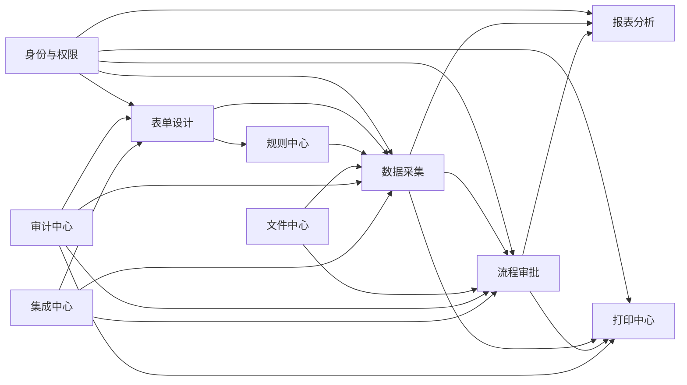
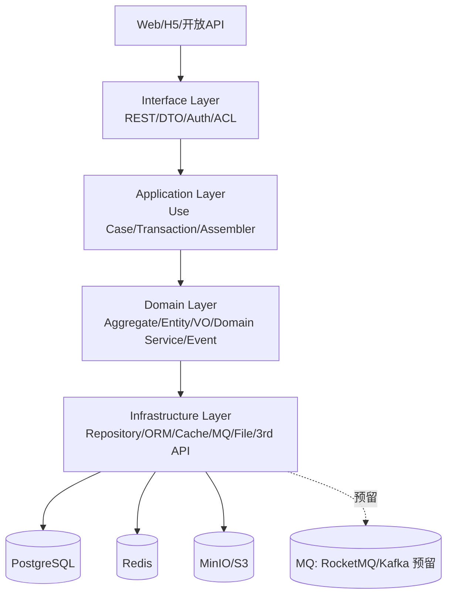
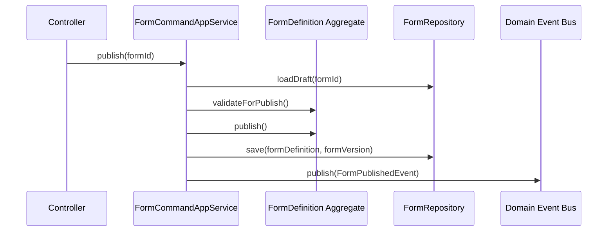
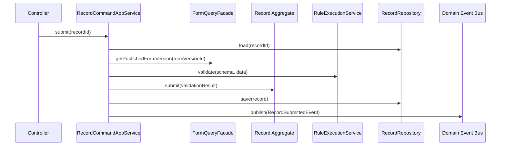

# 后端架构设计

## 元信息
| 字段 | 内容 |
|---|---|
| 状态 | 已定稿 |
| 负责人 | 待补充 |
| 创建日期 | 待补充 |
| 最后更新 | 2026-03-19 |
| 适用范围 | 全局后端架构 |
| 输入文档 | `docs/需求/需求梳理.md` |

## 1. 设计目标

基于 `docs/需求` 下的需求，后端采用 DDD 进行领域建模，当前阶段以模块化单体优先，保障 MVP 快速落地；同时通过限界上下文、领域事件、模块边界和独立数据契约设计，保留后续平滑拆分为微服务的能力。

核心目标如下：

| 目标 | 说明 |
|---|---|
| 业务闭环 | 支撑“表单设计 -> 发布 -> 填报 -> 审批 -> 报表 -> 打印 -> 审计”闭环 |
| DDD落地 | 通过限界上下文、聚合、领域服务、仓储、领域事件组织复杂业务 |
| 单体优先 | 在一个 Spring Boot 应用中落地，降低部署和协作成本 |
| 可拆分 | 模块内聚、模块间显式接口、事件解耦，未来可按上下文拆服务 |
| 配置优先 | 80% 以上业务通过表单/流程/模板/规则配置完成 |
| 安全合规 | 支持 RBAC、数据权限、字段权限、审计留痕、租户隔离预留 |

## 2. 架构原则

| 原则 | 设计要求 |
|---|---|
| 领域优先 | 先识别业务能力与上下文，再映射技术模块 |
| 单一事实源 | 表单定义、流程定义、模板定义都以版本快照为准 |
| 聚合内强一致 | 聚合内部使用本地事务，聚合间通过应用服务和领域事件协作 |
| 读写分离思维 | 写模型保证规则正确，读模型面向列表、报表、待办等查询场景 |
| 模块显式边界 | 禁止跨模块直接访问内部实现，只能通过应用服务/ACL/事件协作 |
| 演进式微服务 | 单体时期先形成稳定领域边界，再按组织与性能瓶颈拆分 |

## 3. 领域全景与限界上下文

### 3.1 领域划分

结合现有需求，建议划分为以下限界上下文：

| 限界上下文 | 领域类型 | 核心职责 | 当前阶段 |
|---|---|---|---|
| 身份与权限 Identity & Access | 通用子域 | 用户、角色、组织、岗位、数据权限、字段权限 | MVP必选 |
| 表单设计 Form Design | 核心域 | 表单草稿、字段定义、布局、校验规则、发布版本 | MVP必选 |
| 数据采集 Data Collection | 核心域 | 草稿填报、提交、版本绑定、记录查询、导出 | MVP必选 |
| 规则中心 Rule Center | 支撑子域 | 联动、计算、唯一性校验、生命周期规则 | 第二阶段 |
| 流程审批 Workflow | 核心域 | 流程定义、审批实例、待办、意见、流转日志 | 第三阶段 |
| 报表分析 Reporting | 支撑子域 | 数据集、指标、图表、筛选、看板 | 第四阶段 |
| 打印中心 Printing | 支撑子域 | 打印模板、变量绑定、渲染、PDF导出、打印日志 | 第四阶段 |
| 文件中心 File Management | 通用子域 | 附件上传、元数据、预览、访问控制 | MVP必选 |
| 审计中心 Audit | 通用子域 | 操作日志、变更日志、审计查询、告警留痕 | MVP必选 |
| 集成中心 Integration | 通用子域 | OpenAPI、Webhook、消息、主数据同步 | 平台化阶段 |

### 3.2 上下文关系图



### 3.3 上下文映射关系

| 上下文A | 上下文B | 关系 | 说明 |
|---|---|---|---|
| 数据采集 | 表单设计 | Customer / Supplier | 数据采集消费“已发布表单版本” |
| 数据采集 | 规则中心 | Customer / Supplier | 提交时调用规则引擎进行强校验 |
| 流程审批 | 数据采集 | Partnership | 提交流程由采集发起，审批结果回写业务单据 |
| 报表分析 | 数据采集 | Conformist | 报表以采集域的事实数据为基础 |
| 打印中心 | 数据采集/流程审批 | ACL | 打印只依赖已批准的业务数据和流程状态 |
| 各业务域 | 身份与权限 | Shared Kernel | 共享身份、组织、角色、权限模型 |
| 各业务域 | 审计中心 | Published Language | 通过统一审计事件和审计DTO落库 |

## 4. 通用语言

| 术语 | 定义 |
|---|---|
| 表单定义 FormDefinition | 一个业务表单的逻辑身份，承载表单头信息，不承载前端 `page_root` 节点 |
| 表单草稿 FormDraft | 表单当前可编辑版本，保存前端过滤 `page_root` 后的 `fields` JSON |
| 表单版本 FormVersion | 一次发布形成的不可变快照，保存发布时的 `fields` JSON |
| 字段 Field | 表单中的基础输入单元 |
| 记录 Record | 用户基于某个表单版本填报的一条业务数据 |
| 记录草稿 RecordDraft | 尚未提交的记录 |
| 提交 Submission | 一次对记录的正式提交动作 |
| 流程定义 WorkflowDefinition | 审批流程模板 |
| 流程实例 WorkflowInstance | 某条业务记录发起的审批过程 |
| 待办 Task | 当前节点产生的审批任务 |
| 打印模板 PrintTemplate | 单据打印布局与变量绑定模板 |
| 审计事件 AuditEvent | 被审计的关键操作事实 |

## 5. 模块化单体总体架构

### 5.1 逻辑架构



### 5.2 代码组织建议

采用“按限界上下文分包 + 上下文内分层”而不是按技术层平铺。

```text
backend
└── src/main/java/com/dataapp
    ├── shared
    │   ├── kernel
    │   ├── security
    │   ├── tenancy
    │   ├── event
    │   ├── exception
    │   └── config
    ├── identity
    │   ├── interfaces
    │   ├── application
    │   ├── domain
    │   └── infrastructure
    ├── form
    ├── record
    ├── rule
    ├── workflow
    ├── report
    ├── print
    ├── file
    ├── audit
    └── integration
```

约束如下：

| 约束 | 说明 |
|---|---|
| 上下文内闭环 | `interfaces -> application -> domain -> infrastructure` 单向依赖 |
| 禁止横向穿透 | `record.infrastructure` 不直接访问 `form.infrastructure` |
| 跨上下文协作 | 通过 application facade、ACL、domain event 完成 |
| 共享内核最小化 | 仅共享用户上下文、基础异常、事件基类、租户上下文等 |

## 6. 核心领域设计

### 6.1 表单设计上下文

#### 核心聚合

| 聚合 | 聚合根 | 主要实体/值对象 | 说明 |
|---|---|---|---|
| 表单定义聚合 | `FormDefinition` | `FormCode` `FormStatus` `FormDraft` | 管理表单身份、状态、当前草稿 |
| 表单版本聚合 | `FormVersion` | `FieldSchema` `LayoutSchema` `ValidationRule` | 管理一次发布的不可变快照 |

#### 关键职责

| 能力 | 说明 |
|---|---|
| 创建表单 | 分配业务编码、归属业务域、创建初始草稿 |
| 编辑草稿 | 修改字段、布局、属性、校验规则 |
| 发布版本 | 发布前校验，生成版本号，固化 schema snapshot |
| 停用版本 | 控制是否允许新建填报 |
| 差异追踪 | 记录版本间字段增删改摘要 |

#### 领域事件

| 事件 | 触发时机 | 下游 |
|---|---|---|
| `FormDraftSavedEvent` | 草稿保存成功 | 审计中心 |
| `FormPublishedEvent` | 表单版本发布成功 | 数据采集、规则中心、审计中心 |
| `FormDisabledEvent` | 版本停用 | 数据采集、审计中心 |

### 6.2 数据采集上下文

#### 核心聚合

| 聚合 | 聚合根 | 主要实体/值对象 | 说明 |
|---|---|---|---|
| 记录聚合 | `Record` | `RecordId` `RecordData` `RecordStatus` `RecordVersionBinding` | 一条填报业务记录 |
| 提交聚合 | `Submission` | `SubmitCommandSnapshot` `ValidationResult` | 记录一次正式提交动作及结果 |

#### 状态机

| 当前状态 | 动作 | 下一状态 |
|---|---|---|
| `DRAFT` | 暂存 | `DRAFT` |
| `DRAFT` | 提交 | `SUBMITTED` / `IN_APPROVAL` |
| `REJECTED` | 重新编辑 | `DRAFT` |
| `REJECTED` | 重新提交 | `IN_APPROVAL` |
| `IN_APPROVAL` | 审批通过 | `APPROVED` |
| `IN_APPROVAL` | 驳回 | `REJECTED` |
| `IN_APPROVAL` | 撤回 | `WITHDRAWN` |

#### 关键职责

| 能力 | 说明 |
|---|---|
| 新建记录 | 基于发布版表单创建记录，绑定 `formVersionId` |
| 草稿保存 | 弱校验，保证基础数据结构合法 |
| 提交校验 | 使用发布版 schema 强校验，后续接入规则中心 |
| 查询导出 | 按权限返回记录列表，导出时二次鉴权 |
| 历史追踪 | 保存记录修改历史和提交流水 |

#### 领域事件

| 事件 | 触发时机 | 下游 |
|---|---|---|
| `RecordDraftSavedEvent` | 草稿保存成功 | 审计中心 |
| `RecordSubmittedEvent` | 提交成功 | 流程审批、报表分析、审计中心 |
| `RecordReSubmittedEvent` | 驳回后重新提交 | 流程审批、审计中心 |
| `RecordApprovedEvent` | 审批通过后回写 | 报表分析、打印中心 |

### 6.3 规则中心上下文

| 聚合/服务 | 说明 |
|---|---|
| `RuleSet` | 一个表单版本对应一组规则集合 |
| `RuleDefinition` | 单条规则定义，区分联动、计算、唯一性、生命周期 |
| `RuleExecutionService` | 执行规则，输出命中结果、错误信息、计算结果 |
| `RuleConflictDetector` | 发布前检测循环依赖、互斥规则 |

说明：规则中心在 MVP 可先以内嵌领域服务落在 `form`/`record` 模块中，第二阶段再独立为上下文。

### 6.4 流程审批上下文

| 聚合 | 聚合根 | 说明 |
|---|---|---|
| 流程定义聚合 | `WorkflowDefinition` | 节点、连线、审批人策略、版本 |
| 流程实例聚合 | `WorkflowInstance` | 对某条业务记录发起的一次流程 |
| 任务聚合 | `WorkflowTask` | 每个待办节点的执行载体 |

关键领域规则：

| 规则 | 说明 |
|---|---|
| 一条业务记录同一时刻最多一个活动流程实例 | 避免并发审批 |
| 首节点未处理前允许撤回 | 满足需求约束 |
| 审批结果必须回写业务单据状态 | `record` 为业务事实主源 |
| 流程定义按版本执行 | 重提时是否使用最新流程版本作为策略配置 |

### 6.5 报表分析上下文

| 核心对象 | 说明 |
|---|---|
| `ReportDefinition` | 报表定义，包含图表、筛选器、指标 |
| `DatasetDefinition` | 数据集定义，可基于表单记录事实表构建 |
| `MetricDefinition` | 指标口径定义 |

建议：报表上下文优先采用“读模型”思路，避免反向侵入交易模型。

### 6.6 打印中心上下文

| 核心对象 | 说明 |
|---|---|
| `PrintTemplate` | 模板定义与版本 |
| `PrintJob` | 一次打印或导出任务 |
| `PrintRenderService` | 将业务数据 + 模板渲染为 HTML/PDF |

关键约束：

| 约束 | 说明 |
|---|---|
| 打印依据已审批或满足条件的业务记录 | 防止未生效单据被打印 |
| 模板版本独立管理 | 模板变更不影响历史单据回放 |
| 批量打印走异步任务 | 避免阻塞业务请求线程 |

## 7. 应用层设计

应用层负责用例编排、事务控制、权限校验和 DTO 装配，不承载复杂业务规则。

### 7.1 典型应用服务

| 模块 | 应用服务 | 主要用例 |
|---|---|---|
| form | `FormCommandAppService` | 创建表单、保存草稿、发布、停用 |
| form | `FormQueryAppService` | 查询表单、加载草稿、获取发布版 |
| record | `RecordCommandAppService` | 新建记录、保存草稿、提交、撤回 |
| record | `RecordQueryAppService` | 列表查询、详情、导出 |
| workflow | `WorkflowCommandAppService` | 发布流程、发起实例、审批、驳回、转交 |
| report | `ReportQueryAppService` | 获取看板、聚合查询 |
| print | `PrintCommandAppService` | 预览、打印、导出 PDF |
| audit | `AuditQueryAppService` | 审计检索 |

### 7.2 典型命令流程

#### 表单发布



#### 填报提交



## 8. 数据设计

### 8.1 存储策略

| 数据类型 | 存储策略 |
|---|---|
| 结构元数据 | PostgreSQL 关系表 + `jsonb` 保存可扩展 schema |
| 业务记录 | 主索引字段结构化存储，长尾字段 `jsonb` 承载 |
| 审计日志 | 关系表落库，可归档到对象存储/ES（后续） |
| 附件 | MinIO/S3，对象元数据存 PostgreSQL |
| 缓存 | Redis 缓存发布版 schema、权限快照、幂等键 |

### 8.2 核心表建议

| 表名 | 说明 | 关键字段 |
|---|---|---|
| `form_definition` | 表单主实体/头信息 | `id` `form_code` `name` `description` `status` `current_version_id` |
| `form_draft` | 当前草稿 | `form_id` `fields_json` `version` `updated_by` `updated_at` |
| `form_version` | 发布快照 | `id` `form_id` `version_no` `fields_json` `published_at` |
| `record` | 业务记录主表 | `id` `form_id` `form_version_id` `status` `tenant_id` `created_by` |
| `record_data` | 记录正文 | `record_id` `data_json` `search_json` |
| `record_history` | 历史变更 | `record_id` `op_type` `before_json` `after_json` |
| `workflow_definition` | 流程定义 | `id` `biz_type` `version_no` `definition_json` |
| `workflow_instance` | 流程实例 | `id` `biz_id` `status` `current_node_key` |
| `workflow_task` | 待办任务 | `id` `instance_id` `assignee_id` `status` `acted_at` |
| `report_definition` | 报表定义 | `id` `dataset_id` `config_json` |
| `print_template` | 打印模板 | `id` `biz_type` `version_no` `template_json` |
| `file_asset` | 文件元数据 | `id` `object_key` `biz_type` `biz_id` |
| `audit_log` | 审计日志 | `id` `module` `action` `target_id` `detail_json` |

### 8.2.1 表单设计前后端数据对齐规则

为减少前后端重复建模成本，表单设计场景采用“页面头信息与字段树拆分”的对齐规则：

| 层次 | 数据内容 | 说明 |
|---|---|---|
| 前端编辑态 | `page_root + nodesById` | 前端内部状态，`page_root` 仅用于页面标题、说明等编辑体验 |
| 前端提交命令 | `name` `description` `fields` | 提交时前端先过滤掉 `page_root`，将剩余 `nodesById` 转成 JSON 后放入 `fields` |
| 后端领域模型 | `FormDefinition` + `FormDraft/FormVersion` | `FormDefinition` 管理头信息，`FormDraft/FormVersion` 管理字段树快照 |
| 后端持久化 | `form_definition` + `form_draft/form_version` | `name/description` 落在头表，`fields` JSON 落在草稿表/版本表 |

具体约束如下：

1. 前端 `page_root.props.title` 映射为后端表单名 `name`。
2. 前端 `page_root.props.description` 映射为后端表单说明 `description`。
3. 前端提交给后端的 `fields` 为过滤 `page_root` 后的 `nodesById` JSON，不再包含根节点。
4. 后端不负责补齐、校验或恢复 `page_root` 是否存在，前端自行保证编辑态根节点完整。
5. 后端保存草稿、发布版本时，均以 `fields` 作为唯一字段树事实源，不再从根节点反推字段结构。
6. 运行态渲染、记录校验、规则执行只消费已发布版本中的 `fields` 快照与表单头信息。
7. 若后续前端节点结构升级，优先通过 `fields` JSON 的版本号字段兼容，不通过恢复 `page_root` 兼容。

推荐的接口命令模型如下：

```json
{
  "formCode": "supplier_onboarding",
  "name": "供应商准入申请",
  "description": "用于供应商基础信息采集",
  "fields": {
    "tmp_a1": {
      "id": "tmp_a1",
      "serverId": null,
      "type": "field",
      "parentId": "tmp_group_1",
      "childrenIds": [],
      "props": {
        "component": "input",
        "label": "供应商名称",
        "required": true
      },
      "layout": {
        "span": 12
      }
    }
  }
}
```

说明：后端对外接口字段命名统一使用 `fields`，数据库列可命名为 `fields_json`；若现阶段因历史原因仍使用 `schema_json`，则仅作为持久化实现细节，不应继续暴露到接口契约中。

### 8.3 记录数据模型建议

为兼顾灵活性和查询性能，记录域建议使用“固定列 + 扩展 JSON”模型：

| 层次 | 内容 |
|---|---|
| 固定列 | `id` `form_id` `status` `tenant_id` `created_by` `submitted_at` 等高频筛选字段 |
| 扩展列 | `data_json` 保存表单字段值 |
| 搜索投影 | `search_json` 或独立索引表，用于关键字、组合查询、导出 |

说明：后续若报表和查询压力提升，可增量构建 `record_fact_*` 投影表，而不是侵入交易聚合。

## 9. 接口设计原则

| 原则 | 说明 |
|---|---|
| 命令与查询分离 | 写接口与读接口职责清晰 |
| 版本显式化 | `/api/forms/{id}/versions/{versionNo}` 风格保留历史访问能力 |
| 错误可定位 | 提交失败需返回字段级错误码、字段路径、提示文案 |
| 幂等控制 | 提交、导出、打印等操作支持幂等键 |
| 权限前置 | Controller 做资源鉴权，应用层做业务权限校验 |

## 10. 关键技术选型

| 层次 | 建议选型 | 说明 |
|---|---|---|
| 应用框架 | Spring Boot | 单体优先，生态成熟 |
| ORM | MyBatis-Plus + 局部 JPA | 复杂查询灵活，聚合持久化可控 |
| 数据库 | PostgreSQL | `jsonb`、索引能力、复杂查询更友好 |
| 缓存 | Redis | schema 缓存、权限缓存、幂等控制 |
| 安全 | Spring Security + JWT/OAuth2 | 可平滑对接 SSO |
| 文件存储 | MinIO / S3 | 附件、导出文件、打印产物 |
| 任务调度 | XXL-Job / Spring Scheduler | 导出、打印、报表推送 |
| 消息总线 | RocketMQ / Kafka（预留） | 微服务拆分后承接异步事件 |
| 可观测性 | Micrometer + Prometheus + Grafana + SkyWalking | 指标、日志、链路 |

## 11. 技术栈与工程脚手架落地方案

### 11.1 技术栈分层建议

| 分层 | 技术选型 | 落地说明 |
|---|---|---|
| Web接口层 | Spring MVC + Spring Validation + Jackson | 面向管理端、填报端、开放接口统一暴露 REST API |
| 应用层 | Spring + Transactional | 承载用例编排、事务边界、幂等控制 |
| 领域层 | 纯 Java Domain Model | 聚合、值对象、领域服务不依赖 Spring 细节 |
| 持久层 | MyBatis-Plus + XML SQL | 复杂查询、分页、动态筛选更易控 |
| 缓存层 | Spring Data Redis | 表单版本、权限快照、验证码、幂等键 |
| 对象存储 | MinIO SDK | 附件、导出文件、打印产物 |
| 异步任务 | Spring Event + Scheduler，后续接 MQ/XXL-Job | 单体期先满足审计、通知、异步导出 |
| 安全 | Spring Security + JWT | 支持角色、数据权限、字段权限扩展 |
| 数据库变更 | Flyway | 保证 DDL 可版本化、可回滚、可审计 |
| 测试 | JUnit 5 + Spring Boot Test + Testcontainers | 核心聚合、应用服务、数据库集成测试 |

### 11.2 工程模块脚手架

建议后端仓库采用 Maven 多模块，先形成模块边界，再决定是否拆独立部署。

```text
backend
├── pom.xml
├── dataapp-boot
│   └── src/main/java/com/dataapp/boot
├── dataapp-shared
│   └── src/main/java/com/dataapp/shared
├── dataapp-identity
├── dataapp-form
├── dataapp-record
├── dataapp-rule
├── dataapp-workflow
├── dataapp-report
├── dataapp-print
├── dataapp-file
├── dataapp-audit
├── dataapp-integration
└── db
    ├── migration
    └── seed
```

各模块职责建议如下：

| 模块 | 职责 | 是否MVP |
|---|---|---|
| `dataapp-boot` | 启动类、全局自动配置、统一装配 | 是 |
| `dataapp-shared` | 共享内核、基础设施抽象、公共组件 | 是 |
| `dataapp-identity` | 用户、角色、组织、权限 | 是 |
| `dataapp-form` | 表单定义、草稿、版本发布 | 是 |
| `dataapp-record` | 填报记录、提交、查询、导出 | 是 |
| `dataapp-rule` | 规则引擎、规则校验、冲突检测 | 二期 |
| `dataapp-workflow` | 流程定义、实例、待办、审批动作 | 三期 |
| `dataapp-report` | 报表定义、数据集、看板查询 | 四期 |
| `dataapp-print` | 模板、打印任务、PDF导出 | 四期 |
| `dataapp-file` | 文件上传、访问控制、对象存储适配 | 是 |
| `dataapp-audit` | 审计事件、查询、归档 | 是 |
| `dataapp-integration` | Webhook、OpenAPI、主数据同步 | 平台期 |

### 11.3 上下文内包结构细化

以 `dataapp-form` 为例，建议使用如下结构：

```text
dataapp-form
└── src/main/java/com/dataapp/form
    ├── interfaces
    │   ├── rest
    │   ├── dto
    │   └── assembler
    ├── application
    │   ├── command
    │   ├── query
    │   ├── service
    │   └── facade
    ├── domain
    │   ├── model
    │   │   ├── aggregate
    │   │   ├── entity
    │   │   ├── valueobject
    │   │   └── event
    │   ├── service
    │   ├── repository
    │   └── specification
    └── infrastructure
        ├── persistence
        │   ├── po
        │   ├── mapper
        │   ├── repository
        │   └── converter
        ├── cache
        ├── acl
        └── config
```

包职责建议：

| 包 | 说明 |
|---|---|
| `interfaces.rest` | Controller，仅处理协议转换、鉴权注解、参数校验 |
| `interfaces.dto` | 请求/响应 DTO，不泄漏领域对象 |
| `interfaces.assembler` | DTO 与 Command/Query 对象转换 |
| `application.command` | Command 对象定义 |
| `application.query` | Query 对象定义 |
| `application.service` | AppService，用例编排入口 |
| `application.facade` | 提供跨上下文访问的公开门面 |
| `domain.model.aggregate` | 聚合根 |
| `domain.model.entity` | 聚合内部实体 |
| `domain.model.valueobject` | 值对象 |
| `domain.model.event` | 领域事件 |
| `domain.repository` | 仓储接口 |
| `infrastructure.persistence.po` | 数据库持久化对象 |
| `infrastructure.persistence.mapper` | MyBatis Mapper |
| `infrastructure.persistence.repository` | 仓储接口实现 |
| `infrastructure.acl` | 访问外部上下文的适配器 |

### 11.4 模块依赖规则

建议在工程层面强制依赖规则，避免单体后期演变成“大泥球”。

| 模块 | 允许依赖 | 禁止依赖 |
|---|---|---|
| `dataapp-boot` | 所有业务模块 | 无 |
| `dataapp-shared` | 仅基础三方库 | 任何业务模块 |
| `dataapp-identity` | `dataapp-shared` | 其他业务模块内部实现 |
| `dataapp-form` | `dataapp-shared` `dataapp-identity` | `dataapp-record.infrastructure` 等横向实现 |
| `dataapp-record` | `dataapp-shared` `dataapp-identity` `dataapp-form` 的 facade | 直接依赖 `dataapp-form.domain/internal` |
| `dataapp-workflow` | `dataapp-shared` `dataapp-identity` `dataapp-record` facade | 直接写入 `record` 数据表 |
| `dataapp-report` | `dataapp-shared` 读模型/投影模块 | 交易域聚合实现 |
| `dataapp-print` | `dataapp-shared` `dataapp-record`/`workflow` facade | 直接依赖交易域仓储实现 |
| `dataapp-audit` | `dataapp-shared` | 被其他业务模块反向依赖内部实现 |

进一步的编码约束：

| 规则 | 说明 |
|---|---|
| 规则1 | `domain` 层不得依赖 `interfaces`、`infrastructure` |
| 规则2 | `application` 层可以依赖本模块 `domain` 与外部模块 `facade` |
| 规则3 | 跨模块只能依赖 `facade`、`acl dto`、`published event` |
| 规则4 | 禁止一个模块直接操作另一个模块的数据表 |
| 规则5 | 所有对外事件定义放在 `domain.model.event` 或独立 `published-event` 包 |

### 11.5 启动与配置脚手架

建议配置分为四层：

| 层次 | 文件 | 说明 |
|---|---|---|
| 默认配置 | `application.yml` | 通用默认值 |
| 环境配置 | `application-dev.yml` `application-test.yml` `application-prod.yml` | 分环境差异化 |
| 模块配置 | `application-form.yml` 等 | 模块专属配置，可通过 `spring.config.import` 合并 |
| 机密配置 | 环境变量 / Secret | 密钥、对象存储凭证、JWT 密钥 |

建议预置以下基础能力：

| 能力 | 说明 |
|---|---|
| `WebMvcConfig` | 时区、枚举序列化、全局消息转换 |
| `SecurityConfig` | JWT 过滤器、RBAC、匿名白名单 |
| `TenantContextFilter` | 多租户上下文预留 |
| `IdempotentConfig` | 幂等键拦截器 |
| `DomainEventConfig` | 进程内事件总线装配 |
| `MybatisConfig` | 分页、审计字段自动填充、JSONB 类型处理器 |

## 12. 接口分层与协议细化

### 12.1 接口分层模型

```text
Controller -> Request DTO -> Assembler -> Command/Query -> AppService
AppService -> Domain Aggregate/Domain Service -> Repository
Repository -> PO/Mapper -> Database
AppService -> ResponseAssembler -> Response DTO -> Controller
```

### 12.2 DTO 与领域对象隔离规则

| 对象类型 | 所在层 | 作用 |
|---|---|---|
| Request DTO | `interfaces.dto` | 接收 HTTP 请求参数 |
| Command/Query | `application.command/query` | 用例输入对象 |
| Domain Object | `domain.model` | 业务规则承载 |
| Persistence PO | `infrastructure.persistence.po` | 数据库存取对象 |
| Response DTO | `interfaces.dto` | 对外返回对象 |

禁止事项：

| 禁止项 | 原因 |
|---|---|
| Controller 直接返回领域对象 | 容易泄漏内部结构和规则 |
| Mapper 直接映射 DTO -> Domain | 会把协议层污染到领域层 |
| Query 接口复用 Command DTO | 可读性差，边界不清晰 |

### 12.3 Controller 分类建议

| Controller | 职责 |
|---|---|
| `AdminFormController` | 管理端表单配置、发布、停用 |
| `FormRuntimeController` | 获取发布版表单 schema |
| `RecordController` | 填报新建、暂存、提交、详情、列表 |
| `WorkflowController` | 流程发起、待办、审批、历史 |
| `ReportController` | 报表看板、聚合查询 |
| `PrintController` | 打印预览、打印任务、PDF 导出 |
| `FileController` | 上传、下载、签名URL |
| `AuditController` | 审计检索 |

建议 URI 风格：

| 场景 | URI 示例 |
|---|---|
| 表单管理 | `/api/admin/forms` |
| 表单发布版 | `/api/runtime/forms/{formCode}` |
| 记录提交 | `/api/records/{recordId}/submit` |
| 待办处理 | `/api/workflow/tasks/{taskId}/approve` |
| 打印导出 | `/api/print/jobs` |

### 12.4 返回体与错误码规范

统一返回体建议：

```json
{
  "code": "SUCCESS",
  "message": "ok",
  "traceId": "b3f4d2f6c5",
  "data": {}
}
```

字段级校验失败建议：

```json
{
  "code": "FORM_FIELD_VALIDATION_FAILED",
  "message": "表单校验失败",
  "traceId": "b3f4d2f6c5",
  "data": {
    "errors": [
      {
        "fieldKey": "amount",
        "path": "amount",
        "errorCode": "NUMBER_OUT_OF_RANGE",
        "message": "金额必须小于10000"
      }
    ]
  }
}
```

错误码分层建议：

| 错误码前缀 | 模块 | 示例 |
|---|---|---|
| `AUTH_` | 认证授权 | `AUTH_TOKEN_EXPIRED` |
| `FORM_` | 表单设计 | `FORM_PUBLISH_CONFLICT` |
| `RECORD_` | 数据采集 | `RECORD_ALREADY_SUBMITTED` |
| `WORKFLOW_` | 流程审批 | `WORKFLOW_TASK_ALREADY_CLAIMED` |
| `PRINT_` | 打印中心 | `PRINT_TEMPLATE_NOT_FOUND` |
| `SYS_` | 系统错误 | `SYS_INTERNAL_ERROR` |

## 13. 数据库分表与索引建议

### 13.1 当前阶段数据库策略

MVP 阶段建议先保持单库，但按业务域独立表命名，并预留分表键。

| 维度 | 建议 |
|---|---|
| 数据库实例 | 1 个 PostgreSQL 主库 |
| Schema策略 | 可选按业务域分 schema，如 `form` `record` `workflow` |
| 表命名 | `ctx_entity` 风格，如 `record_main` `workflow_task` |
| 分表键预留 | `tenant_id`、`form_id`、`biz_date` |

### 13.2 分表建议

| 表 | 当前策略 | 后续分表建议 | 触发条件 |
|---|---|---|---|
| `record` / `record_data` | 单表 | 按 `form_id` 或 `tenant_id + biz_month` 分表 | 记录量超过千万级 |
| `record_history` | 单表 | 按月分表 | 审计历史快速增长 |
| `workflow_task` | 单表 | 按 `status + created_month` 归档/分表 | 待办和已办量巨大 |
| `audit_log` | 单表 | 按月分表或冷热分离 | 日志查询与归档压力上升 |
| `file_asset` | 单表 | 可不分表，优先对象存储治理 | 元数据量中等 |
| `print_job` | 单表 | 按月分表 | 批量任务增长明显 |

说明：

| 原则 | 说明 |
|---|---|
| 优先分区而非业务代码分库 | PostgreSQL 可优先用分区表降低复杂度 |
| 先归档再分表 | 很多问题可通过冷热分离解决 |
| 交易表和日志表分开治理 | 不用同一套策略处理 |

### 13.3 索引建议

| 表 | 推荐索引 |
|---|---|
| `form_definition` | `(form_code)` 唯一索引，`(status, updated_at)` |
| `form_version` | `(form_id, version_no)` 唯一索引 |
| `record` | `(form_id, status, created_at)`，`(created_by, status)`，`(tenant_id, created_at)` |
| `record_data` | `GIN(data_json)`，必要时对高频字段建表达式索引 |
| `workflow_instance` | `(biz_id)` 唯一索引，`(status, updated_at)` |
| `workflow_task` | `(assignee_id, status, created_at)`，`(instance_id, status)` |
| `audit_log` | `(module, action, created_at)`，`(operator_id, created_at)` |

### 13.4 数据归档建议

| 数据类型 | 在线保留 | 归档策略 |
|---|---|---|
| 审计日志 | 6-12个月 | 归档到冷库或对象存储 |
| 已完成流程任务 | 12个月 | 迁移历史表 |
| 导出/打印任务 | 3-6个月 | 仅保留结果元数据 |
| 记录历史快照 | 视合规要求 | 分层存储，保留关键版本 |

## 14. 工程治理建议

### 14.1 DDL 与初始化

| 项目 | 建议 |
|---|---|
| DDL管理 | 使用 Flyway，禁止手工改线上库 |
| 初始化数据 | `seed` 只放角色、权限、枚举等基础数据 |
| 回滚策略 | 每个版本对应回滚脚本或兼容性说明 |

### 14.2 测试脚手架

| 层次 | 测试重点 |
|---|---|
| Domain Test | 聚合状态迁移、规则校验、领域事件 |
| Application Test | 事务边界、幂等控制、跨模块协作 |
| Integration Test | PostgreSQL/Redis/MinIO 真实集成 |
| API Test | 鉴权、错误码、字段级错误回传 |

### 14.3 代码规范

| 规范 | 说明 |
|---|---|
| 聚合方法使用业务语言命名 | 如 `publish()` `submit()` `approve()` |
| 禁止在 Controller 写业务逻辑 | Controller 仅做协议处理 |
| 一个应用服务对应一组用例 | 避免 Service 巨石化 |
| Repository 返回领域对象 | 不向上暴露 PO |
| 事件命名使用过去式 | 如 `RecordSubmittedEvent` |

### 14.4 后端项目初始化清单

建议项目启动时按“先骨架、再模块、后业务”的节奏初始化，避免一开始就把业务逻辑写散。

| 阶段 | 初始化项 | 目标 |
|---|---|---|
| Step 1 | 创建 Maven 父工程与基础模块 | 统一依赖、插件、版本管理 |
| Step 2 | 搭建 `boot`、`shared`、`identity`、`form`、`record`、`file`、`audit` 模块 | 满足 MVP 最小闭环 |
| Step 3 | 接入 PostgreSQL、Redis、MinIO、Flyway | 跑通基础设施 |
| Step 4 | 建立统一异常、返回体、鉴权、审计、领域事件骨架 | 形成统一工程规范 |
| Step 5 | 落第一批 Flyway 脚本与 seed 数据 | 支撑本地联调与测试环境初始化 |

### 14.5 Maven `pom` 拆分建议

#### 父工程 `pom.xml`

父工程负责统一版本、插件和 dependencyManagement。

```xml
<project>
  <modelVersion>4.0.0</modelVersion>
  <groupId>com.dataapp</groupId>
  <artifactId>dataapp-parent</artifactId>
  <version>1.0.0-SNAPSHOT</version>
  <packaging>pom</packaging>

  <modules>
    <module>dataapp-boot</module>
    <module>dataapp-shared</module>
    <module>dataapp-identity</module>
    <module>dataapp-form</module>
    <module>dataapp-record</module>
    <module>dataapp-file</module>
    <module>dataapp-audit</module>
    <module>dataapp-rule</module>
    <module>dataapp-workflow</module>
    <module>dataapp-report</module>
    <module>dataapp-print</module>
    <module>dataapp-integration</module>
  </modules>
</project>
```

建议在父工程统一以下内容：

| 分类 | 建议统一项 |
|---|---|
| Java版本 | `java.version=21` |
| Spring版本 | `spring-boot-dependencies` |
| 持久层 | MyBatis-Plus、PostgreSQL Driver、Flyway |
| 基础设施 | Redis、MinIO、Lombok、MapStruct |
| 测试 | JUnit5、Testcontainers、Mockito |
| 插件 | `maven-compiler-plugin` `spring-boot-maven-plugin` `surefire` |

#### `dataapp-boot/pom.xml`

职责：作为唯一可执行模块，负责聚合所有业务模块。

依赖建议：

| 依赖类型 | 模块 |
|---|---|
| 必须依赖 | `dataapp-shared` `dataapp-identity` `dataapp-form` `dataapp-record` `dataapp-file` `dataapp-audit` |
| 按阶段加入 | `dataapp-rule` `dataapp-workflow` `dataapp-report` `dataapp-print` `dataapp-integration` |

#### 业务模块 `pom.xml`

建议每个业务模块都保持轻量，默认只暴露本模块 API 能力，不引入启动插件。

```xml
<project>
  <parent>
    <groupId>com.dataapp</groupId>
    <artifactId>dataapp-parent</artifactId>
    <version>1.0.0-SNAPSHOT</version>
  </parent>
  <artifactId>dataapp-form</artifactId>

  <dependencies>
    <dependency>
      <groupId>com.dataapp</groupId>
      <artifactId>dataapp-shared</artifactId>
    </dependency>
    <dependency>
      <groupId>org.springframework.boot</groupId>
      <artifactId>spring-boot-starter</artifactId>
    </dependency>
  </dependencies>
</project>
```

MVP 阶段模块依赖建议：

| 模块 | 直接依赖 |
|---|---|
| `dataapp-shared` | Spring Context、Validation、Jackson、通用工具 |
| `dataapp-identity` | `dataapp-shared` |
| `dataapp-form` | `dataapp-shared` `dataapp-identity` |
| `dataapp-record` | `dataapp-shared` `dataapp-identity` `dataapp-form` |
| `dataapp-file` | `dataapp-shared` |
| `dataapp-audit` | `dataapp-shared` |

建议增加的后续治理：

| 能力 | 做法 |
|---|---|
| 依赖检查 | 引入 ArchUnit 或 Maven Enforcer |
| 重复依赖控制 | 在父工程统一版本并开启依赖收敛检查 |
| 模块边界守护 | 编写架构测试约束跨模块包访问 |

### 14.6 Spring Boot 包骨架建议

#### 启动模块骨架

```text
dataapp-boot
└── src/main/java/com/dataapp/boot
    ├── DataAppApplication.java
    ├── config
    │   ├── WebMvcConfig.java
    │   ├── SecurityConfig.java
    │   ├── JacksonConfig.java
    │   ├── MybatisConfig.java
    │   ├── RedisConfig.java
    │   ├── MinioConfig.java
    │   └── FlywayConfig.java
    ├── interceptor
    │   ├── TraceIdInterceptor.java
    │   ├── IdempotentInterceptor.java
    │   └── TenantContextInterceptor.java
    └── listener
        └── ApplicationStartedListener.java
```

#### 共享模块骨架

```text
dataapp-shared
└── src/main/java/com/dataapp/shared
    ├── kernel
    │   ├── model
    │   │   ├── AggregateRoot.java
    │   │   ├── Entity.java
    │   │   └── ValueObject.java
    │   ├── event
    │   │   ├── DomainEvent.java
    │   │   ├── DomainEventPublisher.java
    │   │   └── IntegrationEventPublisher.java
    │   └── response
    │       ├── Result.java
    │       └── PageResult.java
    ├── security
    │   ├── CurrentUser.java
    │   ├── LoginUser.java
    │   ├── DataPermission.java
    │   └── FieldPermission.java
    ├── exception
    │   ├── BizException.java
    │   ├── ErrorCode.java
    │   └── GlobalExceptionHandler.java
    ├── tenancy
    │   ├── TenantContext.java
    │   └── TenantHolder.java
    └── util
        ├── JsonUtils.java
        ├── SnowflakeId.java
        └── TimeUtils.java
```

#### MVP 业务模块骨架

以 `dataapp-record` 为例：

```text
dataapp-record
└── src/main/java/com/dataapp/record
    ├── interfaces
    │   ├── rest
    │   │   ├── RecordController.java
    │   │   └── RecordExportController.java
    │   ├── dto
    │   │   ├── RecordCreateRequest.java
    │   │   ├── RecordSaveDraftRequest.java
    │   │   ├── RecordSubmitRequest.java
    │   │   ├── RecordQueryRequest.java
    │   │   └── RecordResponse.java
    │   └── assembler
    │       └── RecordAssembler.java
    ├── application
    │   ├── command
    │   │   ├── CreateRecordCommand.java
    │   │   ├── SaveRecordDraftCommand.java
    │   │   └── SubmitRecordCommand.java
    │   ├── query
    │   │   ├── RecordPageQuery.java
    │   │   └── RecordDetailQuery.java
    │   ├── service
    │   │   ├── RecordCommandAppService.java
    │   │   └── RecordQueryAppService.java
    │   └── facade
    │       └── RecordFacade.java
    ├── domain
    │   ├── model
    │   │   ├── aggregate
    │   │   │   └── Record.java
    │   │   ├── entity
    │   │   │   └── RecordSnapshot.java
    │   │   ├── valueobject
    │   │   │   ├── RecordId.java
    │   │   │   ├── RecordStatus.java
    │   │   │   └── RecordData.java
    │   │   └── event
    │   │       ├── RecordDraftSavedEvent.java
    │   │       └── RecordSubmittedEvent.java
    │   ├── repository
    │   │   └── RecordRepository.java
    │   └── service
    │       └── RecordValidationDomainService.java
    └── infrastructure
        ├── persistence
        │   ├── po
        │   │   ├── RecordPO.java
        │   │   ├── RecordDataPO.java
        │   │   └── RecordHistoryPO.java
        │   ├── mapper
        │   │   ├── RecordMapper.java
        │   │   └── RecordDataMapper.java
        │   ├── repository
        │   │   └── RecordRepositoryImpl.java
        │   └── converter
        │       └── RecordConverter.java
        ├── acl
        │   └── FormQueryAcl.java
        └── export
            └── RecordExportService.java
```

#### 首批必须创建的核心类

| 模块 | 首批类 |
|---|---|
| `shared` | `Result` `BizException` `ErrorCode` `DomainEvent` |
| `identity` | `UserController` `RoleController` `PermissionService` |
| `form` | `AdminFormController` `FormCommandAppService` `FormDefinition` |
| `record` | `RecordController` `RecordCommandAppService` `Record` |
| `file` | `FileController` `FileStorageService` |
| `audit` | `AuditEventListener` `AuditQueryAppService` |

### 14.7 配置与环境文件初始化

建议初始化以下配置文件：

```text
backend
└── dataapp-boot/src/main/resources
    ├── application.yml
    ├── application-dev.yml
    ├── application-test.yml
    ├── application-prod.yml
    ├── logback-spring.xml
    └── db
        └── migration
```

`application.yml` 建议包含：

| 配置分类 | 关键项 |
|---|---|
| Spring | `application.name` `profiles.active` |
| 数据源 | `spring.datasource.*` |
| Flyway | `spring.flyway.enabled` `locations` |
| Redis | `spring.data.redis.*` |
| Jackson | 时区、日期格式、序列化规则 |
| MinIO | `endpoint` `access-key` `secret-key` `bucket` |
| Security | JWT 密钥、过期时间、白名单 |
| Logging | 日志级别、traceId 输出格式 |

### 14.8 Flyway 初始脚本规划

建议第一批 Flyway 脚本按“基础设施 -> 身份权限 -> 表单 -> 填报 -> 文件 -> 审计”顺序落地。

#### 脚本命名建议

| 文件名 | 说明 |
|---|---|
| `V1__init_extensions.sql` | 初始化扩展、通用函数 |
| `V2__init_identity_tables.sql` | 用户、角色、组织、权限 |
| `V3__init_form_tables.sql` | 表单、草稿、版本 |
| `V4__init_record_tables.sql` | 记录、记录内容、历史 |
| `V5__init_file_tables.sql` | 文件元数据 |
| `V6__init_audit_tables.sql` | 审计日志 |
| `V7__init_indexes.sql` | 首批索引 |
| `V8__seed_basic_data.sql` | 基础角色、权限、管理员账号 |

#### 首批表规划

| 脚本 | 建议表 |
|---|---|
| `V2` | `iam_user` `iam_role` `iam_permission` `iam_user_role` `iam_role_permission` `iam_department` |
| `V3` | `form_definition` `form_draft` `form_version` |
| `V4` | `record_main` `record_data` `record_history` |
| `V5` | `file_asset` |
| `V6` | `audit_log` |

#### PostgreSQL 通用字段约定

| 字段 | 类型 | 说明 |
|---|---|---|
| `id` | `bigint` | 雪花算法或号段主键 |
| `tenant_id` | `bigint` | 租户预留，MVP 默认 `0` |
| `created_by` | `bigint` | 创建人 |
| `created_at` | `timestamp with time zone` | 创建时间 |
| `updated_by` | `bigint` | 更新人 |
| `updated_at` | `timestamp with time zone` | 更新时间 |
| `deleted` | `boolean` | 逻辑删除标记，默认 `false` |

#### 表单相关脚本样例规划

```sql
-- V3__init_form_tables.sql
create table if not exists form_definition (
  id bigint primary key,
  tenant_id bigint not null default 0,
  form_code varchar(64) not null,
  name varchar(128) not null,
  description varchar(512),
  status varchar(32) not null,
  current_version_id bigint,
  created_by bigint not null,
  created_at timestamptz not null default now(),
  updated_by bigint not null,
  updated_at timestamptz not null default now(),
  deleted boolean not null default false
);

create unique index if not exists uk_form_definition_code
  on form_definition (tenant_id, form_code);

create table if not exists form_draft (
  id bigint primary key,
  tenant_id bigint not null default 0,
  form_id bigint not null,
  fields_json jsonb not null,
  version integer not null default 0,
  updated_by bigint not null,
  updated_at timestamptz not null default now()
);

create table if not exists form_version (
  id bigint primary key,
  tenant_id bigint not null default 0,
  form_id bigint not null,
  version_no integer not null,
  fields_json jsonb not null,
  published_by bigint not null,
  published_at timestamptz not null default now()
);
```

#### 填报相关脚本样例规划

```sql
-- V4__init_record_tables.sql
create table if not exists record_main (
  id bigint primary key,
  tenant_id bigint not null default 0,
  form_id bigint not null,
  form_version_id bigint not null,
  status varchar(32) not null,
  created_by bigint not null,
  created_at timestamptz not null default now(),
  updated_by bigint not null,
  updated_at timestamptz not null default now(),
  submitted_at timestamptz,
  deleted boolean not null default false
);

create table if not exists record_data (
  id bigint primary key,
  tenant_id bigint not null default 0,
  record_id bigint not null,
  data_json jsonb not null,
  search_json jsonb,
  created_at timestamptz not null default now()
);

create table if not exists record_history (
  id bigint primary key,
  tenant_id bigint not null default 0,
  record_id bigint not null,
  op_type varchar(32) not null,
  before_json jsonb,
  after_json jsonb,
  operated_by bigint not null,
  operated_at timestamptz not null default now()
);
```

#### 初始化顺序清单

| 顺序 | 动作 |
|---|---|
| 1 | 创建父工程与模块目录 |
| 2 | 编写父 `pom.xml` 和 `dataapp-boot/pom.xml` |
| 3 | 创建 `shared` 基础类和全局配置 |
| 4 | 创建 `identity/form/record/file/audit` MVP 包骨架 |
| 5 | 接入 `application.yml`、本地开发配置、日志配置 |
| 6 | 编写 Flyway `V1-V8` 初始脚本 |
| 7 | 启动本地 PostgreSQL/Redis/MinIO 并执行迁移 |
| 8 | 编写第一个冒烟接口：登录、创建表单、保存草稿 |

## 15. 安全与合规设计

| 能力 | 方案 |
|---|---|
| 认证 | JWT/OAuth2，支持未来接入企业 SSO |
| 授权 | RBAC + 数据权限 + 字段权限 |
| 多租户 | MVP 可先单租户结构预留 `tenant_id`，平台化阶段启用租户隔离 |
| 审计 | 关键命令统一发送审计事件，记录操作者、时间、对象、前后快照 |
| 数据保护 | HTTPS、敏感字段脱敏、对象存储私有桶、下载签名 |
| 文件安全 | 类型/大小/MIME 校验，恶意文件扫描预留 |

## 16. 非功能设计

| 维度 | 方案 |
|---|---|
| 性能 | 发布版 schema 缓存；读多写少场景优先缓存和索引优化 |
| 一致性 | 聚合内本地事务，跨上下文采用最终一致性 |
| 可用性 | 导出/打印/通知异步化，失败可重试 |
| 可维护性 | 统一错误码、事件模型、审计模型、领域基类 |
| 可测试性 | 聚合规则单测 + 应用服务集成测试 + 合约测试 |

## 17. 从单体到微服务的演进方案

### 17.1 当前落地形态

当前推荐采用“模块化单体 + 统一数据库 + 上下文独立表 + 事件总线接口”的方式：

| 项目 | 当前方案 |
|---|---|
| 部署 | 单个 Spring Boot 应用 |
| 数据库 | 一个 PostgreSQL 实例，同库分表 |
| 事件 | 先用进程内事件总线，接口层预留 MQ publisher |
| 集成 | 模块内 Facade + ACL |

### 17.2 拆分触发条件

| 拆分对象 | 触发条件 |
|---|---|
| 流程审批 | 待办量大、流程规则快速复杂化、需独立扩容 |
| 报表分析 | 查询和聚合明显影响交易链路 |
| 打印中心 | 批量打印/PDF 任务导致资源争抢 |
| 文件中心 | 文件流量、存储治理、外链安全策略独立 |
| 集成中心 | 对外接口、Webhook、同步任务快速增长 |

### 17.3 推荐拆分顺序

| 顺序 | 服务 | 原因 |
|---|---|---|
| 1 | `workflow-service` | 事务边界天然独立，异步特征明显 |
| 2 | `report-service` | 读多写少，适合独立数据投影 |
| 3 | `print-service` | CPU/IO 密集，适合任务化独立扩容 |
| 4 | `integration-service` | 对接外部系统变更频繁 |
| 5 | `form-service` / `record-service` | 核心交易域，最后拆分更稳妥 |

### 17.4 微服务拆分前置约束

| 约束 | 说明 |
|---|---|
| 数据不共享写 | 服务拆分后禁止跨服务直连数据库写入 |
| 契约先行 | 通过 OpenAPI、事件协议、ACL DTO 固化边界 |
| 身份统一 | 统一认证中心，不在业务服务重复维护账号体系 |
| 投影补偿 | 报表、待办、打印等读取模型通过订阅事件构建 |

## 18. 分阶段落地建议

| 阶段 | 架构重点 | 必做项 |
|---|---|---|
| M1 单表编辑+填报 | 表单设计、数据采集、身份权限、文件、审计 | 完成模块化单体骨架、表单版本化、记录聚合、审计事件 |
| M2 多表+规则 | 规则中心独立化、记录模型扩展 | 支持主子表、跨字段/跨记录校验、规则观测 |
| M3 基础审批 | 流程定义与实例、待办中心 | 建立流程聚合、事件回写、流程日志 |
| M4 报表+打印 | 读模型、异步任务、模板引擎 | 事实投影、报表聚合、打印任务中心 |
| M5 平台化 | 集成中心、多租户、微服务治理 | 网关、配置中心、MQ、服务拆分 |

## 19. TDD 开发约束与质量门禁

### 19.1 总体原则

后端开发默认采用 TDD（Test Driven Development）推进，遵循 `Red -> Green -> Refactor` 节奏：

| 阶段 | 要求 |
|---|---|
| Red | 先写失败测试，明确用例、边界条件和预期错误 |
| Green | 仅实现让测试通过的最小代码，不提前过度设计 |
| Refactor | 在测试保护下重构命名、抽象、重复逻辑和对象边界 |

说明：

1. 新增应用服务方法、聚合业务规则、领域服务规则时，必须先补测试再写实现。
2. 修复缺陷时，必须先增加可复现该缺陷的回归测试，再提交修复代码。
3. 对外接口变更时，至少补一层应用服务测试；若涉及序列化、鉴权、参数绑定，再补接口层测试。

### 19.2 测试分层约束

| 层次 | 测试类型 | 目标 | 约束 |
|---|---|---|---|
| Domain | 单元测试 | 验证聚合不变量、状态机、值对象规则 | 不依赖 Spring 容器，不访问数据库 |
| Application | 单元测试 | 验证用例编排、事务边界前的业务判断、仓储调用顺序 | 使用 Mockito 替身仓储/外部服务 |
| Interfaces | Web 层测试 | 验证路由、鉴权、参数校验、错误码映射 | 优先 `@WebMvcTest` 或轻量切片 |
| Infrastructure | 集成测试 | 验证 Mapper、Repository、Flyway、外部适配器 | 使用 Testcontainers 或独立测试环境 |

执行优先级：

1. 聚合和应用服务测试是强制项。
2. Repository/Mapper 测试在涉及复杂 SQL、分页、JSONB、索引依赖时为强制项。
3. 全链路集成测试聚焦关键主流程，不替代单元测试。

### 19.3 目录与命名规范

| 生产代码位置 | 测试代码位置 | 命名规范 |
|---|---|---|
| `src/main/java/.../application/service/FooAppService.java` | `src/test/java/.../application/service/FooAppServiceTest.java` | 一一对应 |
| `src/main/java/.../domain/model/.../Record.java` | `src/test/java/.../domain/model/.../RecordTest.java` | 按聚合/值对象命名 |
| `src/main/java/.../interfaces/rest/AuthController.java` | `src/test/java/.../interfaces/rest/AuthControllerTest.java` | 接口维度命名 |

测试方法命名建议使用“行为 + 条件 + 结果”风格，例如：

- `shouldSubmitRecordWhenStatusIsDraft`
- `shouldThrowBizExceptionWhenRecordDoesNotExist`
- `shouldReturnFormDetailWhenFormExists`

### 19.4 编码流程约束

每个需求开发默认按以下顺序推进：

1. 编写验收用例清单，拆成领域规则、应用编排、接口行为三个层次。
2. 先写最小失败测试，确保需求和缺陷能被测试捕获。
3. 编写最小实现使测试通过。
4. 在不破坏测试的前提下完成重构。
5. 本地执行 `mvn test` 或 `mvn verify` 后再提交。

禁止项：

1. 先写完整实现，最后补“证明性测试”。
2. 用集成测试替代应用层/领域层单元测试。
3. 在未新增回归测试的情况下直接修复线上缺陷。
4. 通过随意降低门禁阈值来规避质量问题。

### 19.5 覆盖率门禁策略

当前阶段已在 Maven 中引入 JaCoCo 门禁，默认在 `verify` 阶段执行。

门禁范围：

| 范围 | 说明 |
|---|---|
| `com.dataapp.*.application.service.*` | 首批强制覆盖应用服务层，保证核心用例先被测试保护 |

门禁阈值：

| 指标 | 最低要求 |
|---|---|
| 行覆盖率 Line Coverage | 80% |
| 分支覆盖率 Branch Coverage | 60% |

说明：

1. MVP 阶段先对应用服务层强制门禁，避免一开始把 DTO、配置类、Mapper 样板代码也纳入考核。
2. 第二阶段应逐步把聚合根和领域服务纳入门禁范围。
3. 任何新增应用服务类，如果没有测试覆盖，将在 `mvn verify` 阶段被门禁拦截。

### 19.6 PR 与提交流程要求

每个 PR 至少满足以下条件：

| 检查项 | 要求 |
|---|---|
| 测试说明 | 说明新增了哪些测试，覆盖了哪些业务场景 |
| 缺陷修复 | 必须附带回归测试 |
| 覆盖率门禁 | `mvn verify` 通过 |
| 风险说明 | 标注是否涉及数据库、鉴权、流程状态机、导出打印等高风险区域 |

建议在 PR 描述中固定包含：

1. 需求/缺陷背景
2. 新增测试列表
3. 手工验证步骤
4. 风险与回滚点

### 19.7 例外与豁免规则

以下场景可申请临时豁免，但必须在 PR 中说明原因和补测计划：

| 场景 | 豁免条件 |
|---|---|
| 紧急生产故障止血 | 允许先修复后补测，但必须在下一个提交补齐回归测试 |
| 大规模脚手架初始化 | 允许分阶段引入测试，但应用服务门禁不得绕过 |
| 第三方适配不稳定 | 可先对 ACL/Facade 做桩测试，再逐步补充集成测试 |

豁免原则：

1. 豁免的是时点，不是质量要求本身。
2. 不允许长期保留“无测试”代码进入核心业务路径。

## 20. 结论

该方案以 DDD 为核心，将系统拆解为“表单设计、数据采集、规则、审批、报表、打印、权限、文件、审计、集成”多个限界上下文。在当前阶段，使用模块化单体即可满足交付效率和复杂度控制要求；同时通过聚合边界、发布版本快照、领域事件、ACL、防横向穿透等手段，为未来拆分微服务保留了清晰路径。

建议项目启动时优先建设以下基础能力：

1. 模块化单体代码骨架与共享内核规范。
2. 表单版本化模型与记录聚合模型。
3. 统一权限、审计、文件、异常、错误码体系。
4. 进程内领域事件总线与未来 MQ 发布适配层。
5. 读写分离思维下的查询模型与报表投影预留。
