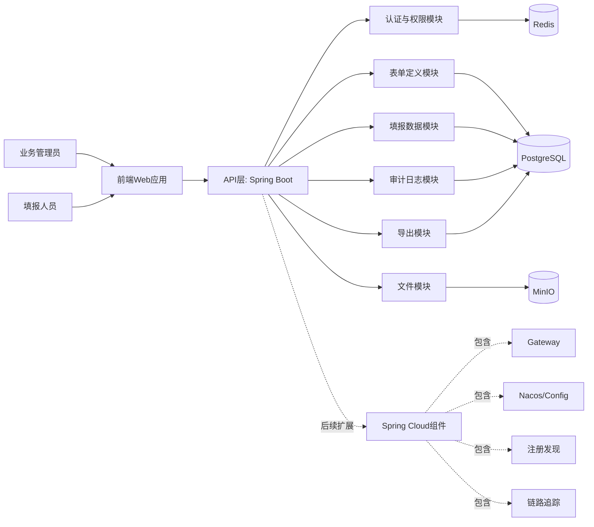

# 第一阶段技术调研与选型（单表表单编辑与填报）

## 元信息
| 字段 | 内容 |
|---|---|
| 状态 | 已定稿 |
| 负责人 | 待补充 |
| 创建日期 | 待补充 |
| 最后更新 | 2026-03-19 |
| 适用范围 | 第一阶段技术基线 |
| 输入文档 | `docs/需求/01-单表单编辑器/阶段需求.md`、`docs/需求/02-单表单填报/阶段需求.md` |

## 1. 设计目标与约束（二维表）
| 维度 | 目标/约束 | 设计要求 |
|---|---|---|
| 业务目标 | 实现单表“设计-发布-填报-提交-查询-导出”闭环 | 支持管理员零代码配置，填报人员低门槛使用 |
| 功能范围 | 组件、布局、属性、校验、发布、填报、查询、导出、日志 | 不实现关联表、审批、打印 |
| 性能指标 | 编辑器打开 < 2s，属性切换 < 300ms，提交响应 < 2s | 前后端分层+索引优化+缓存 |
| 安全要求 | 角色隔离、数据权限、日志可追溯 | RBAC + 操作审计 |
| 可演进性 | 第二阶段扩展关联表与规则引擎 | 模型与接口预留扩展字段 |

## 2. 技术调研与选型（二维表）
| 层级 | 方案A | 方案B | 评估结论 | 选型 |
|---|---|---|---|---|
| 前端框架 | React + TypeScript | Vue3 + TypeScript | 两者均可；React生态在表单设计器、状态管理、低代码组件方面更成熟 | React + TypeScript |
| UI组件库 | Ant Design | Element Plus | 第一阶段重点是后台管理端，AntD表格/表单能力更直接 | Ant Design |
| 拖拽能力 | dnd-kit | react-beautiful-dnd | dnd-kit维护活跃、扩展性更好 | dnd-kit |
| 状态管理 | Redux Toolkit | Zustand | 数据流向清晰、Action可追踪，便于AI开发与人工审核协同 | Redux Toolkit |
| 后端框架 | Spring Boot（Java） | NestJS（Node.js） | 考虑企业级稳定性、团队通用性与后续Spring Cloud扩展能力，优先Spring体系 | Spring Boot |
| 数据库 | PostgreSQL | MySQL | 两者均可；PostgreSQL在JSONB、复杂查询与演进性更优 | PostgreSQL |
| 缓存 | Redis | 本地缓存 | 发布版本、会话、限流场景需要集中缓存 | Redis |
| 对象存储 | MinIO/S3兼容 | 本地文件系统 | 附件上传与后续扩展需要对象存储能力 | MinIO（可替换S3） |
| 导出方案 | 后端流式导出（ExcelJS） | 前端导出 | 需权限控制和大数据量稳定性，后端更可靠 | 后端流式导出 |
| 导出组件 | EasyExcel/Apache POI（后端） | 前端导出 | 需权限控制和大数据量稳定性，后端更可靠 | EasyExcel（优先） |
| 部署方式 | Docker Compose/K8s | 传统进程部署 | 首期可Compose快速落地，后续平滑迁移K8s配合Spring Cloud | Docker Compose起步 |

## 3. 总体架构方案

## 4. 逻辑模块拆分（二维表）
| 模块 | 核心职责 | 输入 | 输出 | 扩展点 |
|---|---|---|---|---|
| 认证与权限 | 登录鉴权、角色权限、数据范围控制 | 用户Token、资源请求 | 是否授权、可见字段集 | 后续接SSO |
| 表单定义 | 表单草稿、字段配置、版本发布、停用 | 组件配置JSON | 发布版本元数据 | 后续加子表/关联配置 |
| 渲染协议 | 统一前后端Schema协议 | 字段定义 | 渲染Schema | 后续兼容复杂组件 |
| 填报数据 | 草稿保存、提交校验、列表查询 | 表单ID、数据payload | 草稿/已提交记录 | 后续加审批状态 |
| 校验引擎 | 前端即时校验+后端强校验 | 字段规则、输入值 | 校验结果与错误详情 | 后续支持表达式引擎 |
| 导出模块 | 按权限导出Excel | 查询条件、导出字段 | 文件下载流 | 后续异步任务化 |
| 审计日志 | 发布、提交、导出等行为落库 | 操作上下文 | 可查询日志 | 后续接审计中心 |
| 云原生扩展层 | 网关、配置中心、注册发现、服务治理 | 服务实例与配置 | 稳定的微服务运行底座 | 随业务拆分逐步启用 |

## 5. 数据模型设计（二维表）
| 表名 | 用途 | 关键字段 | 说明 |
|---|---|---|---|
| form_definition | 表单定义主表 | id, form_key, name, status, current_version, created_by | 表单实体与当前版本索引 |
| form_version | 表单版本表 | id, form_id, version_no, schema_json, published_at, published_by | 保存每次发布的完整Schema快照 |
| form_record | 填报记录主表 | id, form_id, form_version_id, status, data_json, created_by, submitted_at | 单表记录，`status`=draft/submitted |
| form_record_history | 记录变更历史 | id, record_id, op_type, before_json, after_json, op_by, op_at | 支持追溯编辑轨迹 |
| file_asset | 附件元数据 | id, biz_type, biz_id, object_key, file_name, size, uploader | 关联填报记录附件 |
| rbac_user_role | 用户角色关系 | user_id, role_id | 权限控制基础 |
| audit_log | 审计日志 | id, module, action, target_id, operator, detail_json, created_at | 发布/提交/导出可追踪 |

## 6. Schema协议建议（二维表）
| 字段 | 类型 | 必填 | 示例 | 说明 |
|---|---|---|---|---|
| fieldKey | string | 是 | applicant_name | 字段唯一标识 |
| label | string | 是 | 申请人姓名 | 显示名称 |
| component | string | 是 | input/number/date/select/upload | 组件类型 |
| required | boolean | 是 | true | 是否必填 |
| readonly | boolean | 否 | false | 是否只读 |
| visible | boolean | 否 | true | 是否可见 |
| defaultValue | any | 否 | "" | 默认值 |
| rules | array | 否 | [{type:"max",value:50}] | 校验规则集合 |
| layout | object | 否 | {span:12} | 布局占位 |
| props | object | 否 | {placeholder:"请输入"} | 组件扩展属性 |

## 7. 核心流程技术实现（二维表）
| 流程 | 技术实现 | 关键校验 | 失败策略 |
|---|---|---|---|
| 草稿保存 | 前端编辑Schema diff后调用保存接口 | fieldKey唯一、规则合法 | 返回错误字段并定位到配置面板 |
| 发布版本 | 后端对Schema执行发布前校验并写入form_version | 组件参数完整、冲突检测 | 校验失败阻断发布 |
| 填报暂存 | 写入form_record.status=draft | 基础类型校验（弱） | 保存失败提示重试 |
| 填报提交 | 后端按发布版Schema强校验后提交 | 必填、范围、格式、附件限制 | 返回字段级错误列表 |
| 列表查询 | 条件拼装+分页查询+权限过滤 | 数据范围权限、字段脱敏 | 无权限字段不返回 |
| 数据导出 | 二次鉴权后流式读取并写Excel | 导出字段白名单、行数阈值 | 超阈值切异步任务（预留） |

## 8. API设计清单（二维表）
| 接口 | 方法 | 描述 | 请求核心参数 | 返回 |
|---|---|---|---|---|
| /api/forms | POST | 新建表单 | name, formKey | formId |
| /api/forms/{id}/draft | PUT | 保存表单草稿Schema | schemaJson | ok/version |
| /api/forms/{id}/publish | POST | 发布表单版本 | publishRemark | versionNo |
| /api/forms/{id}/active | GET | 获取当前发布版本Schema | formId | schemaJson |
| /api/records | POST | 新建填报草稿 | formId, dataJson | recordId |
| /api/records/{id} | PUT | 编辑草稿 | dataJson | ok |
| /api/records/{id}/submit | POST | 提交记录 | recordId | submittedStatus |
| /api/records | GET | 分页查询记录 | formId, keyword, status, pageNo, pageSize | list,total |
| /api/records/export | POST | 导出Excel | formId, filters, columns | fileStream/taskId |
| /api/audit-logs | GET | 查询操作日志 | module, action, operator, timeRange | list,total |
| /api/files/upload | POST | 附件上传 | file, bizType | fileId,url |

## 9. 前端实现方案（二维表）
| 子系统 | 实现方式 | 关键点 |
|---|---|---|
| 编辑器画布 | React + dnd-kit + 虚拟渲染 | 拖拽排序、选中态、局部重渲染 |
| 状态管理 | Redux Toolkit（slice + thunk） | 统一状态流、变更可追踪、便于审计和代码评审 |
| 属性面板 | 动态表单渲染 | 按组件类型切换属性Schema |
| 预览页 | 复用渲染引擎 | 与填报端同协议同渲染 |
| 填报页 | React Hook Form（或AntD Form） | 前端校验+后端错误回填 |
| 查询列表 | AntD Table + 服务端分页 | 支持筛选与列控制 |
| 导出入口 | 前端触发后端导出 | 下载态提示、失败重试 |

## 10. 后端实现方案（二维表）
| 层次 | 技术方案 | 说明 |
|---|---|---|
| Controller | Spring Web MVC / WebFlux | 输入参数校验+鉴权 |
| Service | 领域服务分层 | 表单服务/记录服务/导出服务/日志服务 |
| Repository | Spring Data JPA / MyBatis-Plus | 复杂查询建议MyBatis-Plus，简单CRUD可JPA |
| Validation | Hibernate Validator + 自定义规则引擎 | 提交时强校验 |
| Security | Spring Security + JWT + RBAC | 角色控制与数据过滤 |
| Observability | Micrometer + Prometheus + SkyWalking/Zipkin | 指标监控、链路追踪、慢查询告警 |
| Cloud扩展 | Spring Cloud Gateway + OpenFeign + Nacos/Consul | 为后续服务拆分预留治理能力 |

## 11. 非功能设计（二维表）
| 类别 | 方案 | 指标/策略 |
|---|---|---|
| 性能 | 热路径缓存（表单发布版Schema） | Redis缓存，失效策略：发布后主动刷新 |
| 并发 | 读写分离预留 | 首期单库，SQL与索引优化优先 |
| 安全 | 输入校验、上传白名单、SQL注入防护 | 文件类型与大小双重校验 |
| 审计 | 核心动作统一审计中间件 | 记录操作者、IP、前后状态 |
| 可用性 | 失败重试与降级 | 导出失败可重试，日志可补偿 |
| 备份 | PostgreSQL定时备份+对象存储版本化 | 满足基础恢复要求 |

## 11.1 Spring Cloud扩展路线（二维表）
| 阶段 | 架构形态 | 引入组件 | 触发条件 | 目标 |
|---|---|---|---|---|
| Phase 1（当前） | 模块化单体（Spring Boot） | Spring Boot + Redis + MQ预留接口 | MVP阶段 | 快速交付与稳定上线 |
| Phase 2 | 单体+网关+配置中心 | Spring Cloud Gateway、Nacos Config | 多环境配置复杂、统一入口需求出现 | 提升配置治理与入口安全 |
| Phase 3 | 核心能力拆分微服务 | 注册发现、OpenFeign、限流熔断 | 团队并行开发与独立扩容诉求明显 | 提升扩展性与弹性 |
| Phase 4 | 云原生治理 | 链路追踪、服务网格、灰度发布 | 服务数增加且发布频率高 | 稳定性与发布效率提升 |

## 12. 第一阶段实施计划（二维表）
| 迭代 | 周期建议 | 交付内容 | 验收要点 |
|---|---|---|---|
| Sprint 1 | 第1-2周 | 表单定义模型、编辑器基础组件、草稿保存 | 可配置并保存单表Schema |
| Sprint 2 | 第3-4周 | 发布机制、填报页、提交校验、记录查询 | 发布后可填报并提交 |
| Sprint 3 | 第5周 | 导出、日志、权限完善、性能优化 | 查询导出与审计可用 |
| Sprint 4 | 第6周 | 联调测试、缺陷修复、上线准备 | 完成UAT与发布 |

## 13. 风险与决策清单（二维表）
| 风险点 | 影响 | 决策/缓解措施 |
|---|---|---|
| Schema频繁变更 | 前后端兼容复杂 | 采用版本快照，不做就地覆盖 |
| 校验规则不一致 | 提交结果不稳定 | 前后端共用规则定义，后端最终裁决 |
| 大数据量导出慢 | 用户体验下降 | 先支持同步小规模，预留异步任务 |
| 上传文件安全 | 安全风险 | MIME+后缀+大小三重校验，隔离存储 |
| 权限边界不清 | 数据泄露风险 | 默认最小权限，导出二次鉴权 |

## 14. 交付物清单（二维表）
| 类别 | 交付物 | 存放建议 |
|---|---|---|
| 设计文档 | 技术调研与选型、架构图、ER草图、接口清单 | 设计/第一阶段-单表表单编辑与填报 |
| 开发规范 | Schema协议、错误码规范、日志规范 | 项目wiki或docs目录 |
| 测试资产 | 用例清单、性能基线、冒烟脚本 | qa目录或测试平台 |
| 运维资产 | Docker部署脚本、环境变量模板 | deploy目录 |
