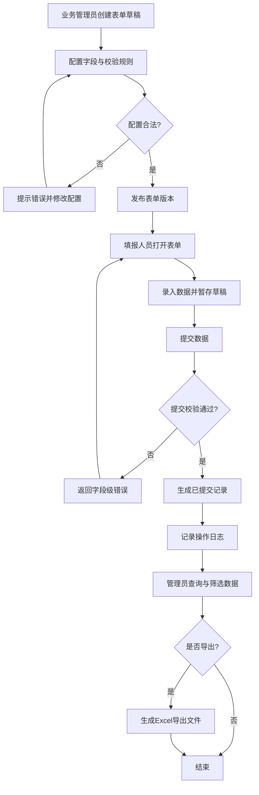
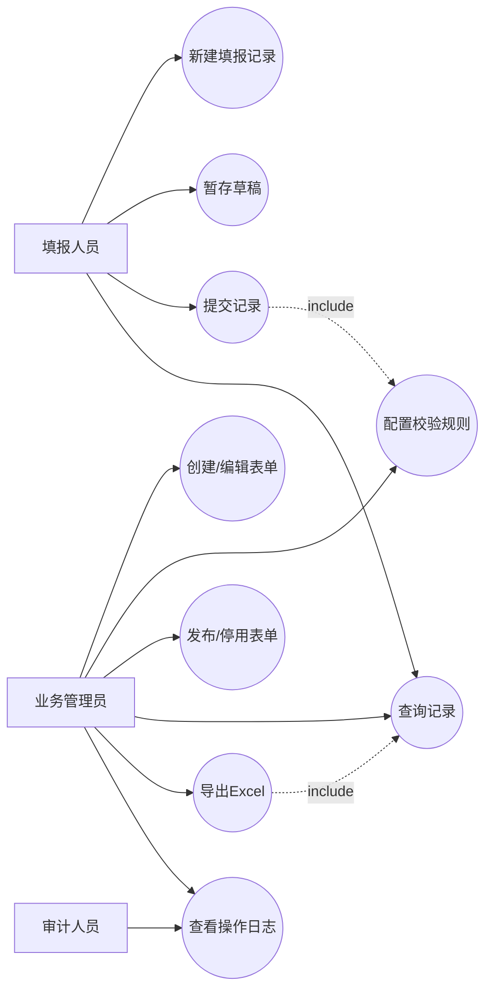

# 第一阶段需求拆分（单表表单编辑与填报）

## 元信息
| 字段 | 内容 |
|---|---|
| 状态 | 已定稿 |
| 负责人 | 待补充 |
| 创建日期 | 待补充 |
| 最后更新 | 2026-03-19 |
| 适用范围 | 02-单表单填报 |
| 关联文档 | `docs/需求/需求梳理.md`、`docs/设计/02-单表单填报/后端设计/单表单填报后端技术设计.md` |

## 1. 阶段目标与范围（二维表）
| 维度 | 内容 | 说明 |
|---|---|---|
| 阶段目标 | 实现单表场景从设计到填报的最小闭环 | 不含跨表关联、不含审批、不含打印 |
| 面向角色 | 业务管理员、填报人员 | 管理员负责配置，填报人员负责录入 |
| 业务边界 | 仅支持一个主表数据模型 | 暂不支持子表/明细表 |
| 成功标准 | 能独立配置并发布单表，用户可填写并提交 | 具备基础查询与数据导出 |

## 2. 功能需求矩阵（二维表）
| 模块 | 子功能 | 需求描述 | 验收标准 | 优先级 |
|---|---|---|---|---|
| 表单编辑 | 字段组件 | 文本、数字、日期、下拉、单选、多选、附件 | 组件可拖拽并保存配置 | P0 |
| 表单编辑 | 属性配置 | 字段名、提示语、默认值、必填、只读 | 修改后实时预览 | P0 |
| 表单编辑 | 校验规则 | 必填、长度、格式、范围校验 | 非法输入提交被拦截 | P0 |
| 表单编辑 | 表单发布 | 草稿保存、发布启用、停用 | 发布后填报端可见 | P0 |
| 数据填报 | 新增与编辑 | 新建记录、暂存草稿、编辑草稿 | 草稿与已提交状态可区分 | P0 |
| 数据填报 | 提交校验 | 提交前统一校验字段规则 | 错误定位到字段级 | P0 |
| 数据填报 | 列表查询 | 按时间、状态、关键字查询 | 常用筛选可组合使用 | P1 |
| 数据填报 | 数据导出 | 单表记录导出 Excel | 导出字段与权限一致 | P1 |
| 系统能力 | 基础权限 | 管理员/填报人员角色隔离 | 非授权用户不可配置表单 | P0 |
| 系统能力 | 操作日志 | 记录配置发布与提交行为 | 支持按时间与用户检索 | P1 |

## 3. 数据与接口边界（二维表）
| 项目 | 约束 | 说明 |
|---|---|---|
| 数据模型 | 单主表结构 | 一条记录对应一行数据 |
| 主键策略 | 系统生成唯一ID | 对外不暴露内部自增规则 |
| 导入导出 | 仅支持导出 | 导入放到第二阶段后评估 |
| 接口范围 | 内部API优先 | 暂不开放外部集成接口 |

## 4. 风险与对策（二维表）
| 风险 | 影响 | 对策 |
|---|---|---|
| 字段配置过多导致体验复杂 | 管理员上手慢 | 首版限制高级属性数量 |
| 校验规则不足 | 数据质量下降 | P0覆盖高频校验类型 |
| 查询性能不稳定 | 填报端反馈慢 | 建立字段索引与分页策略 |

## 5. 端到端业务需求深化（二维表）
| 业务阶段 | 参与角色 | 输入 | 系统动作 | 输出 | 异常处理 |
|---|---|---|---|---|---|
| 需求准备 | 业务管理员 | 业务字段清单、填报规则 | 创建表单草稿并配置字段属性 | 草稿版表单 | 字段定义不完整时禁止发布 |
| 表单配置 | 业务管理员 | 草稿表单 | 配置校验规则、默认值、字段顺序 | 可预览表单 | 规则冲突时提示并阻断保存 |
| 表单发布 | 业务管理员 | 已完成配置的草稿 | 执行发布并生成版本号 | 在线可用版本 | 发布失败回滚到上个可用版本 |
| 填报创建 | 填报人员 | 发布版表单 | 新建记录并录入字段数据 | 草稿记录 | 网络异常时本地暂存并提示重试 |
| 填报提交 | 填报人员 | 已填写记录 | 触发前后端校验并提交 | 已提交记录 | 校验失败返回字段级错误 |
| 数据查询 | 填报人员/管理员 | 查询条件 | 按权限返回记录列表 | 可筛选记录集 | 无权限字段自动脱敏/隐藏 |
| 数据导出 | 业务管理员 | 导出条件与字段范围 | 生成Excel导出文件 | 导出文件 | 大数据量时异步导出并通知 |
| 审计追踪 | 业务管理员 | 操作日志条件 | 检索发布/提交等行为日志 | 审计明细 | 日志缺失触发告警 |

## 6. 端到端业务流程图

## 7. 用例图（第一阶段）

## 8. 用例规约清单（二维表）
| 用例编号 | 用例名称 | 参与者 | 前置条件 | 基本流程 | 结果 |
|---|---|---|---|---|---|
| UC-01 | 创建并发布单表 | 业务管理员 | 已登录且有表单管理权限 | 创建草稿→配置字段/规则→保存→发布 | 生成可用表单版本 |
| UC-02 | 填报并提交记录 | 填报人员 | 存在已发布表单 | 打开表单→填写→提交→系统校验 | 记录状态变为已提交 |
| UC-03 | 草稿暂存与续填 | 填报人员 | 已开始填写 | 点击暂存→后续重新打开并编辑 | 草稿可被续填并最终提交 |
| UC-04 | 查询与筛选记录 | 填报人员/业务管理员 | 有记录查看权限 | 输入筛选条件→分页查看结果 | 返回权限范围内数据 |
| UC-05 | 导出记录 | 业务管理员 | 有导出权限 | 选择条件与字段→执行导出 | 生成可下载Excel文件 |
| UC-06 | 查看日志追踪 | 业务管理员/审计人员 | 开启日志记录 | 输入操作人/时间范围→查询 | 返回可审计操作轨迹 |
