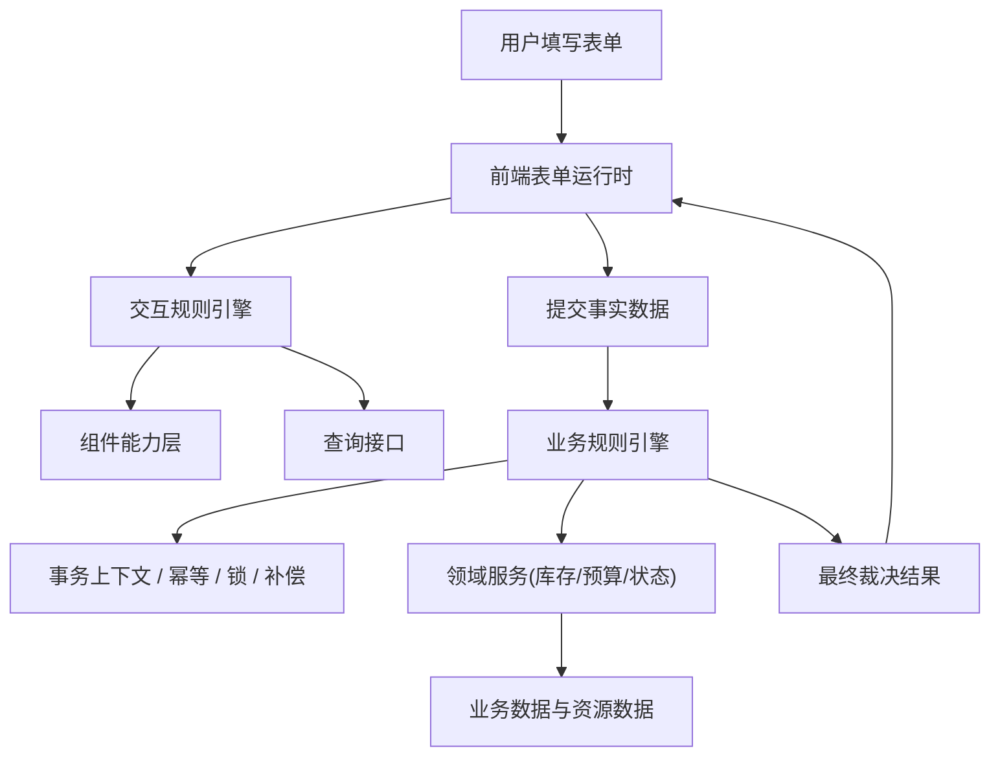

# 规则体系总览

## 1. 文档目标（二维表）
| 维度 | 内容 | 说明 |
|---|---|---|
| 文档目标 | 统一说明多表单扩展阶段的整体规则体系 | 串联交互规则引擎、业务规则引擎和阶段落地路线 |
| 面向对象 | 产品、前端、后端、测试、架构评审 | 作为规则体系的总入口文档 |
| 核心问题 | 规则能力如何分层、如何协同、如何分期建设 | 避免前后端边界模糊和范围蔓延 |

## 2. 统一术语定义（二维表）
| 术语 | 统一定义 |
|---|---|
| 规则引擎 | 一套由事件触发、按规则链执行多个原子单元并输出结果的执行框架 |
| 流程编排式执行模型 | 规则的实现方式，即把多个原子执行单元按顺序编排成可执行链路 |
| 交互规则引擎 | 采用流程编排式执行模型、运行在前端当前表单边界内的规则引擎 |
| 业务规则引擎 | 采用流程编排式执行模型、运行在服务端跨表单事务边界内的规则引擎 |
| 原子执行单元 | 交互侧称“执行单元”，业务侧称“规则处理器”，本质上都是规则链中的最小动作 |

## 3. 整体分层（二维表）
| 层级 | 核心职责 | 代表文档 |
|---|---|---|
| 表单交互层 | 负责当前表单内的回填、筛选、联动、汇总、提示 | `交互规则引擎.md` |
| 业务事务层 | 负责跨表单写入、状态推进、库存/预算扣减、幂等与补偿 | `业务规则引擎.md` |
| 表单能力层 | 负责明细表、关联选择、跨表引用等基础能力 | `../03-多表单扩展/阶段需求.md` |
| 规则扩展层 | 负责字段联动、计算规则等增强能力 | `字段联动与计算规则需求.md` |

## 4. 分层职责边界（二维表）
| 问题 | 交互规则引擎 | 业务规则引擎 |
|---|---|---|
| 谁负责当前页面怎么变化 | 负责 | 不负责 |
| 谁负责候选项怎么加载 | 负责 | 不负责 |
| 谁负责当前表单字段如何回填 | 负责 | 可做最终纠偏 |
| 谁负责提交前预校验 | 负责 | 负责最终校验 |
| 谁负责跨表单写入 | 不负责 | 负责 |
| 谁负责库存/预算最终扣减 | 不负责 | 负责 |
| 谁负责幂等、锁、补偿 | 不负责 | 负责 |

## 5. 典型数据流（二维表）
| 阶段 | 前端交互层动作 | 服务端业务层动作 |
|---|---|---|
| 页面加载 | 加载主表、明细表、关联候选项、初始化上下文 | 返回基础表单数据与必要配置 |
| 用户填写 | 触发字段联动、刷新候选项、回填字段、实时汇总 | 不直接参与，必要时提供查询接口 |
| 点击提交 | 做预校验、展示错误、提交事实数据 | 做幂等校验、业务校验、跨表单事务执行 |
| 事务完成 | 根据返回结果刷新页面状态 | 返回最终裁决结果、状态变更、异常信息 |

## 6. 整体架构图

## 7. 一期到三期落地路线（二维表）
| 阶段 | 目标 | 核心交付 |
|---|---|---|
| 一期 | 打通关联表扩展 | 明细表组件、关联选择组件、主子表结构、跨表引用、统一提交 |
| 二期 | 完成交互规则扩展 | 字段联动、计算规则、交互规则引擎基础能力 |
| 三期 | 完成业务事务闭环 | 业务规则引擎、跨表单事务、库存/预算/状态一致性 |

## 8. 推荐实施顺序（二维表）
| 顺序 | 建议 | 原因 |
|---|---|---|
| 1 | 先稳定表单结构能力 | 没有主表、明细表、关联选择，规则无从承载 |
| 2 | 再建设交互规则引擎 | 先解决当前表单填报体验和配置化问题 |
| 3 | 最后补业务规则引擎 | 跨表单事务复杂度最高，应建立在前两层稳定之上 |

## 9. 各阶段重点风险（二维表）
| 阶段 | 风险 | 对策 |
|---|---|---|
| 一期 | 组件模型不稳定，二期难扩展 | 预留字段标识、作用域、上下文扩展位 |
| 二期 | 前端规则承担过多业务语义 | 明确当前表单边界，跨事务能力不上前端 |
| 三期 | 事务与规则耦合过重 | 分离规则定义、领域处理器、事务框架 |

## 10. 评审建议（二维表）
| 评审主题 | 重点确认项 |
|---|---|
| 产品评审 | 哪些规则属于交互层，哪些属于业务事务层 |
| 前端评审 | 组件能力协议、触发器模型、规则运行时边界 |
| 后端评审 | 幂等、锁、补偿、领域服务接口与事务模型 |
| 联合评审 | 提交链路上的事实输入、最终裁决和结果回传协议 |
